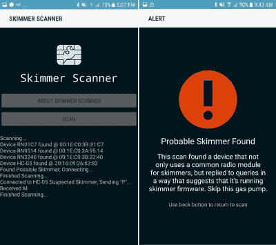

# 说真的，略读卡片有那么容易吗？

> 原文：<https://hackaday.com/2017/09/20/seriously-is-it-that-easy-to-skim-cards/>

我们都听说过盗卡机，这是一种窃取信用卡和借记卡身份的邪恶设备，安装在自动取款机和其他机器上，供不知情的消费者使用。他们通常依赖于从卡本身物理提取数据，例如通过在假的 ATM 面板中插入磁条读取器，或者通过使用隐藏的摄像机来捕捉卡和用户 PIN 输入的照片。

Sparkfun 的人们写下了他们从一家执法机构收到的一种方法，这种方法带有安装在汽油泵中的一系列卡套装置。这些攻击不依赖于对卡本身的拦截，而是作为中间人攻击位于读卡器单元和泵电子设备之间的串行线路中。让我们记住这一点:一条任何人都可以用泵制造商的标准密钥轻易访问的串行线，以未加密的形式传输卡数据。撇除设备的所有者是罪犯，但留下如此大的漏洞的公司真的应该加入他们的行列，不得不对当局负责。

The Skimmer Scanner app may help keep you safe.

该设备本身非常简单，操作也很好，虽然看起来电线和连接器的连接是留给骗子的工作。一些电路板以出色的焊接而自豪，而另一些则有简单的犯罪接头。板上有一个 PIC 微控制器、一个串行闪存芯片和一个商用蓝牙模块。这最后一个组件为歹徒提供了获取不义之财的手段，并且顺便提供了一种可以识别受损泵的简便方法。Sparkfun 的人提供了一个 Android 应用程序，可以询问它遇到的任何模块，并警告任何返回 skimmer 签名的模块。

很遗憾地说，某种程度的犯罪是人类状况不可避免的特征，因此，任何我们信任我们的敏感数据(如信用卡号码)的实体都应该采取合理的步骤来确保其安全性，这不应是一种不合理的期望。如果一家银行用敞开式手推车在街上运送成捆的 10 美元钞票，他们很可能会很快陷入麻烦，因此，泵制造商通过这样一种容易访问的介质以明文形式发送卡信息应该是类似程度的丑闻。金融机构宁愿掩盖问题，将损失转移到加油站，而不是要求油泵制造商提供更好的设备安全性，这充分说明了它们的优先事项错位。

如果你对这个话题感兴趣，[我们已经向你展示了一个更传统的撇渣器](https://hackaday.com/2016/05/03/reverse-engineering-an-atm-card-skimmer/)的拆卸过程。

谢谢[CYK]的提示。