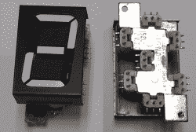

# 七段翻转时钟显示终于完成

> 原文：<https://hackaday.com/2017/12/29/seven-segment-flip-clock-display-finally-finished/>

今年早些时候，我们在 Hackaday Links 的一篇文章中提到，[斯潘塞·汉布林]正在建造一个七段翻转时钟。嗯，终于完成了，而且[看起来很棒](https://imgur.com/a/mkczu)！

复古的七段数字组成了显示屏。这些数字的工作方式与 flip-dot 显示器的工作方式相同——电流通过每个片段的线圈产生磁场，导致片段翻转。另一个方向的电流会产生相反的磁场，使线段向另一个方向翻转。在这些数字上，线圈上有三个连接。中间的一个是电源，另外两个用于启用和禁用该段-即。把它翻过来。为了节省微控制器上的引脚，[斯潘塞]将所有中间线圈的引脚连接在一个数字上。每个线圈都可以通过微控制器上的一个引脚供电。类似地，每个数字的段也连接在一起，因此微处理器上的一个引脚控制每个数字上的相同段。问题中的微控制器是 AVR ATMega48。

钟面还有两部分要做:AM/PM 和是否设置闹钟。[斯潘塞]使用了第五个数字，略微偏移，用于那些-顶部和中间段被使用。

对于钟的外壳，[斯潘塞]使用了抵消彩色木材层。木材(沙比利和白蜡木)被 CNC 切割和对齐。背板也是木制的，上面有设置时间和闹钟的按钮，还有一些发光二极管，用于[斯潘塞]所说的“日光闹钟”设备顶部(木箱内)的电容传感器用于关闭警报。

经过打磨和去壳后，效果看起来令人惊叹。[斯潘塞]找到了他想要的装饰艺术风格。有大量的图片和电路设计，原理图和代码在【斯潘塞】的 [Hackaday.io 页面](https://hackaday.io/project/26220-7-segment-flip-display-clock)上，[你可以在这里](https://hackaday.com/2017/08/06/hackaday-links-august-6th-2017/)找到 Hackaday 链接。这是我们之前在 Hackaday 上提到的一个项目的完整日志，这里，但是还有其他机械翻转显示时钟项目，例如[这个 DIY 机械翻转七段原型](https://hackaday.com/2017/06/18/towards-diy-flip-digit-clocks/)，或者，你可以使用这个[乐高机械七段显示](https://hackaday.com/2014/08/07/lego-technic-mechanical-seven-segment-display/)创建你自己的(真正大的)时钟。

via [Reddit](https://www.reddit.com/r/electronics/comments/7kl57k/update_on_the_flip_clock_its_finally_done) 。