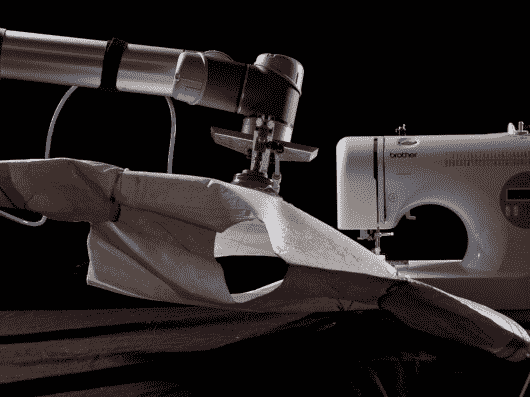
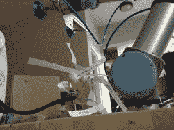
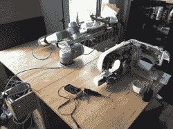
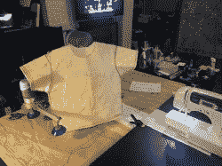

# Sewbo 机器人缝合自动化服装制造

> 原文：<https://hackaday.com/2016/09/12/sewbo-robot-sews-up-automated-garment-manufacturing/>

尽管机器人成群结队地进入其他行业，但服装组装长期以来一直是乏味的人类特权。现在，机器人第一次缝制了一整件可穿的衣服。Sewbo 是一个工业机器人，它被编程来处理这个棘手的任务，组装衣服并使它看起来很容易。

尽管机器人很精确，但它们仍然缺乏认知能力和运动技能来可靠地加工柔软的织物。Sewbo 通过用 PVA(一种无毒的可生物降解的聚合物)浸渍织物来解决这个问题。然后，暂时硬化的织物可以像金属板一样进行加工。它可以被焊接、模制，最重要的是，可以被机器人以可重复的方式抓取和缝合。从成品服装，聚乙烯醇被删除，只要用温水冲洗它。

      

为了将两片浸渍过的织物缝合在一起，首先使用超声波焊接机将它们钉在一起。除此之外，这一过程与手工缝纫惊人地相似:Sewbo 只需抓住组件，然后让它通过标准缝纫机，在适当的位置形成一条永久的接缝。由于织物的刚性增加，这一步是可重复的，足以让机器人蒙着眼睛工作，不需要 CV 魔法。

自然，每个聪明的机器人背后，都有一个聪明的人。就 Sewbo 而言，是[Jonathan Zornow]发明了新的工艺。为了验证他的概念，他租了一个通用机器人 UR-5 30 天，给它配备了一个真空杯末端执行器(好心地从新泽西州的安讯士自动化公司借来的)，并用螺栓将整个东西固定在他的宜家餐厅桌子上。一台消费级的兄弟 CS6000i 缝纫机随后被黑客攻击，由机器人的运动控制器处理。

在[填补服装制造](http://hackaday.com/2016/08/16/filling-the-automation-gap-in-garment-manufacturing/)自动化空白的道路上，Sewbo 标志着一个重要的里程碑，我们很想看到这一概念被进一步推广。用聚合物浸渍织物可能会引起环境问题，但在纺织品制造中，用 PVA 增强纱线以更容易在织机上加工已经是常见的做法。它可能会在工艺链的后几个步骤中被洗掉。

这里有人有在餐桌上打洞的经验吗？请在评论中告诉我们！欣赏下面的视频，你可以看到 Sewbo 如何从头到尾组装一件 t 恤。

[https://player.vimeo.com/video/158544539](https://player.vimeo.com/video/158544539)