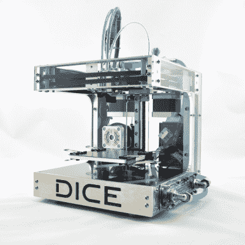

# 最性感的微型金属芯-XY 3D 打印机

> 原文：<https://hackaday.com/2017/04/27/sexiest-tiny-metal-core-xy-3d-printer/>

这是一个很大的限制，但我们很确定你不能指责我们在标题中的夸张:[这是我们见过的最紧凑的小型 3D 打印机构建之一](http://www.well-engineered.net/index.php/en/82-this-time-not-a-teaser-seconddiceupdate)。再加上稍微深奥的 [CoreXY](http://corexy.com/) 运动学和厚厚的铝框架，它除了是一个旁观者之外，还是一个速度恶魔。

[rené]以前制造过一些 3D 打印机，所以在着手 DICE 项目之前，他对参数和设计权衡有很好的感觉。例如，制作小的印刷量意味着框架可以更小，因此刚性指数更高。这意味着它能够非常快速地移动——833 毫米/秒不是开玩笑的！它还可以制作非常精确的小印刷品。什么能让它变得更棒？水冷步进电机、磁性可互换打印头和内置照明。

建造看起来令人惊叹，在[René]的网站上有整个过程的视频文件，包括一份完整的材料和设计清单。这肯定不是我们见过的最便宜的 3D 打印机，微小的构建平台使它成为通用机器的糟糕选择，但如果你需要第二台打印机，并且你想要一台有风格的打印机，这个骰子看起来很难击败。

感谢[laimunos mock us]的提示！