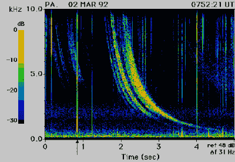

# 斯费里斯、口哨者和黎明合唱团:在甚低频上听地球音乐

> 原文：<https://hackaday.com/2017/11/06/sferics-whistlers-and-the-dawn-chorus-listening-to-earth-music-on-vlf/>

我们生活在电磁汤里，被从 DC 到日光甚至更远的波长轰击着。很多都是我们自己制造的，特别是在光谱的更高处，波长短到足以满足 WiFi 和手机等设备所需的带宽。但早在人类想出如何制造自己的电磁涟漪之前，地球就在唱着频谱低端的歌。甚低频(VLF)波段充满了有趣的自然辐射，聆听这些地球声音可能是一种享受。

### 长长的波浪

VLF 频段大致定义为从 3 kHz 到 30 kHz 的频谱区域。波长是巨大的；大多数 hams 工作的最低波段的波长约为 160 米，而 3 kHz 信号的波长高达 100 公里。由于该波段覆盖了人类听觉的正常范围(20 赫兹到 20 千赫兹)，如果它们是机械波而不是电磁波，它们将是可听见的。

如此长的波长赋予甚低频波段有趣的特性，其中一些我们人类已经开发了。VLF 波的传播倾向于不同于较高的频带。地球和电离层之间的距离只有几个甚低频波长高，这形成了一个波导来限制信号并在地球上传播。甚低频波在某种程度上也能穿透海水，这导致了该波段的主要用途:与潜艇的低比特率通信。

但是，正是地球电力系统的特性使甚低频成为一个有用的波段，也产生了一些真正有趣的自然甚低频信号。这些信号的通用术语是 *sferics* ，来自“atmospherics”，主要由每天释放到大气中的 130 万道闪电产生。这些放电会产生宽带电磁辐射，但由于放电的电气和机械特性，大部分功率是在 VLF 波段辐射的。由于波段的传播特性，这意味着用合适的设备你可以听到地球另一边的雷暴。

sferics 听起来像什么？我们大多数人都听过雷暴期间 AM 收音机的静电碰撞声，这是一种直接到达闪电的宽带 sferic 信号。在甚低频波段，这些相同的信号听起来更像是[噼啪作响的盖革计数器](http://www.home.pon.net/785/sounds/sferic1.wav)。如果传播条件良好，甚低频收听者可以获得直达路径和电离层反射路径。信号到达之间的微小时间差使得[发出被称为 *tweek* 的乒乒乓乓的声音](http://www.home.pon.net/785/sounds/tweeks1.wav)，在我听来就像冰雹打在金属屋顶或排水沟上。

Spectrogram of a whistler and the sferic that triggered it (arrow). Source: [Stanford VLF Group](http://vlf.stanford.edu/research/introduction-whistler-waves-magnetosphere)

如果条件合适，闪电放电以相对于地球磁场的正确方向发生，就会产生*哨声*。哨声是[一种频率在几秒钟内下降的音调](http://www.home.pon.net/785/sounds/wistlr5.wav)，听起来就像逐渐消失的哨声。哨声本质上是拉长的 tweeks，当来自一次撞击的 VLF 信号远离地表，但沿着地球磁场线返回时，导致信号频率的分散。

幸运的甚低频听众可能会听到黎明合唱。合唱以清晨鸟儿刺耳的叫声命名，是一种罕见的事件，发生在收听地点太阳升起之前。听起来[非常像它的同名鸟类](http://www.home.pon.net/785/sounds/chorus2.wav)，或者是*鸟类*的部分配乐。它不是由雷击引起的，而是由太阳风与磁层相互作用引起的。

### 加速

监听自然甚低频信号并不需要特别复杂的设备，但它需要了解物理学，并为这项工作优化您的设置。这意味着使用适合这项任务的接收器，要么是商用钻机，要么是自制的，可以是 T2 的简单型号，也可以是 T4 的复杂型号。不过，通过电网引起的高噪声层可能是最大的问题。电力线噪声及其高次谐波往往会淹没微弱的甚低频信号，因此真正的地球音乐爱好者会竭尽全力避开电网。将接收器放在尽可能远离电力线的地方非常重要。一英里左右的距离是最好的，一些听众甚至在遥远的荒野中建立了太阳能接收器，通过一个在更高频率的业余波段上工作的中继来连接它们。

当然，如果你只是想在甚低频上闲逛，听一些更高功率的人造甚低频信号，如前面提到的海底通信，你只需将一大块电线连接到一台带有像样声卡的 PC 的音频输入插孔上，就可以实现这一点:

[https://player.vimeo.com/video/124756509](https://player.vimeo.com/video/124756509)