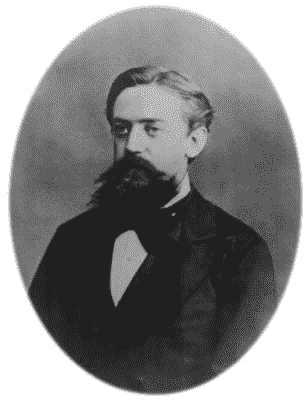

# Shmoocon 2016:网络钓鱼者的网络钓鱼

> 原文：<https://hackaday.com/2016/01/16/shmoocon-2016-phishing-for-the-phishers/>

在多年忽视电子邮件后，现在终于是时候和你一直联系的尼日利亚王子交谈了。罗比·加拉格尔是德克萨斯州奥斯汀 Atlassian 公司的应用程序安全工程师，他想找出网络钓鱼邮件的犯罪者实际上住在哪里。你当然不能指望他们发给你的邮件的标题。追踪他们的一个更好的方法是把他们吸引到对话中，这意味着让你自己成为一个有趣的目标。

在今年的 Shmoocon 上，Robbie 就他的项目 Honey-费西合唱团做了一个精彩的演讲。让它脱颖而出的部分原因是他对探索社会工程技术的每一步的叙述。例如，已经有一个活跃的社区专门与骗子建立关系。那些经常吃[419](http://www.419eater.com/)的人实际上已经把它变成了一项叫做“蹦跶”的运动。最终目的是证明你引诱了一个骗子，让这个人给自己拍一张在头上平衡东西的照片。这篇文章顶部的图片是有意义的，对吗？

如果你有很多时间，并且只想一次追踪一个骗子，给你的骗子写私人邮件是一个很好的方法。Robbie 希望尽可能多地对地理位置进行分类，这意味着自动化。有趣的是，解决方案是钓鱼者的费西合唱团。通过自动回复网络钓鱼电子邮件，并诱使发起这些网络钓鱼诈骗的人点击链接，您可以确定他们的物理位置。

### 这是怎么做到的

该项目的需求如下:收集尽可能多的钓鱼电子邮件，解析每封电子邮件并发送可信的回复，包括从另一端的人收集信息的方法。

首先，Robbie 设置了一个 Gmail 帐户来收集电子邮件。他招募朋友和同事向该账户转发钓鱼邮件，但这并没有覆盖很广的范围。为了增加投入，他开始通过搜索“注册垃圾邮件”来注册垃圾邮件账户，将他带到了像*mailbeat*、*复仇垃圾邮件*和*垃圾邮件注册*这样的网站。不幸的是，这些将他放在邮件列表上，而不是使帐户成为网络钓鱼的目标。不要害怕，毕竟 419 Eater 网站把这当成了一项运动，这也是 Robbie 找到让他的账户受到关注的最好方法的地方。该组织有一些蜜罐，以“来宾簿”的形式设置，就像你会在婚礼上签名一样。在将联系信息放入这些邮箱的 48 小时内，这些邮件就被骗子抓取了，网络钓鱼信息不断涌入收件箱。

Andrey Markov

一种回应并不适用于所有情况，哈尼-费西合唱团需要一种最有可能吸引网络钓鱼者点击的回应方式。为了解释这一部分，罗比向观众讲述了安德烈·马尔科夫和他的胡须的历史。当然，他是马尔可夫链之父，当给定一个合适的输入池时，马尔可夫链在形成自然语言方面做得非常好。罗比举了几个例子来细读，比如加科夫的《T2》加菲猫漫画，它的文字被替换成了马尔可夫链，还有托尼·菲舍蒂的[马尔可夫链酒评](http://www.onthelambda.com/2014/02/20/how-to-fake-a-sophisticated-knowledge-of-wine-with-markov-chains/)。

Robbie 的前几个输入池完全失败了。《The Big Lebowski》的剧本不是用第一人称读的，古腾堡出版社的书使用的英语也太过时了。甜蜜点原来是[的个人财务子栏目](https://www.reddit.com/r/personalfinance)，因为几乎每篇帖子都是第一人称，讨论都围绕着冲突、财务负担和个人成功……这正是网络钓鱼电子邮件瞄准的主题。

### 有用吗？

早期结果包括 41 个独特的电子邮件交流的样本大小，有 2 个点击率(4.9%的成功率)。使用 Jack Spirou 的 ClientJS 库在这两次点击中收集了大量数据……为了这篇文章的目的，这些国家就足够了:巴西和罗马尼亚。Robbie 计划大幅扩大搜索范围，并最终发布网络钓鱼发源地的热图。

也许在演讲中分享的最有趣的故事是以民主党全国委员会为代价的。作为搜寻骗子的一部分，哈尼-费西合唱团订阅了他们的邮件列表。民主党全国委员会发送了如此多的电子邮件，哈尼-费西合唱团回复了每一封，以至于该 IP 地址最终被民主党全国委员会禁止。不，它们不是网络钓鱼，但这种互动有些不对劲。这些谈话都被录了下来，一旦发表，你一定会看到 Robbie 的整个演讲。