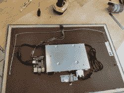

# 一劳永逸的数码相框

> 原文：<https://hackaday.com/2018/03/05/shoot-and-forget-digital-photo-frame/>

如今，数码相框需要你管理储存在上面的照片，或者依赖于相框制造商的云服务。[Henric Andersson]意识到他和他的妻子拍了很多照片，但很少有时间去浏览它们，就像过去的相册一样，并将它们添加到任何像相框一样的设备或服务中。由于谷歌照片可以为他们做大量的分类工作，他决定将其整合到一个数码相框中。

他使用妻子的旧优派 24 英寸 1080p 显示器，将其拆开，并将屏幕纳入一个 24×16 的仿旧木框架中——用 HDF 碎片和大量胶水加固它，以解决庞大的内置电源问题。这个数码相框背后的大脑是他从一个朋友那里收到的树莓 Pi 3。为了打开/关闭整个系统，他建立了一个小电路，但事实证明这并不是绝对必要的，因为没有它一切都开始得很好。

虽然功能齐全，但还需要增加一项功能。一个叫做“色温校准”的小东西——又名白平衡。

发现 Adafruit 的 TCS34725 RGB 颜色传感器以及易于集成的现成代码后，[Andersson]困惑于如何将其添加到框架中。为了伪装它，同时保持它的有效性，他不得不在顶部钻了一个洞，然后用一根塑料棒穿过这个洞，让光线穿过传感器，然后将它粘在框架的后部。

为了让照片显示出来，[Henric Andersson]说他所做的只是在 Google Photos 中添加一些查询，它就会显示所有已经同步到该服务的相关照片。关于这方面的分析，请查看他的另一篇文章。

虽然 Google Photos 可以灵活地显示各种方向、大小和长宽比的照片，但我们推出的数码相框[处理这项任务的方式略有不同](https://hackaday.com/2012/07/12/digital-picture-frame-that-rotates-to-match-image-orientation/)。