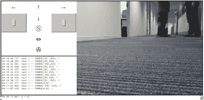

# 向完全陌生的人射飞镖

> 原文：<https://hackaday.com/2016/02/22/shoot-darts-at-the-shins-of-total-strangers/>

[迈克尔·布鲁姆洛]找到了我们并发给我们一个链接。几秒钟之内，我们就开着一辆装有网络摄像头的 Nerf dart 坦克穿过他的办公室，尽量不要撞到墙上或被他的同事踩到。不幸的是，当时飞镖已经卖完了，但如果你四处找找，你会发现满地都是。

 所有的代码细节，包括[你可以自己试驾的链接，都在【迈克尔】的 GitHub](https://github.com/mbrumlow/dartbot) 上。大脑是英特尔爱迪生板，而肌肉由 Arduino 电机控制器屏蔽和从中国购买的底盘(最新版本)提供。

考虑到从(迈克尔)在德克萨斯州的办公室出发，经过亚马逊保存网络服务的地方，到达德国的我们这里，然后返回的漫长往返旅程，它运行得相当顺利。一旦我们习惯了轻微的滞后，并开始使用键盘的箭头键进行控制，我们就像专业人士一样开车了。

它仍然有一些小故障，比如相机周期性过热和 WiFi 距离不足。[迈克尔]说他会尽量保持充电和运行，而你给它一个镜头。控制在云中是多路复用的，所以你控制它的机会和其他人一样好。当成千上万的 Hackaday 读者试图同时控制它时，看看会发生什么会很有趣！

把你的远程呈现机器人放到开放的互联网上需要一定的勇气。所以恭喜你，[迈克尔]，我们希望你本周能设法完成一些工作，尽管你会把所有的日常工作都推到你的隔间墙上。