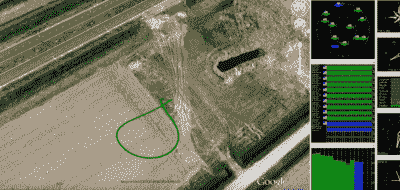

# 在谷歌地球上显示十美元以下的四轴飞行器

> 原文：<https://hackaday.com/2015/10/16/show-a-quadcopter-flight-on-google-earth-for-under-ten-bucks/>

[Joop Brokking]想知道他的四轴飞行器在哪里，去过哪里。他考虑过谷歌地球，但认为很难获得 GPS 数据并将其与谷歌图像整合。但是他发现这比他想象的要容易。他最终花了大约 10 美元，尽管如果他的直升机没有全球定位系统，可能会更多。

在硬件方面，[Joop]使用一个小型 Arduino(Pro Mini)和一个 SD 卡(以及一个 SD 分线板)制作了一个非常简单的数据记录器。通过这种设置，来自 GPS 的 NMEA 数据进入 Arduino 的串行端口，并在 SD 卡上结束。

 不过，有趣的部分是捕捉到的数据的可视化。[Joop]使用 uBlox 的 [u-Center。这款 Windows 软件可以从记录器中读取 NEMA 数据，并提供多种查看方式，包括以不同速度播放的飞行轨迹的谷歌地球视图，以及 2D 或 3D 视图(见右图)。](https://www.u-blox.com/en)

我们已经看到汽车应用中使用的 uBlox 硬件。我们甚至看到了硬件飞行和[收集 WiFi 信息](http://hackaday.com/2014/05/02/nsa-technology-goes-open-hardware/)。但是如果你的飞行器已经有 GPS，这是一个非常简单的方法来获得一些非常酷的飞行后数据解释。你可以在下面的视频中看到 Joop 的创作。

 [https://www.youtube.com/embed/uz8u4VymQiw?version=3&rel=1&showsearch=0&showinfo=1&iv_load_policy=1&fs=1&hl=en-US&autohide=2&wmode=transparent](https://www.youtube.com/embed/uz8u4VymQiw?version=3&rel=1&showsearch=0&showinfo=1&iv_load_policy=1&fs=1&hl=en-US&autohide=2&wmode=transparent)

