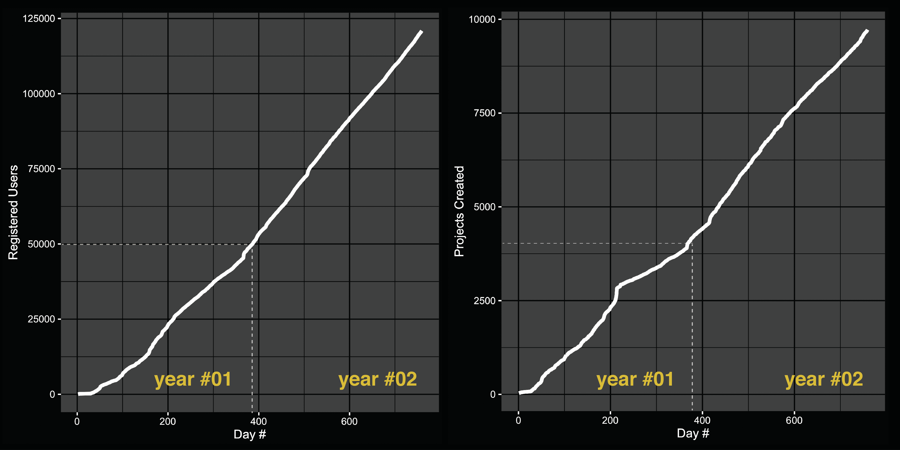
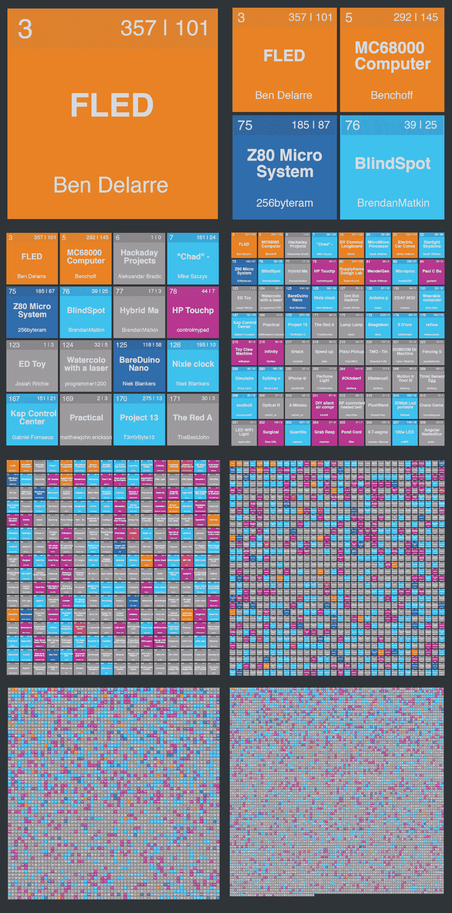
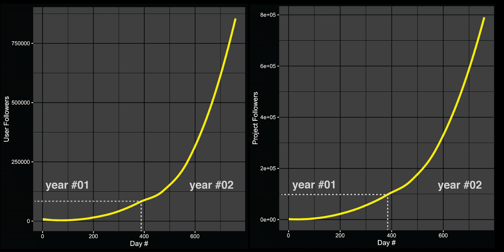
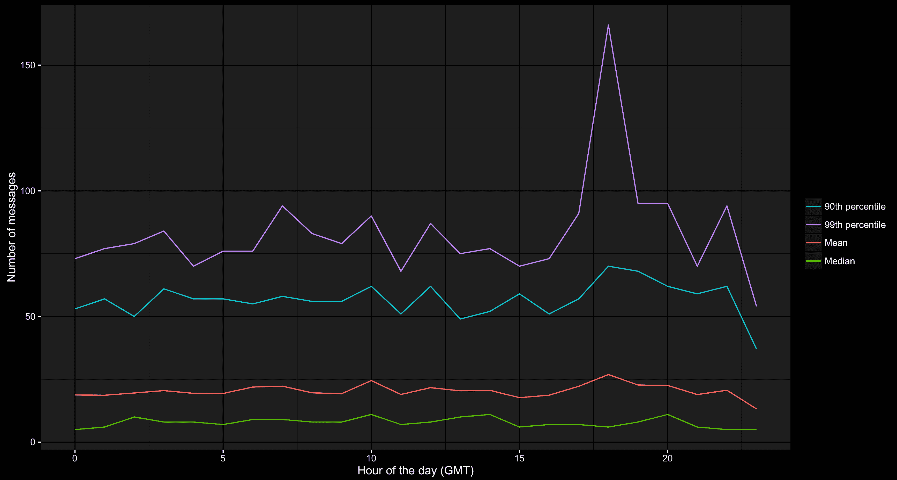
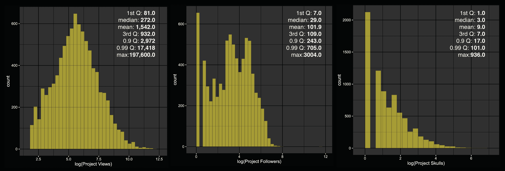

# 给我看数据:Hackaday.io Year #02

> 原文：<https://hackaday.com/2016/02/18/show-me-the-data-hackaday-io-year-02/>

今天，Hackaday.io 刚满两周岁，对于我们所取得的成就，我们感到无比兴奋。最初是一个简单的概念验证，灵感来自于叶老的“虚拟黑客空间”的想法，现在已经真正发展成为你所见过的一些最优秀、最聪明、最有创造力的头脑的全球游乐场。它也成为我们团队中许多人度过不眠之夜的家和地方，我们很高兴分享一些关于我们前进方向的想法。

但在此之前，我们先来看一些数据。

## 数据

我们很高兴地向大家报告，在过去的两年里，Hackaday.io 已经从零成长为一个拥有 121，158 名成员的强大社区，他们共同创建了总计 **9，736 个项目**。从背景来看，这比去年[的里程碑](http://hackaday.com/2015/02/18/show-me-the-data-hackaday-io-year-01/)的 51，838 个用户/ 4，365 个项目增长了两倍多。而且似乎没有任何放缓的迹象。

### 项目

虽然这些“虚荣心”指标确实是一个很好的验证，但最让我们兴奋的数字是这样一个事实，即目前网站上的 9731 个项目是由总共**4966****不同用户**创建的。更好的是，949 项目是两个或更多人合作的结果。总共有 **7，170** 个不同的用户参与了目前驻留在 Hackaday.io 上的大量工程知识的创建

但是真正令人困惑的是，在这个(几乎)1 万个项目的集合中，到底有多少个项目？每当我们出去浏览网站上的项目时，我们发现自己在达到 100 之前就已经信息过载了。虽然这可能与您只能处理这么多数据，同时仍然拥有有意义的用户体验有关，但我们认为尝试一下会很有趣。因此，前几天晚上，我们做了一个快速的可视化，可能有助于您了解整个项目空间:

你也可以在 hackaday.io/projectscape/的[探索 SVG 版本。](http://hackaday.io/projectscape/)

### 社区

我们总是认为 Hackaday.io 是一个“虚拟黑客空间”——一个获得灵感和结识能帮助你实现想法的人的地方。或者，它可以只是一个在学习和分享知识的同时享受乐趣的地方(我们喜欢称之为“正念娱乐”)。因此，从一开始，我们就试图建立机制，帮助你发现相关项目，与其他成员联系和合作。

从定量的角度来看，考虑这个问题最简单的方法是以有向图的形式，节点代表项目/用户，边代表用户/项目追随者关系。一年前，这个图表测量了 88，703 个用户->用户和 105，315 个用户->项目追随者关系。如今，它又高了一个数量级——**868，698 用户——>用户**和 **795，160 用户——>项目遵循**关系。网站上的“社交”似乎真的开始流行了。

### 黑客频道

我们在过去一年发布的另一个主要功能是支持项目成员之间的实时私人“对话”，这导致了 Hackaday.io 上微社区的爆炸式增长。我们最喜欢滥用该功能的是[黑客频道](https://hackaday.io/project/5373-hacker-channel)。该项目拥有 775 名成员，已经成为许多参与者和潜伏者不间断娱乐的来源。如果你身处 Hackaday.io 的这个角落，这里有一个日常活动的小例子:

### 公共方面

虽然我们都知道虚荣心不重要，但当有人给我们的项目一点点爱时，我们中的一些人无法抵抗多巴胺的小冲击。毕竟，我们为什么要这样做呢？项目需要时间和精力，所以无论是什么让我们保持动力，让我们前进，都可能是一件好事。

在 Hackaday.io 上有很多分享爱的方式:项目视图、关注、头骨和评论。以下是这些指标在不同项目中的分布情况:

几个激动人心的要点立即凸显出来:

*   Hackaday.io 上排名前 100 的项目每个都有超过 17500 次浏览，705 个关注者和 101 个头骨
*   前 1000 个项目获得了超过 3000 次浏览，243 名追随者和 17 个头骨
*   Hackaday.io 上所有项目的 50%都获得了超过 272 次浏览、100 个关注者和 8 个头骨

最后一点尤其重要，因为它表明无论你在 Hackaday.io 上发布什么样的项目，它都很可能获得大量曝光，这很容易变成你需要的反馈，让它继续下去。我们已经听说了许多人们把他们的项目放在。io 并立即会见他们的新合作者，共同迭代项目，并借助他们从社区其他人那里获得的所有鼓励，最终将他们的想法转化为成功的 Kickstarters 和公司。

## 走向

这就结束了我们今年应得的表扬，现在，是时候回去工作了。以下是我们未来几个月的一些优先事项:

1.  *问题/缺陷*:尽管这些问题和缺陷是无限的，但我们的首要任务始终是尽可能快地解决关键问题，并不断努力提高平台的整体质量。
2.  *UX 更新*:两年过去了，我们觉得是时候重新审视整体设计和核心用户体验了。虽然我们没有计划任何彻底的改变，也没有试图偏离我们的“黑暗”主题，但我们正在寻找一个更好的项目页面导航和个人资料页面的重大改进，以及用户自定义布局的某些元素的能力。
3.  Tindie Integration–[Tindie](http://tindie.com)成为 Hackaday.io 大家庭的一员已经有一段时间了，我们相信通过将两者更紧密地结合在一起，可以发生许多伟大的事情。首先，我们正致力于将 Hackaday.io 整合到 Tindie 卖家档案中，并加强 Tindie 产品和 Hackaday.io 项目之间的耦合。
4.  *“创意市场”*–协作硬件开发是我们真正热衷的事情，我们觉得我们需要建立更好的机制，让人们找到合作者并围绕创意组建团队。所以我们正在努力。
5.  *更好的 BOM/Schematics 数据管理*–这是去年[列表中的一个功能](http://hackaday.com/2015/02/18/show-me-the-data-hackaday-io-year-01/)，我们还没有交付。我们正在努力尽快让它成为现实。
6.  *协作改进*–团队信息传递仅仅是开始。我们有一些很棒的想法，关于我们如何扩展它的功能，显著改善整个项目协作流程。
7.  *移动应用–*很多人都在寻求这一点，所以我们将它加入到队列中。能够通过手机直接更新项目日志并与团队成员互动是最重要的。
8.  *就业委员会—*[就业委员会](https://hackaday.io/project/8563-jobs-board)项目的成功完全出乎我们所有人的意料。所以我们会把它变成一个成熟的功能。
9.  *竞赛–*除了 Hackaday 奖，这些都不是我们关注的焦点，目前大多数“竞赛”支持只是标准项目视图之上的一个黑客。然而，社区似乎在这种挑战带来的动力下蓬勃发展，所以我们将致力于改善对竞赛自我供应的支持，以及为所有竞赛参与者提供更好的用户体验。
10.  *Hackaday.io 物理层*–首先，我们是一个在线社区，但我们的核心使命是促进协作项目开发。为此，我们也需要我们的社区与现实世界联系起来。我们正在研究一些令人兴奋的东西，应该会有所帮助。

最重要的是，我们希望得到您对我们应该改进的地方和应该开发的功能的反馈。如果您有想法、意见或错误报告，请[发送给我们](http://hackaday.io/project/37-feedback-hackaday-projects)。核心开发团队大部分时间都在 Hackaday.io 上，所以如果你只是想聊天，可以直接 ping 我们。

最后，非常感谢整个 Hackaday.io 社区，他们给了我们极大的支持，帮助我们走到了这一步。我们期待着同样激动人心的 03 年！