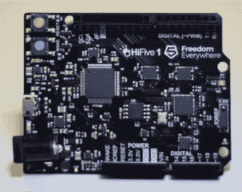

# SiFive 宣布推出 RISC-V SoC

> 原文：<https://hackaday.com/2017/10/04/sifive-announces-risc-v-soc/>

在今天的 Linley 处理器大会上，围绕开放 RISC-V 指令集[制造芯片的半导体公司 SiFive 宣布，运行 Linux](https://www.sifive.com/products/coreplex-risc-v-ip/u54-mc/) 的四核处理器已经上市。我们以前见过 RISC-V 的实现，SiFive 已经发布了基于硅的 RISC-V ISA。不过，这些实现相当小，而且这是第一个为简单的嵌入式设备以外的设备设计的实现。

此次发布推出了 SiFive U54-MC Coreplex，这是一款真正的片上系统，包括四个运行频率为 1.5 GHz 的 64 位 CPU。这款 SoC 采用 TSMC 的 28 纳米工艺制造，适合约 30 毫米的芯片。将于 2018 年初在开发板上上市，如果我们的预期与 SiFive 之前的产品相符，几个月后你就可以购买这款开放式 SoC 作为 BGA 封装。

到目前为止，关于 SiFive U54-MC 的具体细节很少，但我们知道的看起来很棒。在软件支持方面，GCC 中的 RISC-V 支持是稳定的，并且是 7.1 版本的主流。LLVM 正在提交过程中，对 Linux 的支持也在进行中。考虑到 SiFive 之外没有人有这个硬件在手，这个就好了。

这个 SoC 的硬件部分是有趣的地方。这是一款采用现代工艺打造的真正现代的 SoC。典型性能为 1.5 GHz，1.7 DMIPS/MHz 和 2.75 CoreMark/MHz。该 SoC 中包含的外设包括 DDR3/4 控制器、千兆以太网、SD 卡、SPI、UARTs 以及其他处理器中常见的其他外设。特别令人感兴趣的是 ChipLink 互连。[这是一个到 FPGA 的直接连接](https://www.sifive.com/products/peripheral-ip/)，IP 模块在其中运行，为 SoC 外设提供 PCIe、USB、MIPI 或其他高速接口。

以下是 SiFive 今天发布的一些相关幻灯片:

此幻灯片需要 JavaScript。

The HiFive I, the ‘Arduinofied’ version of the E31 RISC-V microcontroller

我们过去已经看过 SiFive 的 RISC-V 产品，最引人注目的是 HiFive I 的形式，这是一种加载了 SiFive E31 CPU 的 Arduino 形状的主板。这是一个微控制器，与四核 SoC 相去甚远。然而，E31 是一款出色的微控制器，速度非常快，功能强大，背后有大量的支持和教程。现在，如果你想要一个速度极快的微控制器，具有快速的 DMA，并可以控制大量的 WS2812 RGB LEDs，你最好的选择是一个 Teensy 或一个带有奇妙 PRUs 的 BeagleBoard。不过，E31 是一个竞争者，随着最近像 LoFive 这样的[低成本产品的出现，我们期待 RISC-V 微控制器很快出现在一些非常有趣的项目中。](https://hackaday.com/2017/09/18/a-smaller-cheaper-risc-v-board/)

这个声明仅仅是一个声明，我们的期望被我们对即时满足的渴望现在还没有得到满足的事实所冲淡。然而，SiFive 在过去几年里做了很多工作，鉴于 HiFive 1 的发布，他们将 E31 微控制器托盘送到工程师手中的工作，以及他们在自己的支持论坛上的诚实的出色工作，没有理由期待这个开放式 SoC 是 vaporware。