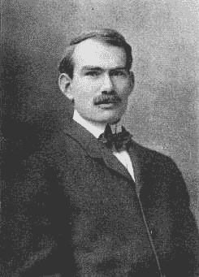
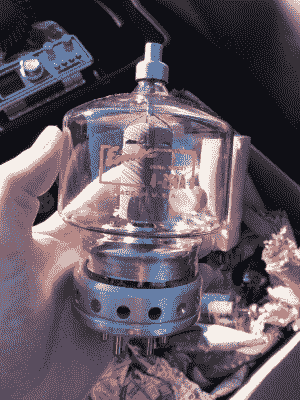
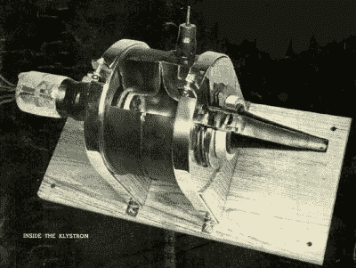
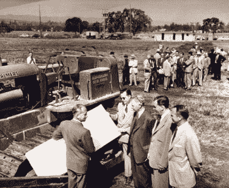

# 硅谷是建立在玻璃管上的

> 原文：<https://hackaday.com/2017/11/02/silicon-valley-was-built-on-tubes-of-glass/>

Lee de Forest

比尔·肖克利把晶体管带到了帕洛阿尔托的一个牧场，但他并非偶然在那里着陆。已经有一个与硅无关的阴谋在进行中，而且它已经发生了一段时间了。

人们常常被爱迪生和门洛帕克或西方电气及其贝尔实验室所掩盖，忘记了现代无线电和电信的实际开端始于旧金山湾区，始于[联邦电讯](https://en.wikipedia.org/wiki/Federal_Telegraph_Company)的李·德·福里斯特的小预算工作台上。

随着 20 世纪第一个十年的过去，李德·福里斯特已经是一个有争议的人物。他在纽约成立了一家公司，开发他早期的真空管作为无线电探测器，但他不太擅长做生意。该公司的一些官员认为进展不够快，并在德·福里斯特不在时耗尽了公司的资产。这导致了多年的法律纠纷，许多涉案人员因欺诈和投资者资金损失而被捕。

德·福里斯特认为他遇到的唯一问题是技术性的，可以及时解决，他向《联邦电讯报》提出了自己的观点。在很短的时间内，他的早期专利被授权给他人，包括贝尔实验室，他们很快将这些专利发展成为第一个电话中继管。

联邦电报公司对连续波(CW)无线电的发展感兴趣，而不是当时更常见的[火花型](https://en.wikipedia.org/wiki/Spark-gap_transmitter)发射机。这项技术是由荷兰的[瓦尔德马·波尔森](https://en.wikipedia.org/wiki/Valdemar_Poulsen)公司开发的，它使用了一个[电弧转换器](https://en.wikipedia.org/wiki/Arc_converter)发射器来产生一个稳定的正弦波，这种正弦波更有效，噪音更小，减少了对其他电台的干扰。考虑到这一点，Federal 和 de Forest 意识到 de Forest 的电子管可用于线性放大，并可用于语音传输的调制。

1 MW Federal Arc Converter Transmitter

德·福里斯特公司的大部分可强制执行的专利在 1925 年到期，与 RCA、GE、Sylvania 和 Westinghouse 等公司展开了一场军备竞赛。当时，这些公司主要通过专利诉讼积极寻求开发更好管道技术的新公司。

要获得真实的故事，你必须跟踪三个非常重要的人物，他们在联邦政府及其子公司海因茨和考夫曼地铁公司工作。查尔斯·利顿、威廉·艾特尔和杰克·麦卡洛都是业余无线电操作员，他们了解目前由大型东方公司提供的可用发射管的局限性。

特别是，利顿在联邦电报公司的亨氏和考夫曼电子管部门花了大量时间设计机械和新的实践，不仅避开了其他专利，还让他获得了许多自己的专利。很快，联邦制造出了比大型制造商更好、更可靠、效率更高、频率更高的电子管。不幸的是，联邦电报公司被 ITT 收购了。在整合各公司的竞赛中，他们削减了联邦政府的预算，并在新的地铁设计获得市场成功之前将运营转移到了新泽西。这导致了现有技术和这些人知道可以做到的技术之间的差距。需求是发明之母，这三人成立了公司来生产这些设计，并开创了现代无线电通信电子产品。

Eimac Power Tube, CC-A-SA by [Jeff Keyzer](https://commons.wikimedia.org/wiki/File:Eimac_Tube.jpg)

威廉·艾特尔(William Eitel)和杰克·麦卡洛(Jack McCullough)不愿意和 Federal 一起搬到新泽西州，他们成立了艾特尔-麦卡洛(Eitel-McCullough)公司(后来简称为 Eimac)，继续生产新的更好的功率管，直接卖给火腿和工程师等。同时，Charles Litton 创立了 Litton Engineering，为任何希望进入该行业的公司设计和制造实验室级管道装配设备。他的玻璃车床至今仍是实验室玻璃加工行业的标准。这两家公司共同为精密高功率设计的发展奠定了肥沃的土壤。

输入[弗雷德里克·e·特曼](http://www.pbs.org/transistor/album1/addlbios/terman.html)

### 商界和学术界之间的新协议

弗雷德里克·e·特曼(Frederick E. Terman)被广泛认为是当今电子学之父，他在 1955 年出版的第四版《电子和无线电工程*仍然是经典电子和无线电工程的最佳教科书。特曼参加了麻省理工学院的研究生院，看到了东方商业和教育是如何运作的。他认为，如果要取得真正的进步，就需要对研究发现的商业化采取新的态度。*

 *特曼作为一名教员回到了斯坦福，他的第一个命令就是雇佣查理斯·利顿和卡尔·施潘根贝格帮助他建立真空管实验室。施潘根贝格后来成为了一名电子管行业专家，也是名为*真空管*一书的作者。这些第一批雇员的结果是一个实验室，致力于不仅在电子学方面，而且在推动该领域前进所需的制造方法方面教育学生——这在当时是一种非常新颖的方法。1938 年，查理斯·利顿给实验室拨款 1000 美元，雇佣了特曼最喜欢的学生[戴维·帕卡德](https://en.wikipedia.org/wiki/David_Packard)和[比尔·休利特](https://en.wikipedia.org/wiki/William_Redington_Hewlett)卡尔·斯潘根伯格。查尔斯·利顿在 1938 年创办惠普公司时担任比尔和戴夫的导师。

### 从无线电到雷达

硅谷的管道技术并不局限于无线电通讯。拉塞尔和齐格鲁德·瓦里安兄弟的一项重要发明影响了全世界的雷达研究。英国人已经在使用雷达系统，但这些设计的重量阻止了雷达在飞机上的部署。瓦里安发明的速调管解决了重量问题。

拉塞尔和齐格鲁德·瓦里安出生在加州。拉塞尔在斯坦福大学读本科，在石油行业工作，为他赢得了第一个振动磁力计专利，后来在伟大的[菲洛·法恩斯沃思](https://en.wikipedia.org/wiki/Philo_Farnsworth)手下工作。齐格鲁德在学业上不太成功，离开大学后从事了许多不同的工作。他以飞行员和机械师的双重身份进入了航空业。在飞行时，他会设想需要一个电子导航和警告系统，以便在夜间和恶劣天气下安全飞行，并且同样可以从地面识别飞行中飞机的位置，用于防御系统。Russel 建议这可以通过微波信号来实现。着眼于与德国不可避免的战争，他们开始创建他们的系统。起初，他们失败了。

The First Prototype Klystron

他们的朋友威廉·韦伯斯特·汉森出场。当时，威廉是斯坦福大学的一名教授，在他的推荐下，物理实验室(而不是试管研究实验室)决定雇用这对兄弟来开发他们的系统，以换取实验室空间和少量预算，并达成谅解，即他们的发现所获得的版税的一半将与大学分享。

在此基础上，他们在 1937 年开发了自己的速度调制方法。1935 年，A. Arsenjewa Heil 和 [Oskar Heil](https://en.wikipedia.org/wiki/Oskar_Heil "Oskar Heil") 已经演示了速度调制，但是没有在斯坦福团队能够找到它的任何地方发表。拉塞尔设计了第一个速调管，第一个实用的移动微波设备，齐格鲁德想出了建造方法。汉森和爱德华·金茨顿兄弟创建了瓦里安联合公司。现在被称为 [CPI](http://www.cpii.com/history.cfm) 用于通信和电力工业，他们继续生产功率管、速调管和磁控管，现在还拥有 Eimac。他们也有助于创造用于肿瘤医学的放射疗法和放射疗法。

### 为战争招募山谷人才

战争的努力集中在无线电技术的发展上。所有这些科学家都受雇于新英格兰的公司和大学，从事雷达系统的研究。其中大部分从未公之于众，但在此期间，电子管制造技术取得了许多进步。特别是，查尔斯·利顿利用他开创的新电子管制造方法，使微波电子管制造成为可能。

Groundbreaking for a Kodak Factory, Stanford Research Park, 1953.

战后，所有这些人都回到了他们在加利福尼亚的企业。Eitel-Mcullough、Litton Engineering、Varian Brothers、Bill 和 Dave 以及斯坦福大学的教授们都非常擅长向军方出售电子管，以及微波设计的未来发展方向。由于对雷达项目的研究，以及现在已经上市的经过战争考验的高功率微波产品，高频设计和实验的全新领域正在快速发展，斯坦福大学希望成为这些新技术商业化的地方。

弗雷德里克·特曼意识到，他们需要吸引公司投资斯坦福大学。邻近似乎是一个开始的好地方。决定留出一些大学用地，其中大部分当时是沼泽地或农田，以开发成世界上第一个工业园区。瓦里安公司是第一批租户，随后是惠普、通用电气和许多航空航天公司，如洛克希德公司。企业得到了前沿研究，大学得到了行业领先的指导和帮助，最重要的是资金。这种伙伴关系才是圣克拉拉谷科技的真正启动点，而不是晶体管。

### 再见玻璃管，你好半导体

没有人会否认固态晶体管会改变世界。在微波领域，设备越小，效率越高，这些公司明白这一点。他们也明白他们需要站在最前沿。

在帕洛阿尔托长大的威廉姆·肖克利需要一个地方开店。他在贝尔实验室破釜沉舟，那里的一些同事觉得他不配得到晶体管发明者的赞誉。斯坦福现在培养出世界一流的工程师，完全掌握最新技术。这个山谷是他应该去的地方。

威廉姆·肖克利。显然没有人喜欢他，但那是另一回事了。

### 本文来源:

你应该读一读史蒂夫·布兰克的《硅谷秘史》。这是一本优秀的书，涵盖了许多其他典型硅谷书籍中没有涉及的主题。这篇文章中的许多信息都来自那里，但在我个人对真空管和技术历史的研究中，我有幸与退休工程师进行了无数次对话，这些对话为我提供了支持。我要感谢他们所有人，但不幸的是，他们中的许多人已经不在了。

我要特别感谢几年前去世的霍华德·布雷迪先生。他在新泽西州为联邦电报公司工作，也在查塔姆公司、联合电子公司和电子技术公司工作，直到最后他仍在高真空测量技术的研究方面取得进展。当世界陷入困境时，他是在任何教科书中都找不到答案时被叫来咨询的“专家”之一。他早在 50 年代末开发的许多设备和技术至今仍被视为商业和安全机密。在许多愉快的谈话过程中，他给了我研究的方向，让我把为什么电子领域的事情会是现在这个样子，以及我们真正站在谁的肩膀上的故事放在一起。*