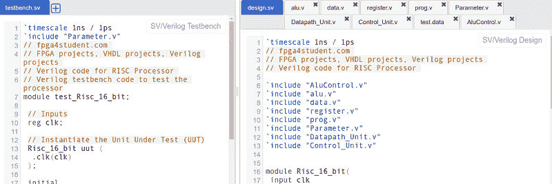
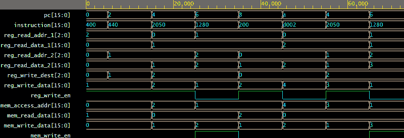

# 模拟通过修复学习 CPU

> 原文：<https://hackaday.com/2017/05/12/simulating-the-learn-by-fixing-cpu/>

上次我看了一款面向学生的简单 16 位 RISC 处理器。它需要一些文档上的帮助，并且有一个丢失的文件，但是我设法让它使用一个叫做 EDA Playground 的免费在线工具进行模拟。这一次，我将向您介绍代码细节以及如何运行模拟。

如果你还没有看过之前的帖子，你可以参考一下。图表给出了一个高层次的概述，这将有助于您理解本文中讨论的文件。

如果你想在一个真正的 FPGA 上编程，你需要做一点工作。存储器和寄存器初始化的方式可以很好地用于仿真，但不能用于真实的 FPGA。不管怎样，我们开始吧！

## 一个文件一个文件地

[](https://hackaday.com/wp-content/uploads/2017/04/verilog.png)

如果你单独看每一个文件，它们都不难理解。这里有一个快速纲要(我使用我将在我的[在线模拟](https://www.edaplayground.com/x/hJv)中使用的文件名):

*   parameter . v——这就像一个包含文件，为所有其他文件设置一些基本定义。
*   Prog . v–这是指令存储器。一个简单的模块，它接受一个地址并为该地址提供数据。$ readmemb 指令从文件(test.prog)中读取数据。
*   register . v–寄存器文件。这几乎就像指令存储器，但它有两个读端口，你可以写入它。
*   data . v–RAM 存储器。这与寄存器非常相似，但更大，并且只有一个读端口。有一些模拟代码可以打开一个文件并打印内存注释，但我删除了它，因为它只是为了调试。初始内容来自 test.data 文件。
*   你可能认为这很复杂，但事实并非如此。它只需要两个输入，然后做一些事情来创建输出。像加减这样简单的事情。always @(*)告诉 Verilog 不要为此创建时钟逻辑。它只是变成了一些简单的门和复用器。
*   data path _ unit . v——这是一个比较复杂的文件，尽管如果你深入研究它，你会发现它大部分是散装的。这个文件创建所有的资源(比如寄存器和内存)并将它们连接在一起。
*   control _ unit . v–另一个更长的模块，它只是实现了指令表，根据当前指令设置控制线。
*   这个文件解码 ALU 的指令。它在最初的帖子上不见了。奇怪的是，在同一个站点上还有另一个类似的 CPU，它有一个 ALUControl 文件，但它显然是用于不同的指令集。然而，从那个文件开始并使用设计表，我能够重新创建它。如果[fpga4students]纠正了这一点，文件看起来可能会非常不同。
*   design . SV——我使用的 EDAPlayground 模拟器需要这个文件。它包含顶级组件(数据路径和控制单元)。因为 EDAPlayground 只处理这个文件，所以它有必要包含上面提到的其他文件。这会导致一些警告，因为每个警告都有一个时间刻度指令，但这是无害的。
*   test bench . SV–测试平台不是真实设计的一部分，只是简单地设置模拟和收集结果。我不得不稍微修改一下，以便与 EDAPlayground 配合使用，但操作是一样的。它只是创建一个 CPU，给它一个时钟，让它运行一段时间。测试程序和内存内容在 test.prog 和 test.data 中。

## 模拟

你可以做两件事之一。你可以打开[我的设计](https://www.edaplayground.com/x/hJv)副本，但这可能不是你的最佳选择。我建议你直接去 [EDAPlayground](https://www.edaplayground.com/) 创建一个新的 Verilog 项目。然后开始把文件从原来的帖子上移走。你会遇到错误和丢失文件。看看你能修好多少。如果你被难住了，那么你可以用我的拷贝来帮助你。那样你会学到更多。

如果你决定尝试一下，这里有一些关于 EDAPlayground 的建议。你不需要选择 UVM/OVM，也不需要任何其他图书馆。我使用的是 Icarus Verilog 0.9.7，但是你也可以使用任何可用的 Verilog 工具。您需要选中 EPWave 复选框，并且需要将其添加到 testbench 的初始部分:

```
initial 
begin
$dumpfile("dump.vcd"); 
$dumpvars;
```

使用文件名选项卡旁边的+号创建新文件。EDAPlayground 每个窗格限制十个文件。记住，你必须包括任何。您在 testbench.sv 或 design.sv 中创建的 v 文件。您不需要包含这些数据文件，因为其他文件会间接使用它们。

## 快跑！

一旦你解决了所有的错误，你可以按下运行，你会得到波形查看器，EPWave。你必须添加感兴趣的信号，这样你才能观察 CPU 的工作。在内存中添加一些 I/O 设备或一些调试端口会很有趣，这样您可以更好地观察事物。我通常会观察程序计数器和寄存器写端口，以了解内部的情况。

最初的代码有一个执行大量指令的程序。我将其注释掉，并替换为以下内容:

```
0000_0100_0000_0000 // 0000: Load R0 <- Mem(R2+ 0) since R2=0 this puts 1 in R0
0000_0100_0100_0000 // 0002: Load the same in R1 (R1 will always contain 1)
// location 8 (byte), 4 (word):
0010_0000_0101_0000 // 0004: R2= R0+ R1
0001_0010_1000_0000 // 0006: Mem[R1]=R2 (that is Mem[1]=R2
0000_0010_0000_0000 // 0008: R0=Mem[R1]
1101_0000_0000_0011 // 000A: Jump to location #4 (CPU will multiply by 2 and add 2)
// no instruction at 000C, but PC will hang there while it processes jump
```

您应该能够跟踪写入内存的递增值，并观察程序计数器在每个循环中循环回到位置 4。下面是一个典型的会话:

[](https://hackaday.com/wp-content/uploads/2017/04/wave2.png)

我省略了许多内部信号，但是您可以看到，在循环的前两次迭代中，内存地址 1 被设置为 2，然后被设置为 3。

## 结束游戏

这是一款好的教育 CPU 吗？我不确定。存在一些更简单的 CPU，但是它们通常很小，因为它们很复杂或者非常不实用。对于初学者来说，比这更复杂的事情可能太难了。虽然我认为在处理这类事情之前，您应该掌握一些基本的 Verilog，但是文档在某些方面有点稀疏(并且令人困惑)。显然，这已经足够好了，因为我让它工作了，但是如果你刚刚开始，你可能会感谢更多的帮助和解释。

你有喜欢的教育类 Verilog CPU 吗？我仍然在寻找那个“刚刚好”的。

 [https://www.youtube.com/embed/v6paddEMvWM?version=3&rel=1&showsearch=0&showinfo=1&iv_load_policy=1&fs=1&hl=en-US&autohide=2&wmode=transparent](https://www.youtube.com/embed/v6paddEMvWM?version=3&rel=1&showsearch=0&showinfo=1&iv_load_policy=1&fs=1&hl=en-US&autohide=2&wmode=transparent)

