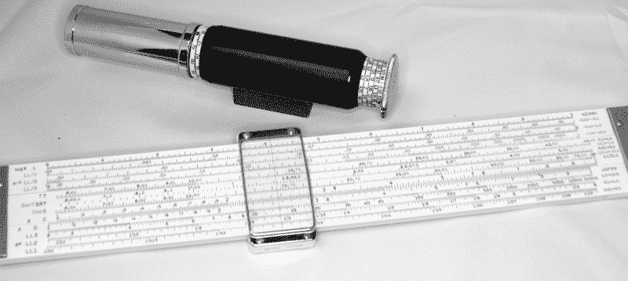
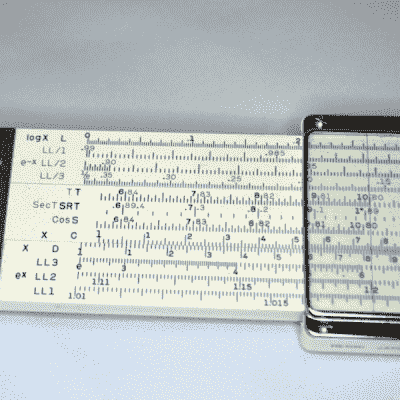
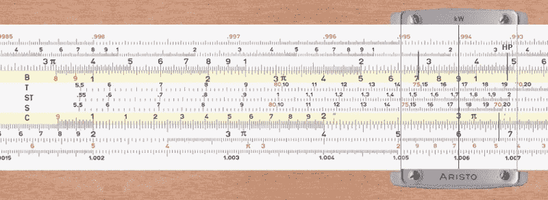

# 计算尺是最初的个人电脑

> 原文：<https://hackaday.com/2015/11/05/slide-rules-were-the-original-personal-computers/>

除非你已经过了一定的年龄，否则你唯一一次看到计算尺(或者我们有时称之为滑棒)是在电影里。你可能已经错过了，但是计算尺出现在*泰坦尼克号*、*这个地球岛*和*阿波罗 13 号*中。如果你是原版《星际迷航》的粉丝，可以看到斯波克先生在几集里使用杰佩森 CSG-1 和 B-1 计算尺。但是曾经有一段时间，我们经常看到一个工程师的腰带上挂着一根棍子，而不是计算器或手机。一把皮克特牌计算尺和宇航员一起飞到了月球，一把 K & E 使原子弹成为可能。

计算尺是数学和历史的完美结合。在即将到来的天启中，它们不容易被电磁脉冲摧毁(可能包括也可能不包括僵尸)。像生活中的许多事情一样，当谈到计算尺时，越大肯定越好，但在我告诉你我收集的 5 英尺计算尺之前，让我们先谈谈计算尺的一般情况。

## 计算尺的历史

牧师[威廉·奥特雷德](可能是他引入了 X 作为乘法符号)在 17 世纪发明了计算尺，所以计算尺已经存在了一段时间，直到 20 世纪 70 年代初，计算尺还是认真研究数学的人的标准配备。实际上，即使在那时，在尺子上做数学也不是一个新的想法。[Edmund Gunter]设计了一个类似计算尺的区域，但是你需要一套单独的分隔器来解决问题。[奥特雷德的]装置是一个圆形计算尺，他的一个学生[理查德·德拉曼]也声称发明了这个装置。两个人都指责对方偷了它。

学者们现在认为这两个人都是独立开发圆形计算尺的。[德拉曼]是第一个发表，虽然[奥特雷德]显然完成了他的设备第一。然而，[奥特雷德]肯定在 1650 年左右发展了直线滑动法则。

## 该规则背后的理论

计算尺依赖于纳皮尔对对数的发现。除了作为科学计算器上的一个奇怪的键，对数在计算机出现之前的数学世界中也是非常重要的。让我们考虑基数为 10 的对数。如果你平方 10(即取 10 的 2 次方)，你得到 100。所以 100 的对数是 2。如果你把 10 的 5 次方提高到 100000，那么 100000 的对数就是 5。数字不一定是整数。例如，200 的对数大约是 2.3。

#### 日志表

如果你花很多时间计算，你可以创建一个数字和它们的日志的表格。问题是:你为什么要这么做？答案很简单。假设你想把两个数相乘。我先做 200 和 100，尽管它们很容易相乘，不需要任何技巧。如果你不使用任何技巧(或者启发式，如果你喜欢的话)，那么你会写 200 比 100，然后乘以每个数字。然而，有了对数，我们可以更容易地做到这一点。200 的对数是 2.301，100 的对数是 2。所以我们想要的结果的对数是对数的和(2.301+2=4.301)。如果你计算 10 的 4.3 次方，你会发现这并不是正确的答案(19998.6)，因为我把 200 的对数四舍五入了，但这已经很接近了。显然，日志表中的数字越多越好。

这似乎是一个愚蠢的例子，但是如果你想乘 7329 和 8115，如果你知道对数分别是 3.8650 和 3.9093，那就容易多了。将这些相加得到 7.7743，这是结果的对数。只需在您方便的日志表中查找，就可以找到答案是 59470282(实际上是 59474835，但是，还是非常接近)。

#### 可移动桌子

这和计算尺有什么关系？计算尺实际上是放在两块木头、塑料或金属上的圆木桌(竹制的计算尺特别受欢迎，因为它们具有自润滑性，手感好，而且非常稳定)。标记是根据数字的对数记下的，但标记是由实际数字标注的。例如，0 和 1 之间的距离，比 8 和 9 之间的距离要大得多。

 我们来考虑一个很简单的例子:2 乘以 3。如果你移动幻灯片(C 音阶；见右)所以 1 在固定刻度(D 刻度)上超过 2，然后你可以数到滑动部分的 3 标记。这与添加 log(2)和 log(3)相同。现在你只需要从 3 标记往下看固定刻度就能看到答案(6)。当你手里有一个的时候，这个就很好理解了。对于那些不知道的人，[试试这个网络模拟器](http://www.stefanv.com/calculators/aristo970/index.html)。在这一部分的底部可以找到计算的屏幕截图。

在某些情况下，移动幻灯片可能会使答案“超出范围”在这种情况下，您可以使用滑动标尺的右侧(通常标记为 1，但实际代表 10)。然后向右移动，记得将结果放大 10 倍(一些规则也提供了处理这种情况的其他方法)。

如果你想做更大的数字，你首先缩小它们，然后在心里把结果放大。因此，计算 20 乘以 30 或 2 乘以 30 是完全相同的过程，但你知道你必须按你移动的位置数放大答案。如果你想做同样的事情，比如说，25 乘以 3.1。你实际上是将 2.5 乘以 3.1，然后缩放结果。

## 除法和其他运算

除法几乎以同样的方式工作，但是依赖于减法。如果你把滑动部分的 3 和固定部分的 6 排在一起，你可以在滑动部分的 1 下面看，看到答案是 2。为了帮助你准确地读出数字，有一个带发际线的小塑料光标用来排列数字。有些规则甚至有一个小小的放大气泡来帮助你更准确地阅读。

花式规则会有其他尺度。例如，A 音阶做平方和平方根和三角音阶也很普遍。如果你想要一个直观的演示，看看下面的视频。

## 得到正确的答案

与计算器不同，计算尺确实需要你知道答案是什么(按比例)才能解释结果。它还依赖于你能够注意到 7.3、7.35 和 7.351 之间的差异。这就是为什么越大越好。

一把“普通的”计算尺通常大约 10 英寸长。有更短的口袋规则，甚至有一个在 tie tac 上的规则不太实用。另一方面是供教室使用的巨型计算尺(有些长达 7 英尺)。对于非常精确的工作，工程师会使用圆柱形的尺子。将天平缠绕在圆柱体的圆周上，你的桌子可以容纳相当于 30 英尺的计算尺。

然而，还有另一种奇怪的计算尺，同样是 66 英寸的尺子，但是可以放进你的口袋里:奥蒂斯·金(也被称为 Geniac 见左图)。乍一看，你会认为这个计算尺是一个望远镜。但它实际上是一把计算尺，标尺以螺旋形缠绕在仪器上。通过伸缩标尺，理论上可以比普通计算尺读出更多的数字。然而，由于刻度标记的不准确，它并不总是像它应该的那样准确。

## 在哪里可以找到更多信息

Oughtred Society 是关于计算尺的丰富信息，包括教程、历史、常见和稀有乐器的图片以及其他有趣地方的链接。

如果你想亲自使用虚拟计算尺，有很多这样的东西，搜索“计算尺模拟器”或“计算尺模拟器”会出现很多类似于[这个](http://www.antiquark.com/sliderule/sim/)的网站。费伯-卡斯特尔制作了许多欧洲计算尺，他们在计算尺市场上有[有趣的一页。](http://www.faber-castell.com/service/slide%20rules)

## 哪里可以找到可收藏的计算尺

你可能认为收集计算尺很难，但实际上这很容易，而且不贵。诀窍在于，它们传播得如此广泛，消失得如此突然，以至于如果你能找到的话，那里有大量的旧的和新的股票规则。费伯-卡斯特尔甚至提到他们仍然有一些，他们会在历史页面的底部卖给你。

易贝是计算尺的主要来源(快速搜索显示超过 3000 个与计算尺相关的列表)。你可能会发现你可以通过逛当地的古董店买到更便宜的。通常人们并不真正知道他们是什么，并且很高兴摆脱他们。此外，如果人们发现你是一个收藏家，他们通常会给你一把计算尺，这些计算尺属于某个已经去世很久的亲戚，他们会很高兴有人会拥有它，并会欣赏和照顾它。我有几个这样的。

如果你真的想买一条规则，有几样东西需要寻找。首先，确保它有光标并且没有模糊。修理或更换光标通常是一个巨大的考验。小心皮革皮套的腐蚀或褪色。这些规则往往可以保存，但是工作量很大。球体站点有一些很好的特定于模型的说明，用于清理不同的规则，另一个[加拿大站点](http://www.sliderule.ca/cleaning.htm)也是如此。幻灯片和固定部分之间的不规则间隙可能会带来麻烦，如果您可以使用计算尺，请确保幻灯片和光标都可以操作。查看规则是否扭曲也是有用的，这可能是无法充分修复的。

## 继续滑

如果你真的得到了一把计算尺，你需要记住一些注意事项。虽然竹子是自润滑的，但其他计算尺可能需要一点帮助才能滑动。Pledge(家具上光喷雾)对木材规则很有效。凡士林是大多数人在金属尺上使用的东西。一点点就够了。保持计算尺的清洁是很重要的，这样污垢就不会出现在光标下面，因为光标下面很难清洁，而且会干扰计算尺的操作。

小心把你的计算尺放在阳光直射的地方。根据你使用的规则的类型，你应该小心使用可能会损坏它的水、肥皂或溶剂。一定要阅读我上面提到的清洁网站，如果你能找到一个不显眼的地方，在你开始用东西清洗整个规则之前，试着测试一下。

我收集了很多旧设备，对我来说，这些就是他们那个时代的电脑。不是每个人都想学习莫尔斯电码，或者知道如何偏置电子管，或者精通驾驶手动档。但是很多人喜欢保留这种旧知识，而且——你永远不知道——当世界末日来临时，计算尺骑师留下的可能是你暂时拥有的最好的电脑。

 [https://www.youtube.com/embed/xYhOoYf_XT0?version=3&rel=1&showsearch=0&showinfo=1&iv_load_policy=1&fs=1&hl=en-US&autohide=2&wmode=transparent](https://www.youtube.com/embed/xYhOoYf_XT0?version=3&rel=1&showsearch=0&showinfo=1&iv_load_policy=1&fs=1&hl=en-US&autohide=2&wmode=transparent)

