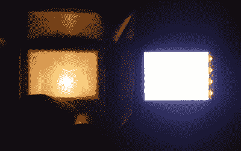

# 幻灯片浏览器升级是一个好主意

> 原文：<https://hackaday.com/2016/10/09/slide-viewer-upgrade-is-a-bright-idea/>

[cunningfellow]最近在所有东西上都装了 led。这可以理解。最近，他用它们彻底升级了他父亲的超级酷的中世纪幻灯片浏览器。【T2

幻灯机以前用的是手电筒灯泡，但是光线一点都不均匀。不仅如此，它还发出一种昏暗的橙色光。[cunningfellow]碰巧有一部旧的诺基亚 N93，他决定拆下那部[奇怪、漂亮、可旋转的翻盖手机](https://www.cnet.com/uk/products/nokia-n93/review/)的背光电路。不幸的是，这 4 个发光二极管不能像手电筒那样依靠一对 C 电池运行。[cunningfellow]需要某种升压转换器。

他发现了一个由安迪·布朗发明的诺基亚 E73 LCD 驱动板。发光二极管比旧的白炽灯泡要亮得多，而且耗电也少了大约 10 毫安。我们认为[cunningfellow]的父亲会对这个结果感到高兴。

如果你有一个旧的幻灯片浏览器并且没有幻灯片，[试着把它作为一个项目案例](https://hackaday.com/2016/06/17/a-slide-viewer-makes-an-excellent-case-for-an-oled-project/)。如果这篇文章让你想念你的 View-Master(也可以理解)，你可以随时[把你的手机变成一个立体视觉器](https://hackaday.com/2012/10/12/turn-your-iphone-into-a-view-master/)。