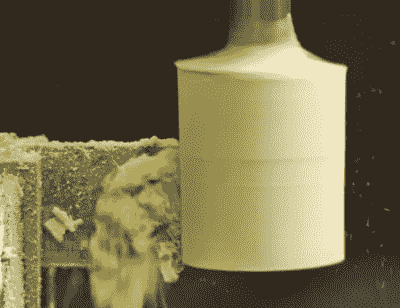

# 减慢飞车手罗德照相机移动速度

> 原文：<https://hackaday.com/2018/02/16/slow-down-that-hot-rod-camera-dolly/>

[Eric Strebel]使用一辆小型自制车辆，车上装有他的相机，为他的视频介绍拍摄精彩的跟踪镜头。如果动作足够慢，那么效果看起来相当专业。但是他想要慢八倍。我们不仅喜欢他做这件事的简单方式，以及他如何为它加工零件，而且结果使它看起来像一个热棒，因此他给它命名为[“多莉热棒](https://www.youtube.com/watch?v=m2xp6RpNSwM&)”。他还有一个优雅的机械装置，可以在重新定位推车时分离马达。

Machining Bondo body filler cylinder

有许多方法可以减缓旋转。我们假设他已经在车辆的 8 RPM 马达传输和电子速度控制器的最低速度。齿轮或滑轮可能是下一个选择。但是[埃里克]做得更简单，从滚轴滑板车轮子换成了更大直径的滑板车轮子。

虽然这听起来很简单，但它导致了一个古老的难题，如何将车轮连接到车辆上。车轴是由聚氯乙烯管制成的。因此，他将一些聚氯乙烯塞子的末端加工成方形，并用螺栓将塞子固定在车轮轴承上。剩下的只是把 PVC 塞推进车轴的管子里。有很多方法可以让他加工 PVC 插头，关于他所选择的方法的完整解释最好留在下面的视频中。但基本上，它涉及到首先加工一个 Bondo body 填充气缸，并在其中嵌入一个螺栓，然后在加工时使用气缸固定 PVC 塞。

他的脱离马达的解决方案很聪明，因为它简单，通过马达驱动车轮的方式成为可能。电机轴只对其中一个车轮的外圆周施加压力。他没有将马达永久固定在适当的位置，而是将它放在一个枢轴上，这样它就可以被撬起，使轴与车轮脱离接触。在这一点上，很容易用手滚动小车。再次降低电机使轴与轮子重新啮合。他用一根弹簧将轴牢牢压在轮子上。

结果是流畅的移动，专业的镜头。

我们已经在 Hackaday 上看到了一些相机娃娃的变体。其中包括一台外观时尚的 3D 打印相机和一台[可编程相机，非常适合进行延时摄影](https://hackaday.com/2017/01/14/motorized-camera-dolly-rolls-with-the-changes/)。

 [https://www.youtube.com/embed/m2xp6RpNSwM?version=3&rel=1&showsearch=0&showinfo=1&iv_load_policy=1&fs=1&hl=en-US&autohide=2&wmode=transparent](https://www.youtube.com/embed/m2xp6RpNSwM?version=3&rel=1&showsearch=0&showinfo=1&iv_load_policy=1&fs=1&hl=en-US&autohide=2&wmode=transparent)

