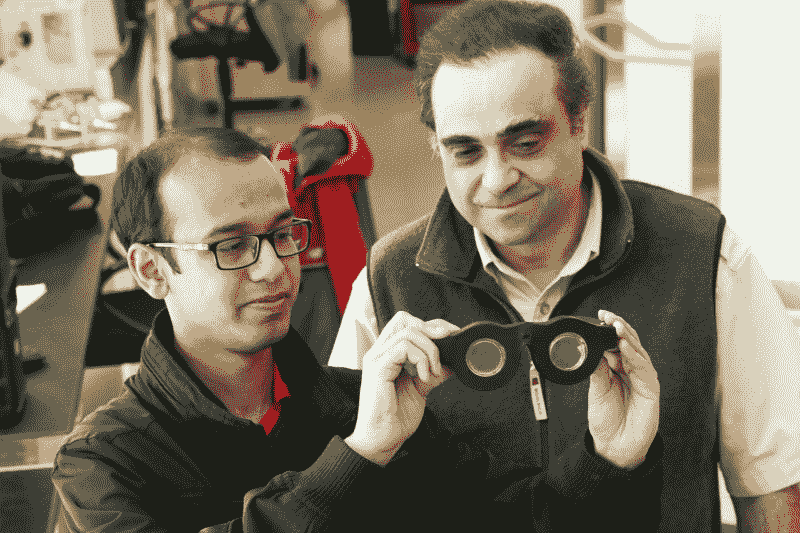

# 智能眼镜可以自动聚焦在你看的地方

> 原文：<https://hackaday.com/2017/02/04/smart-eyeglasses-that-auto-focus-where-you-look/>

犹他大学的一个团队拥有一种新型流体填充镜片的工作原型，用于矫正视力问题:[根据你正在看的东西自动调整和重新聚焦](https://unews.utah.edu/i-can-see-clearly-now/)。从技术上来说，这款眼镜在镜架前部嵌入了一个距离传感器，可以不断调整镜片的焦距。一个 8 克 110 毫安的电池可以为原型供电大约 6 个小时。

能够即时适应不同焦点需求的眼镜非常重要，因为许多视力退化的人同时患有多种疾病，这使得解决他们的视力问题比单个矫正镜片更复杂。例如，许多近视或远视的人(其中分别看到~~近物和远物~~远物和近物失焦)也遭受眼睛改变焦点能力的普遍丧失，这是一种与年龄相关的状况。因此，人们在不同的情况下需要多副眼镜。双焦或三焦或渐进镜片实际上只是多组镜片压缩成一个较小的形状因子，并大大减少了佩戴者的视野，这本身就是一个重大的视力障碍。如果眼镜镜片能够根据物距适应不同的需求，就可以恢复完整的视野，这就是这个项目所要实现的。

真正的创新其实不是距离感应部分，而是可调镜头本身。可以使用各种方法(流体泵等)动态修改的透镜是存在的，但是研究小组没有发现:

1.  具有足够宽的视野以有效地用作矫正眼镜镜片
2.  体积小，重量轻，足以用在眼镜上
3.  具有最小的光学像差(没有来自菲涅耳槽的衍射，没有空气间隙，等等)

在该团队创建的解决方案中，透镜组件是流体填充的，透镜的前面是透明的柔性膜，但透镜的后面充当由三个压电致动器控制的光学透明活塞。该设计是小的、轻的，可以生产平凸或平凹透镜，并且可以快速地(在 15 毫秒内)并且以低功耗生产。[完整的白皮书](https://www.osapublishing.org/oe/fulltext.cfm?uri=oe-25-2-1221&id=357441)可以在网上获得，包含了关于测试、设计和构建的细节。

Carlos Mastrangelo 教授和博士生 Nazmul Hasan 带着原型【图片来源:犹他大学】

原型看起来像是有一个 3D 打印的框架，我们过去也看到过一些 DIY 作品用[充液镜片进行 3D 打印实验](http://hackaday.com/2013/03/06/print-your-own-adjustable-lenses/)。

[via [Engadget](https://www.engadget.com/2017/01/30/electronic-glasses-auto-focus-on-what-youre-looking-at/)