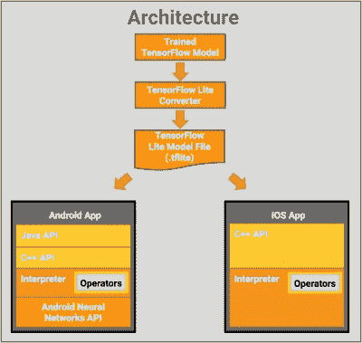

# TensorFlow Lite 让您的电脑变得更加智能

> 原文：<https://hackaday.com/2017/11/23/smarter-phones-in-your-hacks-with-tensorflow-lite/>

在黑客身上运行计算密集型神经网络的一种方法是在车上放一台像样的笔记本电脑。但是，如果你可以用电话来代替，变得更小更便宜，那不是很好吗？如果你的神经网络是使用谷歌的 TensorFlow 框架编写的，那么你可以选择使用 TensorFlow Mobile，但它不使用手机的任何加速硬件，所以它可能不够快。

TensorFlow Lite architecture

谷歌刚刚发布了一个新的解决方案，[tens flow Lite for iOS 和 Android](https://developers.googleblog.com/2017/11/announcing-tensorflow-lite.html) 的开发者预览版，并宣布了支持 Raspberry Pi 3 的计划。在 Android 上，底层是 [Android 神经网络 API](https://developer.android.com/ndk/guides/neuralnetworks/index.html) ，它利用手机的 DSP、GPU 和/或任何其他专门的硬件来加速计算。如果做不到这一点，它就会回到 CPU 上。

目前，支持的运营商比 TensforFlor Mobile 少，但会增加更多。(你在 TensorFlow 里做的大部分事情都是通过运营商，或者说 ops 来完成的。如果您需要复习 TensorFlow 如何工作，请参阅我们的[tensor flow 简介文章](https://hackaday.com/2017/04/11/introduction-to-tensorflow/)。)精简版旨在成为移动版的继任者。和手机一样，你只能在手机上进行推理。这意味着您将在其他地方训练神经网络，可能是在 GPU 丰富的桌面上或通过网络在 GPU 农场上，然后在您的设备上利用训练好的网络。

我们在这里设想的是什么？用一部更小、更轻、更省电的安卓手机取代我们已经讨论过的自动驾驶遥控汽车上的 MacBook Pro 怎么样？这款手机甚至有一个摄像头和一个内置的 IMU，尽管你需要一种方法来代替 GPIO 与其他硬件对话。

您可以通过访问他们的 [GitHub](https://github.com/tensorflow/tensorflow/tree/master/tensorflow/contrib/lite) 并下载一个预构建的二进制文件来相当容易地试用 TensorFlow Lite。我们怀疑这就是制作下面第一个演示视频的目的。

 [https://www.youtube.com/embed/gEnTBCh3950?version=3&rel=1&showsearch=0&showinfo=1&iv_load_policy=1&fs=1&hl=en-US&autohide=2&wmode=transparent](https://www.youtube.com/embed/gEnTBCh3950?version=3&rel=1&showsearch=0&showinfo=1&iv_load_policy=1&fs=1&hl=en-US&autohide=2&wmode=transparent)

 [https://www.youtube.com/embed/RWYjNPMX5Fg?version=3&rel=1&showsearch=0&showinfo=1&iv_load_policy=1&fs=1&hl=en-US&autohide=2&wmode=transparent](https://www.youtube.com/embed/RWYjNPMX5Fg?version=3&rel=1&showsearch=0&showinfo=1&iv_load_policy=1&fs=1&hl=en-US&autohide=2&wmode=transparent)

