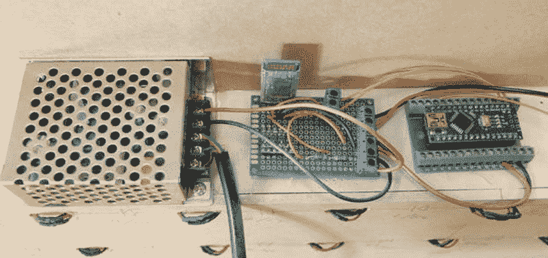

# 智能手机控制的元素周期表

> 原文：<https://hackaday.com/2018/01/16/smartphone-controlled-periodic-table-of-elements/>

可以毫不夸张地说，在 Hackaday，我们和他们一样古怪。话虽如此，当我们听说还有人收集元素时还是很惊讶。我们并不是要抨击其他人如何打发他们的日子，但是在聚会上告诉别人你收集化学元素就像说你家里有霉菌和真菌收藏一样。即便如此，至少完整的霉菌和真菌收藏不会有放射性。

但是如果你打算把你的业余时间花在一个乏味且可能致命的收藏上，你最好把它放在一个合适的陈列柜里。你不能把钋放在厨房的台子上。这就是制造的[交互式周期表背后的想法，我们必须承认，如果我们把它放在这么棒的盒子里，我们可能不得不开始我们自己的收藏。](https://imgur.com/a/VZYfI)

这个项目的很大一部分是建造木质陈列柜本身，因为奇怪的是，宜家目前没有元素周期表形状的货架。单个电池和边缘成型由松木制成，背板是中密度纤维板，显示器的前面用薄的轻木条覆盖所有的接缝。然后在每个电池的背面钻孔，用于 led 布线，最后整个框架被漆成白色。

每个电池包含一个 WS2812B RGB LED，其最大亮度为 60mA。给定展示柜的 90 个电池，[Maclsk]计算出需要 5.4A 的电源来保持所有东西都亮着。然而，他发现了一种让他的预算更满意的 4A 电源，他认为只要他不试图同时将每个电池开到最大，这种电源就没问题。对显示器的控制由 Arduino Nano 和 HC05 蓝牙模块提供。

 该项目的最后一件作品是允许用户控制灯光的 Android 应用程序。但它不只是改变颜色和亮度，它实际上是一种可视化元素本身信息的方法。用户可以做一些事情，比如突出显示某些元素组(比如说，只有放射性元素)，或者按照每种元素被发现的年份顺序照亮单个细胞。下面的视频展示了一些信息可视化，老实说，我们已经看到博物馆的展示没有做得这么好。

我们最后一次见到[Maclsk]是在他创造了一台[非常光滑的机器人线切割机](https://hackaday.com/2017/10/28/automate-wire-prep-with-a-robot-wire-cutter/)的时候，我们只能假设这台机器是为这个特殊的项目工作的。太糟糕了，他没有一个[机器人来处理近 540 个焊接点](https://hackaday.com/2015/05/05/open-source-diy-soldering-robot/)，这花了所有这些 led 的电线。

[通过 [/r/DIY](https://www.reddit.com/r/DIY/comments/7qhwyz/interactive_led_periodic_table_display_for_my/)

 [https://www.youtube.com/embed/3K0wXkf0QAY?version=3&rel=1&showsearch=0&showinfo=1&iv_load_policy=1&fs=1&hl=en-US&autohide=2&wmode=transparent](https://www.youtube.com/embed/3K0wXkf0QAY?version=3&rel=1&showsearch=0&showinfo=1&iv_load_policy=1&fs=1&hl=en-US&autohide=2&wmode=transparent)

