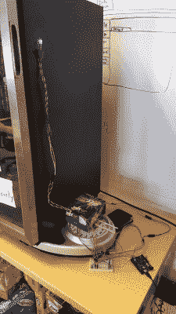

# 苏打冰箱黑客修复懒人问题

> 原文：<https://hackaday.com/2016/04/29/soda-fridge-hack-to-fix-a-lazy-people-problem/>

[Paul]参加了一次工作中的黑客马拉松，并创建了一个黑客来帮助解决最终成为一个人的问题。工作中的汽水冰箱空了也不会再装满。保罗没有试图让人们变得不那么懒惰，而是让冰箱变得更有需求。

保罗做的第一件事是用一个秤做了一个汽水冰箱补充传感器。随着冰箱变空，它变轻了。体重秤可以感应到这一点，并决定是时候重新灌装了。唯一缺少的部分是如何读取秤的输出。为此，他采取了不同寻常的方法。

Soda fridge on an analog scale with color sensor reading the dial

汽水冰箱放在一个带刻度盘的模拟秤上。[Paul]看到没有必要测量冰箱的确切重量，只需要检测再装满的阈值。他想出了一个简单的办法:将彩色纸贴在体重秤的表盘上，用一个 Arduino 和一个[OSEPP COLOR-01](http://osepp.com/products/sensors-arduino-compatible/color-sensor/)颜色传感器对准纸张。转盘会随着冰箱重量的变化而移动，当纸张在传感器下移动时，颜色传感器会读取纸张的颜色。通过一点点试错校准和一些几乎没有修改的传感器样本代码，有可能可靠地检测到冰箱何时需要重新填充。传感器做好了，是时候用它来解决懒人问题了。

从某种程度上来说，根本问题不是人们懒得检查冰箱是否需要重新填充，而是正确的人没有在正确的时间发现。这导致了不稳定的补充，以及在需要时没有订购汽水。这意味着冰箱现在可以主动宣布它的状态，现在可以通过电子邮件通知人们轮到他们重新填充和重新订购了。事实证明，一台能告诉人们它需要什么的冰箱比一台必须等待人们来检查的冰箱有更好的机会得到维修。

我们以前见过有人直接与体重秤的负荷传感器接口，但这次黑客采取了完全不同的方法。

感谢【保罗】的分享。