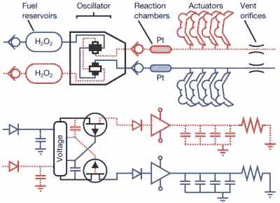

# 具有微流体逻辑电路的软机器人

> 原文：<https://hackaday.com/2016/09/07/soft-robot-with-microfluidic-logic-circuit/>

也许我们未来的霸主终究不是由电路组成的，而是像我们一样的软体动物。然而，他们的设计将起源于电子模拟，就像章鱼机器人一样。

章鱼机器人是哈佛大学一组研究人员的成果，他们最近在《自然》杂志上发表了一篇关于它的文章。它的身体以章鱼为模型，由所有柔软的身体部分组成，这些部分结合了 3D 打印、成型和[软光刻技术](https://en.wikipedia.org/wiki/Soft_lithography)。Octobot 两侧的两组手臂在软振荡器电路的控制下轮流移动。你可以在下面的视频中看到它的运行。

Octobot mechanical and electrical analogue circuits (credit: Michael Wehner at al./Nature)

如图所示，燃料是液体过氧化氢(H2O2 ),振荡器从两个燃料库中的一个获得，并送入两个反应室中的一个。在振荡器中，夹管阀的作用类似于 JFETs。当燃料从一个容器流入一个反应室时，其中一个夹管阀切断燃料向另一个反应室的流动。现在还不清楚燃料流是如何被另一个夹管阀夹断的，因为燃料从另一个容器流向另一个反应室。

反应室含有少量铂作为催化剂，它与过氧化氢反应，释放大量氧气进入臂中的致动器。这些致动器像气球一样膨胀，导致手臂移动。反应室类似于放大器。其他类似的是二极管的止回阀、电阻器的排气孔以及其他看起来像电容器的室。

这是一个概念验证，目前章鱼机器人还不会走路，但该团队希望制造一个可以爬行、游泳并与其环境互动的机器人。当它出现时，我们期待它加入另一个模仿黄貂鱼的软体机器人。看起来我们的霸主可能都来自大海。

这里你可以看到章鱼机器人的动作。

 [https://www.youtube.com/embed/1vkQ3SBwuU4?version=3&rel=1&showsearch=0&showinfo=1&iv_load_policy=1&fs=1&hl=en-US&autohide=2&wmode=transparent](https://www.youtube.com/embed/1vkQ3SBwuU4?version=3&rel=1&showsearch=0&showinfo=1&iv_load_policy=1&fs=1&hl=en-US&autohide=2&wmode=transparent)

这是哈佛的另一个视频，展示了过氧化氢和铂之间产生氧气的化学反应。

 [https://www.youtube.com/embed/Y8GGTtq2_NU?version=3&rel=1&showsearch=0&showinfo=1&iv_load_policy=1&fs=1&hl=en-US&autohide=2&wmode=transparent](https://www.youtube.com/embed/Y8GGTtq2_NU?version=3&rel=1&showsearch=0&showinfo=1&iv_load_policy=1&fs=1&hl=en-US&autohide=2&wmode=transparent)

