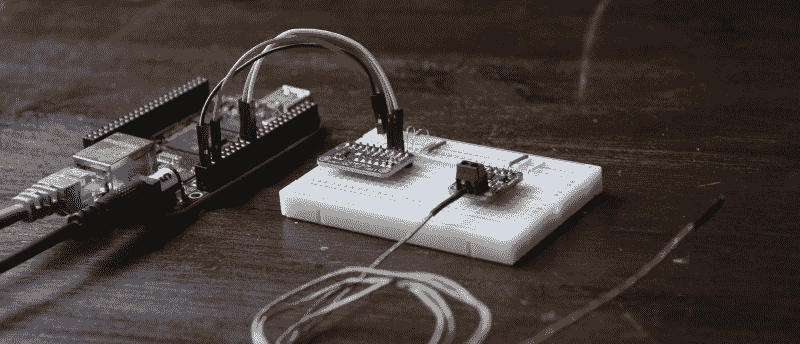
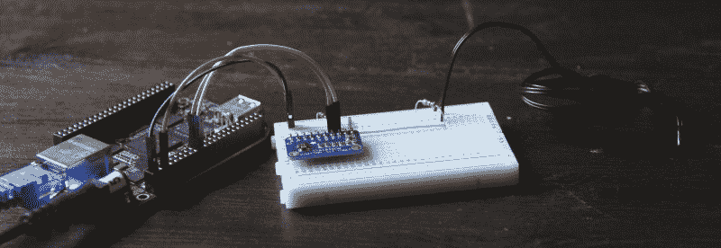
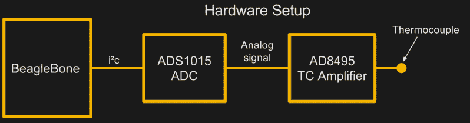
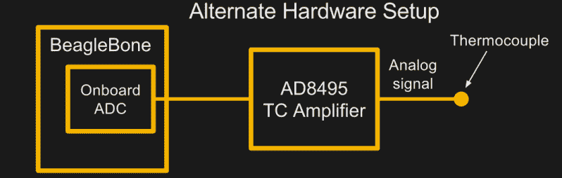
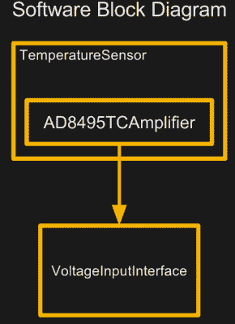
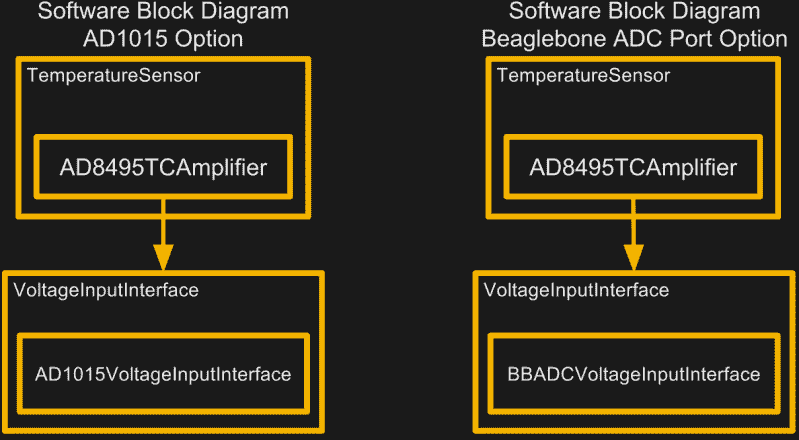

# 真实硬件的软件设计模式

> 原文：<https://hackaday.com/2018/01/12/software-design-patterns-for-real-hardware/>

在 Hackaday 上，我们通常是生活在现实世界中的黑客设计师。然而，我确信一些最有趣的技艺是由软件而不是硬件的可能性决定的。没有合适的软件，任何 3D 打印机都无法打印，任何四轴飞行器都无法飞行。驱动这些机器的源代码可能需要几个月的改进来充实它们的结构。一言以蔽之，这些软件包是复杂的，它们不是一蹴而就的。

那么它们是如何发生的呢？更好的是:*我们*如何让这一切发生？我们如何编写足够灵活的软件，以便在各种硬件变体上和平共存？

将 ROS、LinuxCNC 和 Multiwii 等大型开源软件项目与偶尔出现的黑客马拉松代码区分开来的是管理它们如何编写的基本原则。在面向对象编程中，这些原则被称为*设计模式*。在接下来的几篇文章中，我将揭开其中一些的盖子。更重要的是，我将把它们打包成真实世界的例子，这样我们就可以看到这些模式与真实硬件的交互。下次你打开一个大型开源硬件项目的源代码时，我希望你能在代码中梳理出一些这样的模式。更好的是，我希望你把这些模式带到你的下一个机器人和机器项目中。让我们开始吧。

为了可读性，所有的例子都在 Python3 中运行。为了简洁起见，下面的片段被截断了，但是如果你有一个相似的硬件设置，库中的真实例子[将会工作。](https://github.com/Poofjunior/object_oriented_hardware)

## 昔日的软件先知

在开始之前，我需要向你保证这些设计模式不是我的。其实大部分都有几十年的历史了。如果你很好奇，可以看看这本书: [*设计模式*](https://en.wikipedia.org/wiki/Design_Patterns) ，作者是一群名字很难记住的作者，我们将他们统称为“四巨头”对于许多软件工程师来说，这本书是面向对象设计模式的完整参考，非常可靠。我想过以书评的形式发表这篇文章，在那里我会对你可以放在下一个 blinky 项目中的所有时髦的软件模式垂涎三尺。问题？不要眨眼。事实上，整本书围绕编写一个图形化文档编辑器构建了一些例子。对于我们这些硬件猴子来说，这很无聊，几乎让人无法接受！

考虑到这一点，我将提出智者的话，并适当处理现实世界的硬件。

## 从这些例子中获得最大收益

现在来回答这个问题:这些例子是给谁的？Hackaday 阅读器有各种各样的版本。在写这篇文章时，我希望在两个群体之间架起一座桥梁:渴望涉足硬件的软件人和渴望写出更好软件的硬件人。对于软件人员来说，这些例子是为了展示你已经知道的东西，并给他们一些真实的硬件背景。对于硬件人员来说，这些设计模式可以增强你的软件技术工具箱，增加你以前可能见过的传感器。

为了设定从接下来的工作中获得最大收益的基线，我将假设两件事。(1)通过用 Python 编写几个类，你已经尝到了面向对象编程的滋味，并且(2)你理解了[类继承](https://www.programiz.com/python-programming/inheritance)的基础。在接下来的例子中，我们将构建更高级的继承类型。

## 与硬件相处融洽

今天，我将通过读取各种温度传感器，让大家熟悉一下我们的设计模式。计划？我需要一个代码库，它能让我轻松地读取两种不同类型的温度传感器:热电偶和热敏电阻。这背后的关键思想有三点:

*   孤立可以独立存在的行为。
*   隐藏(通过抽象)对最终用户不必要的细节。
*   不要重复自己；按照第一条分享行为。

起初，我们似乎只是编写一些驱动程序来读取一些温度传感器。现实中，我们要站在更高的层面去思考！让我们问自己:“我们的软件提供的核心特性是什么？拥有不同设置的其他人如何改编这段代码，以获得相同的核心特性，而不必重写它？”在我们的例子中，我们提供了一种执行温度测量的通用方法，并提供了扩展到其他温度传感器的路径。

事不宜迟，我来介绍一下今天的硬件设置。



Thermocouple Setup

第一个设置是 Beaglebone 设置，用于读取现成的基于 I2C 的模数转换器，该转换器读取热电偶放大器。



Thermistor Setup

第二个设置是 Beaglebone 设置为读取相同的基于 I2C 的模数转换器，该转换器现在读取带有热敏电阻的分压器设置。

考虑到真正的硬件，现在让我们讨论我们的设计模式，因为我们建立了一个灵活的代码库来读取两个传感器。

# 多态性

我们首先梳理出构成我们系统的底层对象。首先，我们有两个独立的真实世界传感器，它们都要求以不同的方式读取输入。接下来，我们还知道，虽然这些传感器需要稍微不同的设置，但它们都在测量同一件事:温度！

记住这一点，让我们写出一些要求。假设我们需要:

1.  隔离读取特定传感器所需的设备特定行为。
2.  提供一个通用的软件界面，用于读取温度，而不考虑温度传感器的类型。

根据要求，听起来我们想要编写两个独立的类，每个类都有读取温度数据的特定行为。听起来我们也应该确保我们在读取温度的命名约定上保持一致。假设我们为每个传感器编写一个类。

```

class Thermistor:
...
    def read_temperature_c(self):
        # thermistor-specific details here

```

```

class AD8495ThermocoupleAmplifier:
...
    def read_temperature_c(self):
    # thermocouple-specific details here

```

在这里，我们已经模拟了这样做的东西。特定于设备的行为被包装到类中，我们所有的温度读取方法都有相同的名称。我们完了，对吧？

虽然这个想法可行，但有点幼稚。在上面的源代码中，我们没有在设计合同下给这些方法相同的名字。见鬼，我们可以叫一个 **read_temp** 和另一个 **hi_mom** ，没有人能阻止我们——甚至是我们的母亲！幸运的是，我们可以使用一个设计模式来强制这些方法被命名为相同的。

看看我们的问题，我们有两种不同类型的温度传感器，但是，天哪，我只是想要一种一致的方式来从它们中的每一个请求温度。看，抽象基类的多态性。多态是一种设计模式，它承诺为不同类型的实体提供一个公共接口。这里，我们有三种不同的传感器类别。多态性可以确保它们都使用相同的方法来读出温度。

为了实现多态性，我们使用一个抽象基类。抽象基类是一种特殊类型的基类，它不能独立存在。它*需要*来继承。事实上，如果我们试图实例化基类本身，Python 会抛出一个错误。抽象基类有一个额外的特性:抽象方法。这些是在抽象基类中声明的占位符方法，不做任何事情。相反，它们充当标记并强制派生类定义它们。如果我们试图在没有定义所有抽象方法的情况下实例化抽象基类的子类，Python 也会抛出一个错误。

有了两种新的抛出错误的方法，值得一问:“这样约束自己有什么好处？”原来这些约束其实是一种许下承诺的方式。在这里，我们承诺，我们为温度传感器编写的每个子类都将定义基类中的任何抽象方法。

因为这两个温度传感器都是一种温度传感器，所以我们将使用 temperature sensor 作为我们的基类名称。

```

from abc import abstractmethod, ABCMeta # abstract base class library tools

class TemperatureSensor(object, metaclass=ABCMeta):
...
     @abstractmethod 
     def read_temperature_c(self): 
        &quot;&quot;&quot;
        returns the temperature in Celsius
        &quot;&quot;&quot; 
     pass

```

以上是 Python3 定义抽象基类的方法。在这里，方法 **read_temperature_c** 只是一个占位符。我们不需要在这里定义它做什么，因为细节是特定于我们的传感器的。这里我们只是声明它并用**@ abstract method**decorator 来修饰它，告诉 Python 任何 TemperatureSensor *的子类都必须*定义 **read_temperature_c** 方法。

为了结束这个例子，让我们的热敏电阻类继承我们的抽象基类:

```

class Thermistor(TemperatureSensor):
...
    def read_temperature_k(self):
        &quot;&quot;&quot;
        returns the temperature in Kelvin
        &quot;&quot;&quot;
        voltage_v = self.voltage_input.read()
        r1_ohms = self._read_resistance(voltage_v)
        return (1/298.15 + 1/self.b * log(r1_ohms/self.thermistor_ohms))**(-1)

    def read_temperature_c(self):
        return self.read_temperature_k() - 273.15

```

首先，注意我们的热敏电阻类继承了我们的温度传感器类。我们告诉我们的用户:“嘿，这是一个热敏电阻类，但你可以像温度传感器一样读取它。”它还告诉我们，作者，“嘿，我承诺定义一个 **read_temperature_c** 方法。”最后，我们只需写出读取热敏电阻并将其转换为摄氏温度所需的所有代码。就是这样！

让我们退一步想想为什么这是强大的。我们的用户可能对热敏电阻的工作原理一无所知，但他们仍然可以用一般的 **read_temperature_c** 方法进行测量。封装特定于领域的信息正是我们在这里想要做的，这样我们的用户就不需要知道我们软件栈的每一个细节就可以工作。这里，我们的代码隐藏了从多项式拟合线将电阻转换为温度的复杂细节。通过隐藏这些细节，我们使他们能够进入下一步，编写一些有趣的温度检测应用。

# 布里奇斯

在上一节中，我们没有讨论就跳过了一行。

```

voltage_v = self.voltage_input.read()

```

不要害怕！我们现在将讨论这一部分。

在这一点上，我们有了一个通用的界面来请求温度，但是我们可以有几十种不同的方法来实际收集原始数据。我们如何编写一个单独的类来恰当地封装每个温度传感器的细节，而不需要过多地使用下游设备来读取它们呢？

为了更好地了解这个问题，让我们再看一下我们的物理硬件框图:



但这不是我们唯一可能的配置。由于我在这些例子中使用的是 Beaglebone，我也可以使用 BeagleBone ARM 芯片本身的内置 ADC。该硬件配置可能如下所示:



我们需要为我们的设置编写一系列类，以某种方式将热电偶从用于读取热电偶的额外硬件中分离出来。为此，我们需要确定哪些元件是读取该热电偶所必需的，哪些元件可以替换而不改变端到端系统行为。这种情况下，我们的 AD8495 与热电偶紧密耦合。没有它，我们根本看不懂！另一方面，ADS1015 只是一个普通的模数转换器。见鬼，我们可以用任何模数转换器来代替它，我们仍然可以得到热电偶测量结果。为此，我们将从编写两个类开始:一个封装 AD8495 行为的类和一个处理模拟接口的类。



现在是用框图描绘我们的软件的时候了，以便对我们将要编写的代码有一个大致的了解。作为一个提醒:这些图没有被认证为“UML 类图”；相反，为了清楚起见，我做了一个简化。

让我们看看左边的框图。这些方框代表了类之间的关系。盒中盒代表继承。我们称之为“T0”关系。从一个框到另一个框的箭头表示恰好是另一个类的类属性。我们称之为“[与](https://en.wikipedia.org/wiki/Has-a)的关系。

在我们的框图中，ad 8495 camplifier*是一个*温度传感器，因为它继承了 TemperatureSensor 类。(那就是我们上面描述的多态性。)ad 8495 放大器还*有一个*电压输入接口。换句话说，我们的 AD8495TCAmplifier 拥有对另一个类的引用，我们可以用 **self.voltage_input** (前面提到过)调用该类。

那么 VoltageInputInterface 类到底是什么，它是如何与现实世界交互的呢？嗯，简单的回答是它*取决于*我们的硬件设置！在第一种设置中，voltage input 接口是 AD1015 模数转换器的四个可用模拟输入之一，在第二个输入上，voltage input 接口是 Beaglebone 裸露模拟端口上的一个引脚。然而，在所有情况下，每个 voltage input 接口都需要提供一个 **read** 方法，该方法执行读取单个模拟输入并返回伏特值的实际工作。我们如何保证这一点？使用抽象基类，就像我们在上一节中做的那样！既然我们理解了这种关系，我们就可以用这两种可选设置来完善我们的软件框图。



请注意，在两幅图中，AD8495TCAmplifier 拥有不同的 voltage input 接口子类，但它将它们视为普通的 voltage input 接口。即使底层类不同，我们仍然可以通过使用基类 **read** 方法进行相同的处理。

我们描述的是*桥* *设计模式*。按照四人帮的说法，*桥*意在“将抽象从实现中分离出来，这样两者可以独立变化。”这里，我们的抽象是一个单一的模拟输入。由于有各种方式为我们的 Beaglebone 提供模拟输入，我们需要一个抽象，这样我们就可以用同样的方式处理各种 ADC 硬件。

这种设计模式与我首先描述的多态非常相似。事实上，就像之前一样，我们将使用 Python 的抽象基类库来实现它。不同之处在于我们的用例。之前，我们需要一种通用的方法来处理所有类型的温度传感器。现在，我们试图将温度传感器与任何不特定于温度传感器设置的硬件分开。

现在我们有了图表，我们可以将系统行为划分到不同的类中。与电压温度转换相关的一切都将属于我们的 ad 8495 放大器系列。与读取模拟输入相关的所有内容都将放在一个单独的类中。

事不宜迟，让我们编写 AD8495TCAmplifier 类:

```

class AD8495TCAmplifier(TemperatureSensor):
     def __init__(self, voltage_input_interface, v1_v=1.25, t1_c=0.0, v2_v=1.5, t2_c=50.0): 
         # generate slop and y-intercept for line formula based on two data points: 
         self.gain = (t1_c - t2_c)/(v1_v - v2_v) 
         self.offset = self.gain * (0 - v1_v) + t1_c 
         self.voltage_input = voltage_input_interface

    def read_temperature_c(self):
         voltage_v = self.voltage_input.read() 
         return self.gain * voltage_v + self.offset

```

正如之前所述，我们的 AD8495TCAmplifier 只是 TemperatureSensor 的子类，这意味着我们需要实现一个 **read_temperature_c** 方法。接下来，为了实例化这个类，请注意我们传入了一个对**电压输入接口**的引用。这就是我们上面描述的 VoltageInputInterface 对象。请注意，在 **read_temperature_c** 方法中，我们调用它的 **read** 方法来获取电压。(不要纠结于其他参数:v1_v、t1_c、v2_v 和 t2_c，这些只是我们可以从数据手册和电路基准电压中获得的两个数据点，它们将决定增益和失调。)

接下来是 VoltageInputInterface 和继承它的 ADS1015VoltageInputInterface 子类。

```

from abc import abstractmethod, ABCMeta # abstract base class library tools

class VoltageInputInterface(object, metaclass=ABCMeta):
    ...
    @abstractmethod def read(self):
        &quot;&quot;&quot; returns the analog voltage in volts &quot;&quot;&quot;
        pass

class ADS1015VoltageInputInterface(VoltageInputInterface):
    # Gain to Volts-per-bit conversion from From datasheet Table 1 
    volts_per_bit= \ 
    { 
        2/3: 0.003, 
        1: 0.002, 
        2: 0.001, 
        4: 0.5, 
        8: 0.25, 
        16: 0.125 
    } 
     def __init__(self, ads1x15, channel_index, gain=2/3): 
         super().__init__() 
         self.ads1015 = ads1x15 
         self.gain = gain 
         self.channel_index = channel_index 
         self.ads1015.start_adc(channel_index, gain) 

     def read(self): 
         raw_bits = self.ads1015.get_last_result() 
         return raw_bits * self.__class__.volts_per_bit[self.gain]

```

请注意 ADS1015VoltageInputInterface 如何做了大量工作来隐藏实际 ADS1015 驱动器的所有细节，只需用一个 **read** 方法就可以公开它。这正是我们想要的——用我们电压输入的所有不必要的器件特定细节换取一个简单的接口。

现在，我们只需编写一个 Python 脚本来“连接它们”，连接我们的对象依赖关系。

```

import time 
from object_oriented_hardware.ads1x15 import ADS1015 
from object_oriented_hardware.ads1x15 import ADS1015VoltageInputInterface 
from object_oriented_hardware.temperature_sensors import AD8495TCAmplifier 
from object_oriented_hardware.beaglebone_i2c import BBI2CBus2 

i2c_bus_2 = BBI2CBus2() 
adc_bank = ADS1015(i2c_bus_2) 
voltage_input = ADS1015VoltageInputInterface(adc_bank, channel_index=0) 
thermocouple = AD8495TCAmplifier(voltage_input) 

while True: 
 print(thermocouple.read_temperature_c()) 
 time.sleep(0.5)

```

就是这样！第一周大概就这些了。这一次我们讨论了多态，它为不同的类提供了一个公共接口，还讨论了桥，它将我们的类从一些特定于实现的组件中分离出来。这两种模式都使得我们的代码在不同类型的硬件上更具通用性和灵活性。如果你正在寻找更多的上下文，或者你想运行这些例子，试一试源代码。在那之前，下次请继续收听，我们将讨论单件和存根！