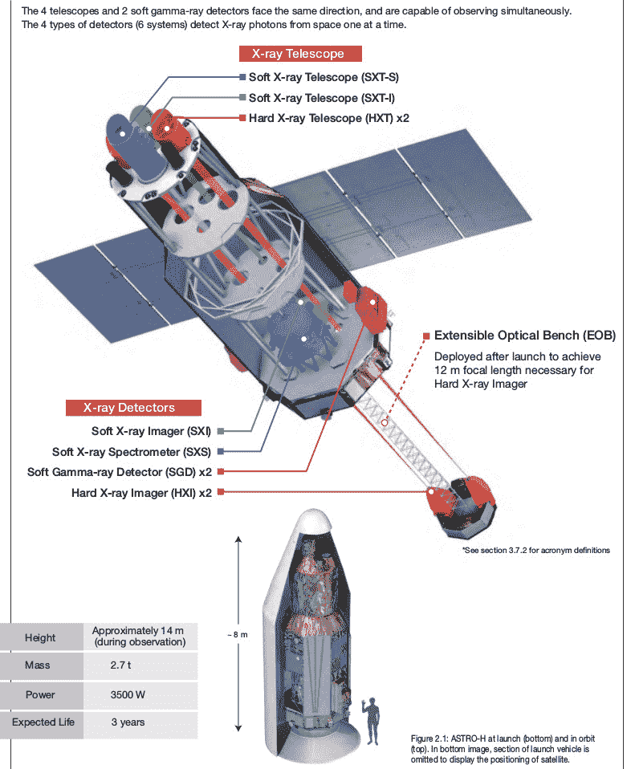

# 软件更新摧毁了价值 2.86 亿美元的日本卫星

> 原文：<https://hackaday.com/2016/05/02/software-update-destroys-286-million-japanese-satellite/>

日本的 X 射线望远镜古谷仁美在失去控制旋转时在轨道上解体，被宣布丢失。原因仍在调查中，但早期分析指出，在仪器探测器从卫星后部伸出后不久，一个软件包中的数据不良。日本航天局 JAXA 损失了 2.86 亿美元，三年的计划观测，以及可能增加的 10 年科学研究。

古谷仁美，也被称为 ASTRO-H，于 2016 年 2 月 17 日成功发射，但在 3 月 26 日灾难降临，只留下一些碎片漂浮在太空中。JAXA 不顾一切地努力回收卫星，却不知道失败的程度。4 月 28 日，他们停止了努力，现在正在努力确定失败的原因，尽管几周前他们确实在新闻发布会上提供了对失败顺序的分析。

 3 月 26 日，卫星完成一次机动指向马卡里安 205 星系。姿态控制系统(ACS)开始使用恒星跟踪(STT)系统数据来控制卫星的位置。STT 在这一点上应该已经更新了另一个位置监测系统，惯性参考单元(IRU)。这可能没有发生。

当时，卫星正通过南大西洋异常点。这很重要，原因有二。首先，它将古谷仁美置于通信中断区域，这意味着没有积极的地面监控情况(人为干预可能会防止灾难性的失败)。第二，环绕地球的辐射带在这个区域倾斜较低，所以粒子密度比轨道的其他部分高。高能粒子可能破坏了机载电子设备。

STT 和 IRU 对卫星的态度有分歧。在这种情况下，IRU 优先，但它的数据显然是错误的，报告的自转速率为每小时 20 度，这是不存在的。卫星试图用反作用轮来阻止这种错误的旋转。早先上传的卫星配置信息是错误的，反作用轮使旋转变得更糟。

卫星现在进入“安全保持”模式，推进器被要求停止旋转。使用同样错误的配置信息，他们增加了自旋，进一步导致卫星的旋转超过设计参数。像太阳帆这样的零件脱落了。除了主体之外，总共观察到至少 5 个片段。一些报告表明，可能有多达 10 块碎片，其中 2 块较大的和 8 块较小的碎片仍在轨道上。很可能所有十块碎片最初都是分离的，但它们靠得很近，使得视觉和雷达图像无法将它们视为独立的实体。

在卫星中，STT 通常会得到一个很好的定位，并将数据发送到 IRU。IRU 使用该数据设置其当前读数，并测量自上次更新以来它漂移了多远。在计算漂移之后，它使用漂移调整来补偿未来的漂移。显然，如果补偿计算是错误的，未来的读数也将是错误的。这似乎在 ACS 试图纠正一个不存在的旋转时起了作用。错误的配置信息导致 ACS 加剧(而非纠正)旋转。

硬件是为了研究宇宙中的硬 X 射线源而建造的。像古谷仁美这样的 x 射线卫星不会受到遮蔽视觉仪器的尘埃云的阻碍。以前的卫星极大地扩展了我们对宇宙的了解，日本在这项技术上处于领先地位。

日本第一颗成功的 X 射线卫星 Hakucho 于 1979 年发射。其他成功的发射发生在 83 年、87 年和 93 年。76 年和 2000 年的发射都失败了。他们最近的 X 射线卫星 Suzaka 于 2005 年发射，由于电池和其他组件的退化，于 2015 年退役。人们曾希望古谷仁美也能看到类似的效用，但这一希望现在已经破灭。

[图片来自 JAXA 网站和报道。]