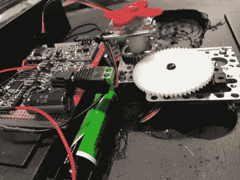

# 太阳潮汐钟跟踪月亮

> 原文：<https://hackaday.com/2017/09/22/solar-tide-clock-keeps-track-of-the-moon/>

老式的潮汐钟试图通过记录月亮的升起和落下来预测涨潮。当你观察一个时，你可以看到离下一次涨潮还有几个小时。[rabbitcreek]想要制作他自己的[版本的潮汐钟](http://www.instructables.com/id/Solar-Tide-Clock/),这种潮汐钟在预测实际涨潮方面比那些老式的时钟做得更好，老式的时钟本质上是根据月亮的相位调整的计时器。

【rabbit creek】基于【卢克·米勒的】[潮汐时钟](http://lukemiller.org/index.php/2015/11/building-a-simple-tide-clock/)开发的潮汐预测软件，该软件考虑到地理特征(盆地深度等)等因素，对标准月球时钟进行特定位置的调整。)来修改默认定时。[Miller]的 Arduino 代码包括一个由 NOAA 站号组织的公共位置库。

[rabbitcreek]的项目包括一个连接到 DS3231 RTC 分线点的 Adafruit 羽毛板和一个转动时钟指针的 HS-225BB 伺服系统。这是一个 180 度的伺服系统，连接到一个被砍倒的 Actobotics 齿轮箱上，以 2:1 的比例将伺服系统减速，以允许 360 度的运动。

理论上，他还想让他的发明无人看管多年——所以太阳能是理所当然的。钟的表面由太阳能电池板的独立波纹组成，粘合成一个巨大的类似时钟的阵列。太阳能电池馈入 Adafruit PowerBoost 500、TPL5111 低功耗定时器突破和 LiPo 电池，供黑暗时使用。

如果你正在寻找更多的太阳能时钟，看看这个用电容器做时标的。