# Sonic 3D 打印机自动调平底座发出嗖嗖声

> 原文：<https://hackaday.com/2016/07/18/sonic-3d-printer-auto-bed-leveling-makes-swoosh/>

3D 打印:最后的前沿。这些是另一个 3D 打印机黑客的旅程。它的任务是:探索平整印刷床的新方法。

到目前为止，我们已经有了伺服探头、艾伦内六角探头、Z 型滑板探头、电感和电容无触点开关，仅举几例。所有这些都允许 3D 打印机探测其打印床，计算校正平面或网格，并补偿其固有的时变误差。

 [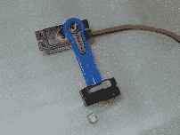](https://hackaday.com/2016/07/18/sonic-3d-printer-auto-bed-leveling-makes-swoosh/servo_arm_extender_switch_holder_1a_preview_featured/) Retractable servo probe [by AndrewBCN](http://www.thingiverse.com/thing:573181) [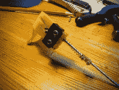](https://hackaday.com/2016/07/18/sonic-3d-printer-auto-bed-leveling-makes-swoosh/c660393421812f0c9798e45deeabc817_preview_featured/) Allen key probe [by micolo](http://www.thingiverse.com/thing:1343493) [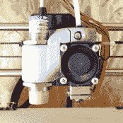](https://hackaday.com/2016/07/18/sonic-3d-printer-auto-bed-leveling-makes-swoosh/2015-05-17-16-06-28-kopie-2/) Capacitive distance switch [by me](https://www.youmagine.com/designs/supermount) [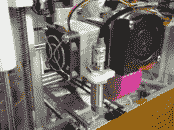](https://hackaday.com/2016/07/18/sonic-3d-printer-auto-bed-leveling-makes-swoosh/2015-10-26_00-55-46_preview_featured/) Inductive distance switch [by slemrijan](http://www.thingiverse.com/thing:1238257) [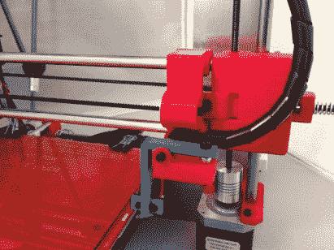](https://hackaday.com/2016/07/18/sonic-3d-printer-auto-bed-leveling-makes-swoosh/img_1971_preview_featured/) Z-sled probe [by oliasmage](http://www.thingiverse.com/thing:396692)[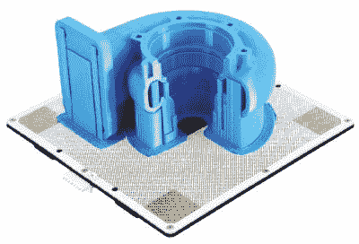](https://hackaday.com/wp-content/uploads/2016/07/zortrax-m200-platform-clean.jpg)

Build plate with conductive pads [by Zortrax](https://zortrax.com/wp-content/uploads/2015/09/ZORTRAX_M200_BROCHURE.pdf)

这些传感器通常安装在打印头上的某个位置，并引入自己的传感器偏移，必须对其进行精确校准才能使整个系统正常工作。为了消除这些偏移以及大部分昂贵的 EOL 测试和校准，波兰 3D 打印机制造商 Zortrax 使用了一种更智能的方法:在构建板上安装导电垫。在调平过程中，打印喷嘴与这些垫接触，这实际上是将喷嘴本身变成无偏移的探针。Makerbot 基于位于打印头中的力传感器获得了接触传感解决方案[的专利，尽管基于限位开关](https://www.google.com/patents/US20140117575?dq=14/065516&hl=en&sa=X&ei=EEGAU8u1N-TmsASar4GgCg&ved=0CDUQ6AEwAA)的类似构建[之前已经为人所知。其他 DIY 构建使用构建板下面的](https://plus.google.com/+SteveGraber/posts/ebSvJ7uBjbo)[力敏电阻(FSR)](http://reprap.org/wiki/FSR) 来实现相同的效果。所有这些技术都是基于检测印刷喷嘴和构建板之间的短暂接触，因此是无偏移的。

出于消除最后一个手动校准步骤的想法，我想让 Zortrax 的接触式传感方法与非导电 PEI、Garolite 和玻璃构建板兼容。我不想干涉 Makerbot 的专利，而且力敏电阻无法承受加热床的温度。我想我可以在打印床上绑一个足够耐热的压电传感器来感应喷嘴与打印床碰撞时产生的轻微*撞击*。然而，当喷嘴以 1 毫米/秒的速度撞击建筑板时，释放的声能并不多。第一次测试表明，敲击声太弱，无法与机器中的其他振动可靠地区分开来。

  Several piezo discs, attached to the bottom of a Prusa MK2a heated bed. [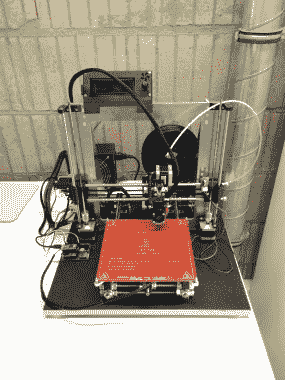](https://hackaday.com/2016/07/18/sonic-3d-printer-auto-bed-leveling-makes-swoosh/prototype_total_bed/) The test platform: A Prusa i3[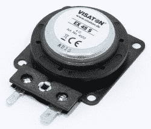](https://hackaday.com/wp-content/uploads/2016/07/sonic_probing_visaton40.jpg)

Visaton EX 45s structure-borne sound exciter ([image source](http://www.visaton.de/en/industrie/koerperschall/ex45s_4.html))

为了解决这个问题，我获得了一个 10 瓦的结构声激励器，并将其连接到挤出机上。激励器允许我主动将白噪声信号注入喷嘴。如果它足够强，这个信号将穿过整个打印机，并可以被打印床上的压电盘拾取，远远高于打印机本身的噪声水平。我假设，当喷嘴接触印刷床时，激励器和压电传感器之间的传递函数必须快速改变，因为声音在两者之间直接传递。这种变化将导致压电拾取的振幅谱的快速变化。一个小小的 DSP 可以处理压电信号，检测振幅谱中的这些快速变化，并返回一个触发信号来指示碰撞。

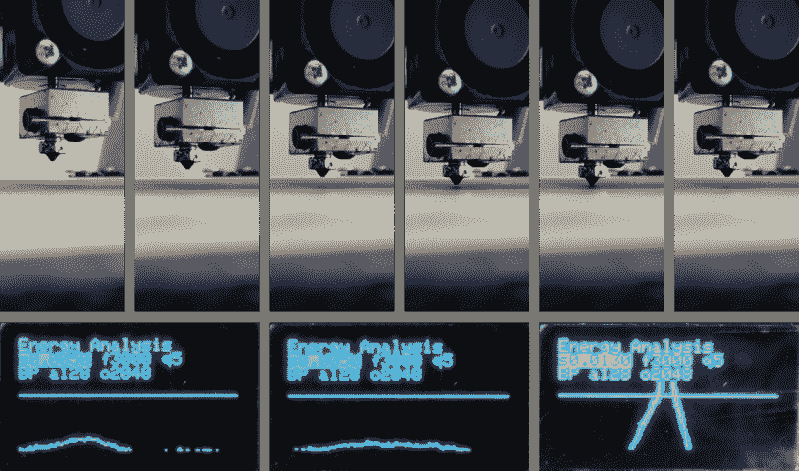

对于所需的实时 DSP，我将压电盘连接到一个配备了 Teensy 3.1 的普通 Teensy 音频屏蔽上，这实际上一步就完成了该项目的硬件部分。使用 Paul Stoffregen 的[令人惊叹的 DSP 库](http://www.pjrc.com/teensy/td_libs_Audio.html)，只需几行代码即可对输入信号执行 256 点 FFT，并生成一个时间平均幅度频谱。这个小草图将通常存在的振动的平均“频率指纹”与当前频谱进行比较，计算两者之间的总能量差，如果该差超过某个阈值，Teensy 将输出引脚拉低，告诉 3D 打印机控制器喷嘴刚刚接触到构建板。我后来添加了一个有机发光二极管显示器和旋转编码器，主要用于绘制信号和调整阈值。

[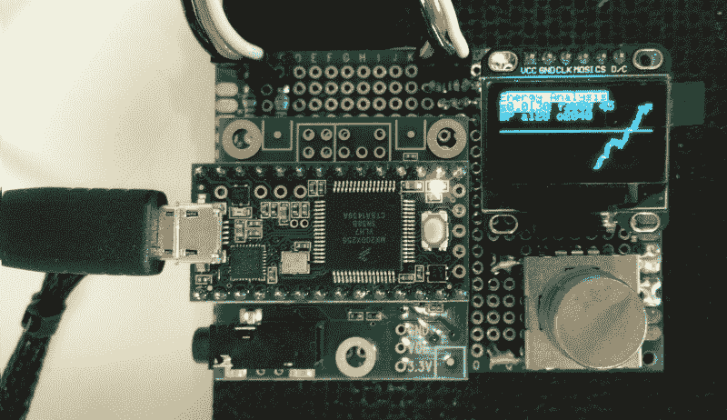](https://hackaday.com/wp-content/uploads/2016/07/sonic_probing_teensy.jpg)

这证明工作得很好，同时将整个打印机淹没在令人愉快的*嗖嗖声*中，但它增加了挤出机组件的相当多的额外重量。此外，这些激励器并不特别便宜，还需要一个额外的音频放大器。那不是真正的*它*。

我花了一段时间才想明白我会对整个项目做些什么。然后，就在我准备把它送进 project-limbo 的时候，我有了另一个想法:为了节省成本和重量，我可以使用挤出机的步进电机作为激励器，步进电机驱动器作为放大器，并坚持使用连接到打印床上的廉价压电盘作为麦克风。理论上，3D 打印机控制器既可以产生噪声信号，也可以处理来自压电元件的声音信号，因此唯一的附加组件是前置放大器和压电盘。

“Extruder, you’re a speaker now.” – “K, boss.”

然而，仍然不清楚步进电机是否会适应成为某种扬声器，所以这是首先需要测试的。我拼凑了一个小小的噪声注入板，它将连接 3D 打印机控制器和步进驱动器。这个小黑客利用 Arduino Pro 迷你克隆在两种模式之间切换:旁路模式，它只传递来自 3D 打印机控制器的信号，以及噪声模式，它将向前和向后微步的伪随机序列传输到电机驱动器。我希望这会导致步进电机振荡并产生噪声信号。事实的确如此。我打开它，挤压机马达*发出强烈的噪音，非常类似于我以前使用的激励器，尽管挤压机的齿轮发出了很大的嘎嘎声。*

[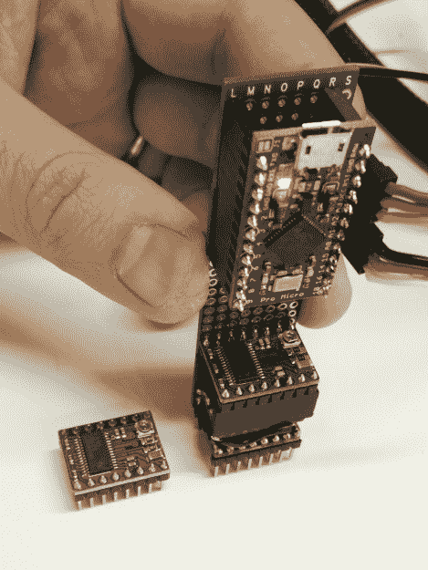](https://hackaday.com/wp-content/uploads/2016/07/sonic_probing_noise_injector.jpg)

Noise injector with Pololu DRV8825 driver (right), plain Pololu DRV8825 driver (left)

我调整了随机序列，以确保步进电机永远不会执行一个实际的完整步骤，作为微步骤的随机累积。除此之外，一切都出奇地好。探测是精确到很难判断它实际上有多精确的程度。如果喷嘴接触到一张纸并在感觉到接触时停止，纸将容易并持续地在喷嘴和构建板之间滑动，而不会被卡住。从那以后，我已经用它进行了几次打印，它的工作方式就像常规的自动基座调平探头一样，尽管它的优势比预期的要少:它消除了偏移校准，但也为触摸检测引入了阈值。

从经济学角度来看，这仍然是一场噩梦。在当前的 Arduino 风格的 3D 打印机平台上，需要额外的 DSP、DAC、前置放大器和噪声注入适配器来实现这种声波自动调平。即使压电盘实际上是免费的，所有东西加起来大约是一个像样的电容距离开关的 5 倍。

在不久的将来，这可能会更有意义。我们开始看到新一代的 3D 打印机控制器，具有更强大的 32 位 MCU，理想情况下，我们需要一个支持 DSP 指令的控制器。鉴于廉价的 STM Nucleo 板与强大的、支持 DSP 的 ARM Cortex-M4 MCU 的可用性，我敢打赌，能够实现这种功能的极其强大的 3D 打印机控制器电子设备一定会很快出现。现在，请欣赏下面的声波自动调平的早期测试视频:

 [https://www.youtube.com/embed/FzCTKbPlMQI?version=3&rel=1&showsearch=0&showinfo=1&iv_load_policy=1&fs=1&hl=en-US&autohide=2&wmode=transparent](https://www.youtube.com/embed/FzCTKbPlMQI?version=3&rel=1&showsearch=0&showinfo=1&iv_load_policy=1&fs=1&hl=en-US&autohide=2&wmode=transparent)

