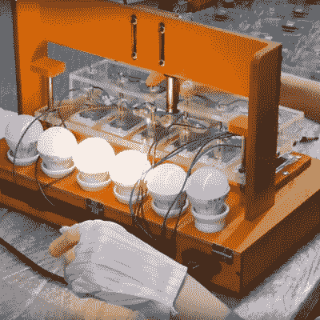

# 索诺夫工厂之旅是深圳生活的一课

> 原文：<https://hackaday.com/2017/12/29/sonoff-factory-tour-is-a-lesson-on-life-in-shenzhen/>

从《造物小百科》和其他同类节目的受欢迎程度来看，观看造物小百科确实很受欢迎。来自 SuperHouse 的[Jonathan Oxer]对工厂参观的魅力也不能免疫，所以他一路来到中国[参观制造 Sonoff 物联网设备的工厂](https://www.superhouse.tv/27-visit-to-the-sonoff-factory/)，他的视频揭示了许多关于电子产品制造的状况。

Test jig for six units at once

对于那些只对 Sonoff 设备如何制造感兴趣的人，请跳到 7:30 左右。但公平的警告——你会错过一个有趣的讨论，关于深圳是如何从一个只有 25000 人的沉睡的渔村发展成为今天 2500 万人的蓬勃发展的电子产品圣地的。由于上世纪 80 年代被指定为经济特区，深圳的增长得到了加速，如今深圳是数千家电子企业的所在地，包括 Sonoff 品牌的制造商 ITEAD。[乔纳森]的深圳之旅包括参观著名的电子市场，在那里几乎可以找到建造任何东西所需的一切。

在 ITEAD 工厂，[Jonathan]走在 Sonoff 装配线上，展示一个令人惊讶的低技术工艺。除了大量的取放机器人、回流和波峰焊生产线，Sonoff 设备基本上是由一小群工人手工制造的。我们数不清从事最终组装、测试和包装工作的人数，但可以说，机器人取代电子组装工人还需要一段时间，至少在中国是这样。

我们发现[乔纳森]的视频很吸引人，非常值得一看。如果你对 Sonoff 的 ESP8266 产品感兴趣，请查看我们关于逆向工程的报道。或者，如果你更喜欢深圳，2016 年超级大会的[【秋叶】](https://hackaday.com/2016/12/07/akiba-shenzhen-in-30-minutes/)旋风之旅将带你开始。

 [https://www.youtube.com/embed/uZjZZKiKlNY?version=3&rel=1&showsearch=0&showinfo=1&iv_load_policy=1&fs=1&hl=en-US&autohide=2&wmode=transparent](https://www.youtube.com/embed/uZjZZKiKlNY?version=3&rel=1&showsearch=0&showinfo=1&iv_load_policy=1&fs=1&hl=en-US&autohide=2&wmode=transparent)

[汉斯]，谢谢你的提示。