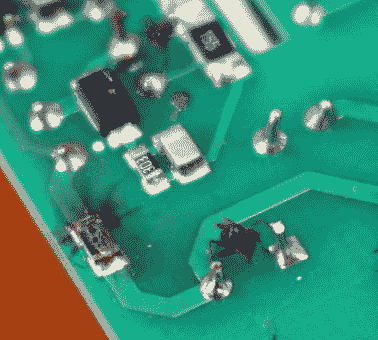

# 索诺夫死后发现了虫子，真的

> 原文：<https://hackaday.com/2018/06/05/sonoff-postmortem-finds-bugs-literally/>

虽然没有人确切知道这个词的确切词源，但托马斯·爱迪生在 1878 年写的一封信中提到他的一些发明充满了“bug”。就计算机而言，任何忠实的 Hackaday 读者都应该知道格蕾丝·赫柏臭名昭著的描述，一只飞蛾被早期机电计算机的继电器缠住了。对于这些令人讨厌的昆虫，我们会谦卑地讲述一个 Sonoff TH16 开关被一只卑微的蚂蚁摧毁的[故事。](https://www.cnx-software.com/2018/05/30/sonoff-th16-wireless-switch-dead-postmortem-analysis/)

 据【CNX 软件】报道，Sonoff TH16 在第一次出现问题迹象之前已经完美运行了一年半。有一天，开关不响应命令，一个电源周期似乎没有解决问题。当打开设备查看出了什么问题时，很明显有东西烧坏了。但经过仔细检查，这不是设计上的错误，甚至也不是劣质组件。这是一只过度好奇的蚂蚁的产品，它得到的比它预想的要多得多。

参考 Sonoff 的接线图，似乎这只可怜的蚂蚁非常不幸地碰到了电路板另一侧通孔电容器的引脚。桥接这个连接不仅给了他致命的一击，而且显然导致足够的电流涌过附近的电阻，从而化为乌有。

现在，有些人可能会对这一开关的运行条件感到疑惑(这是合理的)。如果虫子可以爬进去，假设它没有很好地抵御自然环境也不是没有道理的。也许潮湿的环境是失败的原因，蚂蚁“骑在闪电上”的形象只不过是一个巧合。也许吧。但有时你必须相信。

顺便说一句，如果你想了解更多关于这位帮助保护 IT 词典中“bug”的女性的信息，[这里有一个好的起点](https://hackaday.com/2017/12/05/disrupting-the-computer-industry-before-it-existed-rear-admiral-grace-hopper/)。

编者按:如果你认为你又有似曾相识的感觉，我们确实在周日链接综述中指出了这个故事，但图形太好了，我们无法抗拒完整地运行它。