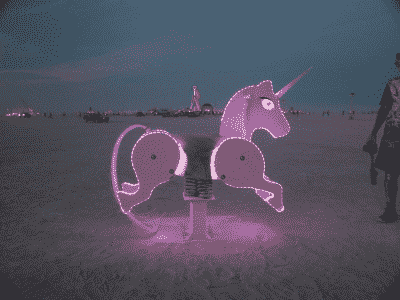

# 索菲·克拉维茨讲述艺术背后的技术

> 原文：<https://hackaday.com/2016/04/25/sophi-kravitz-talks-the-tech-behind-art/>

Hackaday 自己的神秘野兽 Sophi Kravitz 制作了一些令人惊叹的合作技术艺术作品。在这次演讲中，她带领我们参观了她最近参与的四个艺术项目，并让我们一瞥幕后的技术层面，看看一个装置从构思、原型到完成的过程。

观看 Sophi 在 [Hackaday | Belgrade](http://hackaday.io/belgrade) 会议上的发言，然后在跳转之后加入我们，了解更多细节。

 [https://www.youtube.com/embed/Scpx7tMYieY?version=3&rel=1&showsearch=0&showinfo=1&iv_load_policy=1&fs=1&hl=en-US&autohide=2&wmode=transparent](https://www.youtube.com/embed/Scpx7tMYieY?version=3&rel=1&showsearch=0&showinfo=1&iv_load_policy=1&fs=1&hl=en-US&autohide=2&wmode=transparent)

由于这些项目的规模，没有艺术家独自坐在房间里独自工作。Sophi 通常与团队合作，这通常涉及一个机械人和一个程序员结合她的电子设计技能来制作一个成品。实现愿景是团队合作和解决问题的全部，它通常是新颖的，因为艺术意味着做一些新的事情。

在这个过程中，她遇到了非常棘手的技术问题。用 25 个膨胀和收缩的气球来创造一个作品听起来很有趣。但是，你必须使充气和放气速率匹配，这反过来意味着校准输入和输出螺线管的相对直径和流速，然后找出如何将所有这些塞进一个小空间。

作为能说会道又可爱的*——一个为燃烧的人设计的可骑独角兽装置——的一部分，她开始用半吨喷水、焊接钢和数控胶合板工作。索菲还继承了大量的发光二极管，所以当被骑上时，这些独角兽就会发光。这里没有什么技术上的秘密，这只是你常见的独角兽艺术，但是字体很大。*

 *她目前正在帮助的一件作品涉及偏光膜，具体来说是安装在 288 个伺服电机上的 288 片偏光膜。Sophi 的项目部分是确保马达实际工作，并设计供电系统。你注意到你的小机器人马达在重载下是如何拉下电轨的吗？她有 288 个！

索菲正在制作的最终作品涉及[大型单像素液晶显示器](https://hackaday.io/project/9676-shutter-glass-tests)。因为她没有使用现成的东西，这意味着要学习很多关于液晶显示器如何工作的知识。嗯，因为提供面板的人不太帮忙。这意味着表征她所拥有的 LCD 样品，所以她开始摆弄它们一会儿。她把一个放在烤箱里加热，看看它对温度的反应，是的，它们变得很软。

我们已经习惯了液晶屏幕的开关。但是如果你在屏幕上摆弄过“对比度”设置，你就会知道事情没那么简单。经过一系列的实验，Sophie 设计出了一个模拟驱动电路，可以让她淡入淡出液晶显示器。现在，她仍在尝试什么是可能的——最终的艺术应用仍在进行中。许多经过校准的运算放大器驱动电路的技术挑战令人望而生畏，但想象一下，用许多可调光的透明 LCD 像素组成的网格可以做些什么。谁知道这会导致什么？

我们热爱科技艺术。不仅仅是因为它让你跳出常规思维，想出不寻常问题的解决方案，还因为最终，它必须工作起来*和*看起来不错。额外的约束使得解决问题变得更加有趣。所以，感谢索菲为我们讲述了你一直在做的事情，并让我们从你的肩膀上偷看！*