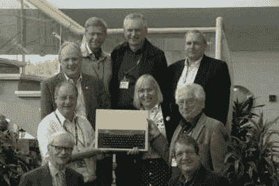

# 索菲·威尔逊:ARM 以及如何让事情变得更简单，让它们变得更快、更高效

> 原文：<https://hackaday.com/2018/05/08/sophie-wilson-arm-and-how-making-things-simpler-made-them-faster-more-efficient/>

索菲·威尔逊是现代 CPU 设计的领军人物之一。在 20 世纪 80 年代，她和同事 Steve Furber 设计了 ARM 架构，这是一种新的 CPU 设计方法，使移动计算成为可能。他们这样做是因为意识到你可以用更少的资源做更多更快的事情。如果你用过 Raspberry Pi，或者任何一种运行在 ARM 芯片上的嵌入式设备，你就已经享受到了它们的劳动成果。

这一切都始于 1978 年索菲·威尔逊的一个电动打火机和一台吃角子老虎机(在英国被称为“水果机”)。一个有抱负的小偷发现，如果你点燃机器旁边的打火机，产生的宽带电磁脉冲会触发支付电路。电子设计师 Hermann Hauser 负责解决这个问题，他向在他公司工作的学生 Wilson 求助。

威尔逊很快发现，如果你增加一个小型宽带无线电接收器来检测脉冲，就可以抑制错误支付，挫败小偷。Hauser 对这一创新印象深刻，他向 Wilson 发出挑战，要求他在暑假期间建造一台计算机，部分基于 Wilson 在大学发明的自动喂牛器的设计。威尔逊创造了这台原型计算机，它看起来更像一个手动连线计算器，而不是一台现代计算机，但这一设计成为了 Hauser 的新公司 Acorn Computers 在 1979 年推出的第一台计算机 Acorn System 1 的基础。

此时，威尔逊已经从剑桥大学毕业，并作为首席设计师加入 Acorn。System One 与众不同，因为它很便宜:售价 65 英镑(不到 90 美元)，作为一个用户可以自己组装和焊接的套件出售。它是围绕 1 MHz 6502 CPU 构建的，内存为 1152 字节。

在接下来的几年中，这款电脑推出了几个新版本，增加了扩展卡等功能。这些产品在发烧友中很受欢迎，但都没有像公司希望的那样引起公众的兴趣。

## 每个学校都有一台电脑

Hermann Hauser, Andy Hopper, Christopher Curry, Sophie Wilson, David Allen, Chris Serle, David Kitson, Chris Turner, Steve Furber at the BBC Micro 30th anniversary in 2012\. [From Wikipedia.](https://commons.wikimedia.org/wiki/File:BBC_Micro_creators_with_micro_in_2012.jpg)

Acorn 的重大突破来自 BBC Micro，这是一台为英国广播公司运营的计算机扫盲计划设计的计算机。BBC Micro 的设计足够坚固，适合教育用途，配有全尺寸键盘、基本解释器、调制器，可以连接到标准电视，还有一个接口，可以将节目保存和检索到标准盒式录音机。这是一个巨大的成功，每月售出超过 40，000 台机器，出现在 85%的英国学校。

然而，此时威尔逊的思想已经转移到了别处。BBC Micro 使用与他们以前的计算机相同的 6502 处理器，但威尔逊和公司的其他人对这种计算机提供的计算能力不满意。因此，他们在 1983 年决定为未来的计算机制造他们自己的中央处理器。

几个因素影响了这个决定。一次是参观制造 6502 的公司，在那里他们意识到有一个人正在开发这种 CPU 的下一个版本。这表明你不需要一个庞大的团队来设计一个 CPU:只要你有一个能为你制造芯片的合作伙伴，这并不是那么困难。第二个项目叫做[伯克利 RISC 项目](https://risc.berkeley.edu/risc-i/reunion/memorabilia)，代表精简指令集编码。这背后的想法是，如果一个 CPU 只运行一个非常小的指令集，它可以运行得更快更有效。运行在处理器上的操作系统不是向处理器本身添加更多的指令，而是将任务分解成 CPU 运行速度更快的更简单的指令。

这个想法吸引了威尔逊。因此，她和同事 Steve Furber 设计了他们自己的指令集，在 BBC Micro 上创建了一个模拟器，让公司的其他人相信这种方法是值得的。他们称这个项目为 A，但后来它被命名为 **Acorn RISC 机器**或**手臂**。

## 更小、更快、更好

他们的系统架构与大多数 CPU 根本不同。威尔逊和其他人测试了 6502 和其他类似的处理器，发现它们只能处理有限的数据量。大多数 CPU 设计者在他们的芯片上增加了更多的指令，提供了 CPU 处理这些数据的新方法。Wilson 和 Furber 采取了相反的方法，移除部分部件，直到它们有了所需的骨架，从而创建了一个比现有 CPU 更简单、功耗更低的芯片。这意味着让 CPU 处理更大的数字要容易得多。因为架构更简单，您可以更容易地创建 16 或 32 位 CPU。通过减少制造量，威尔逊和弗伯生产了一种可以做更多事情的芯片。

让我们举一个例子——一个威尔逊自己用的例子。她在 BBC Micro 中使用的 6502 CPU 将花费 2 个时钟周期，或大约 1 微秒来将两个 8 位数字相加。但是，当你开始使用大多数计算任务所需的更大的数字时，6502 由于必须以 8 位块处理这些数字而步履蹒跚。这是因为 6502 一次只能处理 8 位数据(称为数据总线宽度)，所以它需要将更大的数字分割成 8 位数据块，并将这些数据块单独相加，这需要时间。事实上，6502 将需要 26 个时钟周期来将两个 32 位数字相加。

你可以构建一个具有更大数据总线宽度的 6502 版本，但这将成倍增加芯片所需的晶体管数量:你很快就会需要数百万个晶体管来处理这些更大数据块上的复杂操作。或者，你可以像史蒂夫·沃兹尼亚克对 [Sweet16 所做的那样，这是他为 Apple II(使用与 BBC Micro 相同的 6502 处理器)编写的一个黑客程序，实际上创建了一个虚拟的 16 位处理器](https://en.wikipedia.org/wiki/SWEET16)。问题是它的速度只有 6502 的十分之一。

 [https://www.youtube.com/embed/_9mzmvhwMqw?version=3&rel=1&showsearch=0&showinfo=1&iv_load_policy=1&fs=1&hl=en-US&autohide=2&wmode=transparent](https://www.youtube.com/embed/_9mzmvhwMqw?version=3&rel=1&showsearch=0&showinfo=1&iv_load_policy=1&fs=1&hl=en-US&autohide=2&wmode=transparent)

相比之下，威尔逊和弗伯制造的第一个 ARM CPU 具有 16 位数据总线宽度，运行时钟速度比 6502 更快，因此它可以在 9 个时钟周期内(约 125 纳秒)将两个 32 位数字相加。它可以在一个不比 6502 大多少的芯片上实现。它之所以能够做到这一点，是因为更简单的架构更容易扩展，以支持更大的数据总线宽度。因为它只需要处理少量的指令，所以芯片更简单、更快。

威尔逊和弗伯设计了一个 CPU、图形芯片和内存控制器，它们一起工作，创建了一个完整的测试系统，并于 1985 年交付。当 Furber 决定测量这个测试处理器使用了多少功率时，他的万用表没有检测到任何功率流。Furber 进行了调查，并意识到他们使用的开发板有问题:它没有向 CPU 提供任何功率。取而代之的是，处理器非常高兴地运行在通过信号线将数据输入 CPU 的电源上。

 [https://www.youtube.com/embed/D4nWLIeBuf4?version=3&rel=1&showsearch=0&showinfo=1&iv_load_policy=1&fs=1&hl=en-US&autohide=2&start=530&wmode=transparent](https://www.youtube.com/embed/D4nWLIeBuf4?version=3&rel=1&showsearch=0&showinfo=1&iv_load_policy=1&fs=1&hl=en-US&autohide=2&start=530&wmode=transparent)

Acorn 很快意识到这种设计的潜力，并开始申请专利。这创造了第一个实用的 RISC 架构，称为 ARM V1。这已经经历了几次迭代，但基本原理仍然相同:少量可以快速运行的指令比大量需要很长时间才能运行的指令更有效。

当威尔逊正在创建第一个 ARM 处理器时，Acorn 自己也陷入了困境。BBC Micro 虽然很受欢迎，但生产成本很高，生产问题意味着该公司错过了 1983 年重要的假日购物季。尽管订购了 300，000 多台 BBC 微型计算机，但到了 1983 年圣诞节只交付了 30，000 台。除此之外，该公司还大举借债来扩大生产规模，并开发后续型号 BBC Master。一个债权人变得越来越沮丧，并试图关闭该公司，这一过程导致裁员和财务问题，最终意味着 Acorn 被出售，经过许多不同的公司之手，并剥离了该公司的手臂部分，这很快变得比 Acorn 本身更有价值。

ARM 架构本身花了一段时间才流行起来，但其主要驱动力是移动计算。因为功率在移动设备中非常重要，ARM 架构是理想的，因为与更复杂的芯片相比，它可以用更少的功率运行更多的操作。事实上，ARM 架构仍在大多数手机、笔记本电脑和其他设备上使用，苹果、三星等公司授权在其移动处理器中使用 ARM 架构。