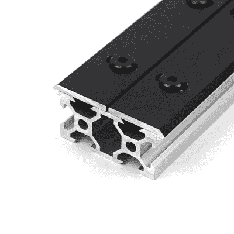
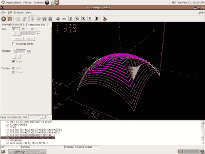

# 2016 年采购您的数控工具:制造它们

> 原文：<https://hackaday.com/2016/01/13/sourcing-your-cnc-tools-in-2016-build-them/>

也许今天业余爱好者的机器的公差对你来说不够好，或者也许工作区域太狭窄。无论哪种方式，都有现成的解决方案不能满足你的需求的时候，你决定建造自己的数控机床。幸运的是，我们中没有人在这项努力中孤独，因为爱好者多年来一直在建造自己的自动化设备。无论你是在谈论制造机器、生成 g 代码，还是将 g 代码翻译成电机信号脉冲，DIY CNC 社区已经发展出一套旨在完成工作的复杂工具。我想我会参观一些业余爱好者的工具，霍尔马克 2016 年是迄今为止建造你的数控机床的最好的一年。

## 五金器具

在过去的几年里，负担得起的挤压型材和支架已经取得了飞跃，以满足饥饿的 DIY 3D 打印机社区。除了 3D 打印机，这些横梁和支架是我们在线性运动控制领域的一些需求的良好开端。这里快速浏览一下一些现成的组件。

### Makerslide 挤压型材

除非你在易贝或全球速卖通找到了一笔交易，否则用精密直线轨道组装一台机器会是一场昂贵的考验。线性导轨为我们提供了一个刚性、无摆动的单轴运动导轨，但在某些情况下，业余爱好者承受这种精度所需的成本超出了他们的预算。[Barton Dring]采用了导向线性运动的想法，推出了一种定制的挤压导轨，使轴承能够沿轴自由滑动。被称为 [Makerslide](http://www.makerslide.com/) 的这种挤压导轨具有直接嵌入挤压件的凹槽，旨在与大多数其他 20 毫米挤压型材兼容，如来自 Misumi 和力士乐的型材。

### 开放式 V 型槽导轨附件

Image Credit: [Ooznest](http://ooznest.co.uk/)

类似地，OpenBuilds 的人将[Barton 的]概念引向了一个稍微不同的方向。对于我们中的许多人来说，他们已经承诺从一个供应商那里挤出来，并且我们的壁橱里堆满了多余的管子， [Open Rail](http://hackaday.com/2012/06/12/open-rail-or-why-didnt-we-think-of-this/) 是一种挤出的 v 形槽附件，它使轴承安装板能够自由滑动，就像 Makerslide 的挤出件一样。然而，与 Makerslide 不同的是，几乎任何 20 毫米的挤压件都可以用开放式导轨进行改造，而不需要专门的挤压件。

### OpenBuilds 线性致动器套件

CNC 机床包括各种各样的机床设计，远远超出了本文的范围。然而，对于传统的机器，单个马达驱动沿着单个轴的运动。为了在一个单独的维度上增加方向，我们有时可以将两个相同的线性运动单元链接在一起。OpenBuilds 的工作人员牢记这一原则，将[单轴系统作为套件](http://openbuildspartstore.com/v-slot-nema-17-linear-actuator-bundle-lead-screw/)提供。通过一些创造性和深谋远虑，用户可以基于附加多个轴的原则开发许多自动化解决方案。当然，OpenBuilds 的人并没有偶然发现一个前所未见的解决方案。米苏米、力士乐等专业自动化设备公司多年来一直在销售直线运动系统；然而，它们的价格范围很容易就超过了 10K 马克。

### 不是结束，而是一个坚实的开始

尽管设计灵活，但 Makerslide 和 OpenBuilds 都不是每一个 CNC 努力的包罗万象的解决方案。具体来说，对于可以啃穿钢铁的刚性机器来说，由螺栓连接的铝挤压件制成的结构远没有类似规模的专业机器刚性大。尽管如此，对于那些没有经历繁重负载的机器，如 3D 打印机、激光切割机，甚至一些小型路由器，Makerslide 和 OpenBuilds 都提供了一个很好的起点。

## 软件

随着我们的手充满了步进电机，挤压型材和皮带，是时候开始探索一种软件解决方案来驱动这一切。虽然有很多特定于机器的解决方案，但我想我应该强调两个足够灵活的解决方案，可以针对定制机器进行调整。

### g 代码解释程序

g 代码解释器就是这样做的:它们接受 g 代码中的输入命令(无论是直接从文件中还是通过电缆串行输入)，并将命令转换为具有正确时序的*步*和*方向*数字输出，以产生步进电机驱动器的控制信号。在某种意义上，它们是机器的“大脑”，接受 g 代码“指令集”，并输出与输入指令对应的行为。

#### LinuxCNC

Image Credit: LinuxCNC Wiki

LinuxCNC 从美国政府资助的[项目中分离出来，开发一个运动控制包](http://linuxcnc.org/docs/html/common/emc-history.html)用于 90 年代的标准测试。随着时间的推移，它已经发展成为一个软件包，旨在将 PC 变成 g 代码解释器，目前它被打包为实时 Linux 发行版。从配置了 LinuxCNC 的 PC 上，您可以简单地将步进电机、限位开关和其他数字 I/O 设备连接到 PC 的并行端口上，进而输出电机*步进*和*方向*脉冲来驱动您的物理硬件。

然而，LinuxCNC 不仅仅是一个 g 代码解释器。15 年以上的积极开发给了它一个坚实的基础，使它成为最适合开发定制机器的软件包之一。通过启用自定义运动学，用户可以驱动非笛卡尔机器，如 [SCARA 手臂](http://hackaday.com/2013/10/09/scara-arm-becomes-enormous-3d-printer/)。有了基于 Debian Linux 的核心操作系统，用户可以连接额外的 PC 外围设备，如 USB 游戏控制器，来驱动他们的机器。一些专门的软件黑客甚至充实了当前的用户界面[来直接生成简单切割的 g 代码](http://hackaday.com/2015/12/25/linuxcnc-features-is-the-garage-fabs-missing-cam-tool/)，而不是简单地运行现有的 g 代码。

#### 格鲁伯

经过 7 年多的积极开发， [Grbl](https://github.com/grbl/grbl) 已经证明自己是 Arduino Uno 的简单、可靠的 g 代码解释器固件。只需将您的电机控制器和限位开关连接到 Uno，Grbl 固件就会处理机器所有 3 个轴的步进和方向脉冲计时。Grbl 的目标不是像 LinuxCNC 一样成为一个无所不包的解释器，但作为交换，它是一个简单得多的解决方案，相对容易设置，并且适用于大多数(如果不是全部)典型的 3 轴机器用例。

虽然 Grbl 驱动物理硬件，但它仍然需要一个串行接口来接收 g 代码指令以执行。幸运的是，g 代码流包是存在的: [bCNC](https://github.com/vlachoudis/bCNC) 和 [UGS](https://github.com/winder/Universal-G-Code-Sender) ，它们已经用 Grbl 专门测试过了。

### g 代码生成器

拥有一台花里胡哨的数控机床，如果我们不能生成指令来驱动它切割零件，那就没什么好说的了！我们需要一个生成 g 代码的解决方案，开源软件社区又一次提供了几个包。

#### DXF 2g 代码

你的许多设计很可能会归结为一系列带有简单特征的平板。对于 2D 铣削，dxf2gcode 简化了基于原始设计文件生成 g 代码的过程，在本例中，原始设计文件是 dxf。该项目还具有在软件中完成的自动刀具补偿功能，这是一个非常方便的功能，它将根据刀具的直径和切削类型(槽或外侧边)生成偏移刀具路径。

#### gcmc

Image Credit: gcmc homepage

如果你曾经尝试过手工编写 g 代码，你会很快意识到在没有记住大部分命令的情况下它是多么的不可读。GCMC 是一种前端语言，旨在生成人类可读的机器例程。通过抽象掉语言中不必要的特质，gcmc 只需调整几个参数，就可以方便地生成复杂的刀具运动和模式。

## 做研究

建造你自己的 CNC 机器可能只是你下一个热爱的工作，但是除非你喜欢重新发明轮子(嘿，从基本原则开始并不总是一件坏事)，值得看一看在我们之前建造 CNC 的大师们的大量建造日志、论坛帖子和现有软件。虽然我已经强调了硬件和软件领域中一些比较常见的工具，但是这个列表还远远不够完整。所以前进吧！做你的研究——当然，让我们知道你在评论中发现了什么。