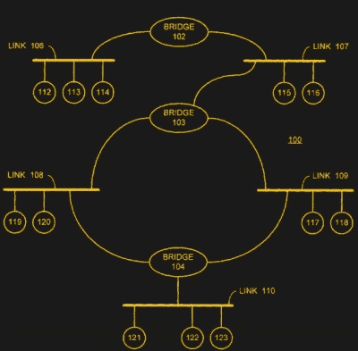

# 跨越树:Radia Perlman 博士&解开网络

> 原文：<https://hackaday.com/2018/05/29/spanning-the-tree-dr-radia-perlman-untangling-networks/>

随着计算机网络变得越来越大，跟踪网络上的数据流变得越来越困难。您如何路由数据，确保数据传播到网络的所有部分？你使用一种叫做生成树协议的算法——这只是杰出的工程师 Radia Perlman 博士对计算机科学的贡献之一。但在她创建这个基本的互联网协议之前，她还致力于开发 LOGO，这是第一种儿童编程语言，为初学走路的孩子创造了一种方言。

帕尔曼出生于 1952 年，是一个在数学和科学方面表现出色的神童，用她自己的话说，“每次有新的课题或测验，我都会非常兴奋有机会解决各种难题”。她于 1973 年毕业于麻省理工学院，并于 1976 年获得硕士学位。

当她在攻读硕士学位时，她与麻省理工学院人工智能实验室的[西蒙·派珀特](https://en.wikipedia.org/wiki/Seymour_Papert)一起研究 LOGO，这是第一种儿童编程语言。在这种语言的最简单版本中，孩子们可以通过编写程序来控制屏幕上或电动海龟的运动，从而学习编程的基础。帕尔曼创造了 [学步儿童自己的递归海龟解释器系统(TORTIS)](https://dspace.mit.edu/handle/1721.1/6224) ，这是一个简化版的标志，可以被学龄前儿童使用。这是由按钮控制的，可以让这个蹒跚学步的孩子用一个比现有系统界面不那么吓人的标志海龟进行实验。“最重要的是，”她描述该项目的论文摘要说，“它应该教导学习是有趣的。”

## 生成树

获得硕士学位并离开麻省理工学院后，帕尔曼加入了国防承包商 BBN，然后在 1980 年进入数字设备公司。在 DEC，她的任务是研究如何应对公司创建的日益复杂的局域网。具体来说，如何阻止数据陷入循环？

想象一个由两台计算机连接到路由器的小型网络。当一台设备发出数据包时，交换机(包括在多个端口之间交换数据的能力的路由器)将它传递到另一台设备。但是局域网很少这么简单，而且随着越来越多的计算机连接到新生的互联网上，人们越来越难弄清楚如何有效地在多个交换机之间路由数据。为了创建能够在失去连接的情况下生存的网络，一台交换机将连接到多台其它交换机。这样，如果一个连接失败，您还有一个备份。您还有多种路由数据的可能方式，这就产生了循环的可能性。环路是指一台交换机将数据包传递给另一台交换机，后者再将数据包发送回第一台交换机。然后，第一个交换机将其重新发送给第二个交换机，依此类推。这可能会造成广播风暴，交换机之间的链路被这些回显数据包填满。

那么如何避免这种情况呢？帕尔曼的解决方案看似简单。她创建了生成树协议(STP ),该协议允许网络中的每个交换机找出自己在事物计划中的位置。这一创新标准被编入 IEEE 标准 802.1d(T1)中，最后一次修订是在 2004 年。

网络设计人员给每台交换机分配一个编号，称为网桥 ID (BID ),表示它在网络中的重要性。BID 最低的交换机被指定为根桥。如果你把它想象成一棵树的根系，那么根桥就是树干的基部，根系的起点。在此之下，每个交换机都是根系统的一个分支，分支并到达根尖处的设备。

不过，它比树根更复杂:树根和树枝之间有多个链接，有时这些链接会被切断。为了解决这个问题，每台交换机都会定期发送特殊的数据包，称为网桥协议数据单元(BPDUs ),其中包含 BID 和另一个数字，称为每个可用连接的路径开销。这个数字是根据连接提供的带宽计算出来的:路径开销越低，连接提供的带宽就越高。当每台交换机收到来自邻居的 BPDU 时，它会使用路径开销来决定使用哪个连接:开销越低，连接越有利。然后，它将自己的 BPDUs 发送给邻居，邻居使用这些信息来计算要使用哪些连接。这种情况会在网络中传播，直到每台交换机都知道自己的位置，以及使用哪条路由最有效。

如果一个连接失败，交换机会发出一个特别标记的 BPDU，其中包含其余连接的详细信息，其它交换机会使用它来重新计算。实际上，这个网络会绕过损害继续工作。

这是一个如此简单的解决方案，现在看来显而易见，但帕尔曼博士努力让她的工程师同事接受它，因为它太简单了。许多工程师难以接受这个问题的答案会如此简单。“我的设计是如此简单，以至于人们很容易认为我只是遇到了简单的问题，”她告诉 [【大西洋】](https://www.theatlantic.com/technology/archive/2014/03/radia-perlman-dont-call-me-the-mother-of-the-internet/284146/) ，“而其他人，做出了超级复杂的设计(这些设计在技术上并不完善，也从未成功过)，并且能够以没人理解的方式谈论它们，却被认为是天才。”

STP 的美妙之处在于，任何路由器都不需要知道整个网络的细节就能工作:它只需要知道自己的 BID 和到其直接邻居的连接的路由开销。网络的倒排树是由每个交换机使用它所拥有的信息来决定如何路由数据而自动创建的。或许最好用一首诗来描述，这首诗是[帕尔曼自己在标准](http://www.freepatentsonline.com/7339900.pdf)的专利申请和[描述协议](https://www.it.uu.se/edu/course/homepage/datakom/ht06/slides/sta-perlman.pdf)的学术论文中写的(PDF 链接):

*算法韵*

我想我再也看不到比树更可爱的图形了。

*一棵树，其关键性质*
*是无圈连通的。*

一棵树，它必须确保跨越
*，这样*数据包*才能到达每个局域网。*

*首先，必须选择根。*
*通过 ID，就当选了。*

从根*开始的最小成本路径被追踪。*
*在树中，这些路径被放置。*

*像我这样的乡亲做一个网，*
*然后桥找一个生成树。*

尽管最初的 STP 已经被增强和更新的版本所取代，如快速生成树协议(RTSP)，但自组织、自适应网络的基本思想仍然是网络和互联网的基础之一。这些替代协议中有许多是在帕尔曼的参与下创建的，帕尔曼继续致力于网络标准，例如大量链路的透明互连( [TRILL](https://en.wikipedia.org/wiki/TRILL_(computing)) )。虽然现在的互联网网络比她在 20 世纪 70 年代第一次想到的要复杂得多，但这些网络的生存在很大程度上归功于她的创新，我们可以说是创造性思维。