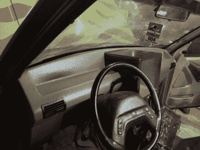

# 不惜代价:克隆侏罗纪公园探索者

> 原文：<https://hackaday.com/2018/05/22/spared-no-expense-cloning-the-jurassic-park-explorer/>

虽然你很难在这些事情上找到任何严肃的数字，但我们敢打赌，没有一部电视剧或电影中的车辆比《侏罗纪公园》中的员工吉普车更被粉丝复制。这并不奇怪:它们不仅看起来很酷，而且相对容易构建。一个体面的油漆工作和一些贴纸将把一个牧马人变成一个“JP 吉普”，约翰哈蒙德自己会感到自豪。

 高度定制化的福特探险者“旅行车”虽然同样具有标志性，但其 DIY 版本却少得多。因为电影中相当大的一部分发生在他们身上，所以内部更加细致，与《股票探险家》没有多少相似之处。建造一辆真正屏幕精确的*侏罗纪公园*游览车被认为是如此困难，以至于自 1993 年电影上映以来没有人成功过。直到 PropCulture 的[Brock Afentul]决定接受挑战。

在历时五年的史诗般的旅程中，[布洛克]创造了他认为是有史以来最精确的*侏罗纪公园*旅行车；看着他把他的探索者和电影里的并排放在一起的照片，很难不同意。大量的工作进入了内部，基本上没有留下什么未被触及的。虽然以前的版本试图修改股票仪表板，使其看起来像电影中的一样，但他用中密度纤维板和泡沫塑料制作了一个全新的仪表板，并涂上了玻璃纤维。具有大型显示屏的中控台也忠实地复制了电影，并运行屏幕精确的动画，地图和旅游信息。座椅也不得不更换，事实上是多次更换，因为他很难找到人按照他的标准来装饰座椅。

T2 但也许最难的部分是透明的丙烯酸屋顶泡沫。这些对电影的拍摄至关重要，因为它们不仅让观众看到了旅游车辆，还让人物看到了标志性的暴龙袭击。但是因为车顶气泡只是为电影创作的，从来没有作为真正的售后产品存在过，所以它通常在旅行车制造中被忽略。对大多数人来说，这太难了。省略泡沫总是被认为是艺术许可的例子；同样的，没有人期望从*回到未来*的复制品能够真正飞行或穿越时间。

但是[Brock]想一直开着他的旅行车，所以他和当地的一家玻璃店合作，让他在他们的烤箱里租时间，这样他就可以加热丙烯酸板。一旦加热到适当的温度，它们就可以被取出并缠绕在模具上来制造气泡。这个过程花了数周时间来完善，但最终他和几个朋友找到了窍门，并能够制作出一个华丽的屋顶泡沫，安装在已经非常令人印象深刻的探险家上。

虽然[以前的*侏罗纪公园*的旅游车辆复制品无疑是令人敬畏的](https://hackaday.com/2016/01/28/ford-explorer-lives-again-as-a-jurassic-truck/)，但这一次建造确实将它带到了一个新的水平。除了给车库[配备一台电影般精确的超级计算机](https://hackaday.com/2011/06/12/rescuing-surplus-blinkenlights/)，很难看出这个标准还能有多高。