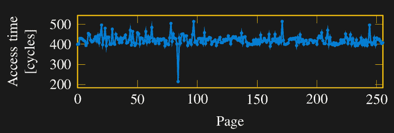

# 幽灵和熔毁:攻击者总是有优势

> 原文：<https://hackaday.com/2018/01/10/spectre-and-meltdown-attackers-always-have-the-advantage/>

虽然整个行业都在争夺 Spectre，但 Meltdown 将大部分注意力集中在英特尔身上，互联网评论中也不乏愤怒。像许多伟大的发现一样，这一发现在事后看来是显而易见的。以至于反应谱跨越了一个极端的范围。从“这么明显，英特尔工程师一定是傻逼”到“这么明显，英特尔工程师一定早就知道！他们与美国国家安全局合谋不让我们知道这件事！”

我们不会试图动摇那些选择相信一个对每个人来说既秘密又显而易见的阴谋的人。然而，作为非显而易见的证据，一些非常聪明的人在去年夏天非常接近崩溃效应，但没有完全明白。[Trammel Hudson]做了一些调查，[发现了一篇 20 世纪 90 年代早期的论文](https://pdfs.semanticscholar.org/2209/42809262c17b6631c0f6536c91aaf7756857.pdf) (PDF)，该论文警告将信息提取到可能跨越权限边界的缓存中的危险，但它直到最近才被武器化。简而言之，这些都是旧的漏洞，但是利用它们是非常困难的，以至于花了 20 年的时间。

制造一个新的 CPU 是一个大型团队历时数年的工作。但是他们并不是一直都在做同一件事。任何单一的功能都是一个小型工程师团队几个月的工作成果。在开发过程中，他们修复了许多我们永远看不到的问题。但归根结底，他们也是人。他们可以达到 99.9%的完美，但这还不够好，因为一旦硬件发布到世界上:这是团队错过的 0.1%的开放季节。

攻击者胜算很大。防御团队有几个人工作几个月来防范所有已知和尚未发现的攻击。这是一场与后来的攻击者的艰难比赛:他们有更多的人，他们在不断完善艺术状态，如果他们需要，他们有二十年的时间来解决一个问题，他们只需要找到一个单一的缺陷就可以获胜。从这个角度来看,《幽灵党》和《熔毁》这样的作品可能会一直伴随着我们。

让我们来看看为英特尔目前的尴尬局面铺平道路的一些因素。

在英特尔的 x86 系列处理器中，1995 年的[奔腾 Pro 是第一个执行推测执行的处理器](http://ieeexplore.ieee.org/document/569689/)。它是为多用户服务器等要求苛刻的角色提供的高端产品，因此它必须防止低权限用户的应用程序失控。但是这个设计只考虑了直接的访问方法。在模拟世界[的那个时候](https://hackaday.com/2009/01/25/tempest-a-signal-problem/)，旁道攻击的一般概念已经很好地建立起来了，但是它还没有被证明适用于数字世界。例如，在侧信道攻击方面的开创性论文之一，[从某些加密算法实现中提取加密密钥](https://www.rambus.com/timing-attacks-on-implementations-of-diffie-hellman-rsa-dss-and-other-systems/)，直到奔腾 Pro 上市一年后才发表。

在 20 世纪 90 年代，计算机安全是一个非常不同而且小得多的领域。例如，Internet Explorer 6(T1)是许多安全课程的主题，直到 2001 年才发布。我们的全球互联网络的增长将扩大机会，并推动进攻和防御方面的安全研究的巨大增长，但这仍需数年时间。在 20 世纪 90 年代初，软件安全处于如此糟糕的状态，以至于只有少数研究人员在研究硬件。

## 对速度的需求

在这段时间里，当更多的人更努力地寻找更多的东西时，英特尔对速度的永无止境的追求无意中使漏洞更容易被利用。从历史上看，CPU 性能的提高超过了内存性能的提高，它们之间不断扩大的差距拖累了整体系统性能。CPU 内存高速缓存的设计是为了帮助攀登这道“内存墙”，这在 1994 年的 ACM 论文中有所描述。奔腾 Pro 的性能提升来自于将其 L2 高速缓存从主板转移到芯片封装中。后来的处理器增加了第三级高速缓存，最终英特尔将一切都集成到了一块硅片上。这些进步都使得缓存访问速度更快，但也增加了读取缓存和未缓存数据之间的时间差。在现代处理器上，这种差异在背景噪音的背景下非常明显，如[这篇关于 Meltdown](https://arxiv.org/abs/1801.01207) 的论文所示。

未来发展到今天:针对高速缓存的计时攻击已经变得非常普遍。去年，所有明星联合起来，多个团队独立地研究如何运用这些技术来对抗投机性执行。鸣谢归功于谷歌 Project Zero 的 [Jann Horn，他是第一个在 2017 年 6 月通知英特尔 Meltdown 的人，引发了对如何处理这个问题的调查，这个问题的种子在 20 多年前就埋下了。](https://googleprojectzero.blogspot.com/2018/01/reading-privileged-memory-with-side.html)

这一事件将作为计算机安全的里程碑而被铭记。这是一个痛苦的教训，其影响将持续一段时间。我们完全有权利让行业主导的英特尔保持高标准，并将它们置于聚光灯下。我们期待缓解和修复。使用慢速内存的快速处理器的基本不匹配将持续存在，因此 CPU 设计将响应这些发现而发展，并且技术水平将向前发展。无论是如何发现问题，还是如何应对问题，因为肯定有更多的缺陷等待发现。

所以如果你想继续骂英特尔工程师傻逼，我们也拦不住你。但是我们认为这个故事的寓意是，总会有这样的漏洞，因为攻击比防御容易得多。英特尔工程师可能在过去做出了他们认为合理的安全性与速度的权衡。考虑到 1995 年的情况，以及花了 20 年时间和一些非常聪明的黑客技术将这个设计缺陷武器化的事实，我们会说他们可能是对的。当然，既然猫已经从袋子里出来了，那就需要更多的聪明来解决它。