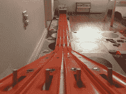

# 用压铸的牵引带测试你的玩具的速度

> 原文：<https://hackaday.com/2016/12/17/speed-test-your-toys-with-die-cast-drag-strip/>

我敢肯定，我们很多人都记得小时候建造玩具赛车跑道，赛车，然后争论哪辆车先来，谁作弊了，因为他们太早放开了他们的车。啊，美好时光。[Phil]想为他的儿子建造一条赛车道，向他介绍压铸汽车。[Phil]能找到的唯一一个商业拖动带没有电子启动门或计时器，[所以他在 Arduino、伺服系统和一些光敏电阻的帮助下创造了自己的](http://www.unmaintained.com/index.php/arduino-hot-wheels-drag-strip-race-track)。

Arduino 控制着一切，按钮输入、光线传感器输入和伺服系统。按下按钮，Arduino 将启动门拉下并启动计时器，开始比赛。当光传感器被盖住时，该车道的计时器停止计时。使用不同颜色的 4 位 7 段 LED 显示每个车道的时间。

有几个问题需要解决。启动赛车的伺服系统在启动时消耗了太多的能量，以至于在比赛开始前，终点线上使用的红外发光二极管会变暗到足以触发！[Phil]的文章回顾了这些问题以及他建造赛道时的设计理念。

这是一个简单的构建，多年来应该为[Phil]的儿子和他的朋友提供数小时的乐趣，并有望平息任何关于谁赢了的争论。在[Phil]的文章中有许多照片，以及几个展示事情如何工作的视频，在文章的结尾，他包括了他用来控制一切的代码。这将是一个很大的惊喜，任何侄女和侄子来访问在假期-你可能想等待最后组装，并包括他们在乐趣！

如果你喜欢这类项目，我们已经看到了类似的[风火轮计时系统](https://hackaday.com/2015/01/19/diy-hot-wheels-drag-race-timer/)，以及基于转盘系统的不同类型的赛道[。](https://hackaday.com/2016/06/22/real-world-race-track-is-real-hack/)

 [https://www.youtube.com/embed/gzuMrknRq5g?version=3&rel=1&showsearch=0&showinfo=1&iv_load_policy=1&fs=1&hl=en-US&autohide=2&wmode=transparent](https://www.youtube.com/embed/gzuMrknRq5g?version=3&rel=1&showsearch=0&showinfo=1&iv_load_policy=1&fs=1&hl=en-US&autohide=2&wmode=transparent)

