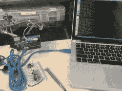
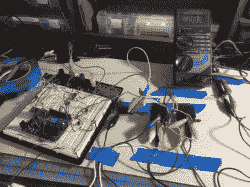
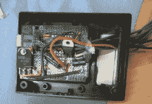

# 剧透警报！修理赛车会变得很复杂，很快。

> 原文：<https://hackaday.com/2017/08/28/spoiler-alert-repairing-a-race-car-can-get-complicated-fast/>

[Big Fish Motorsports]有一辆带有可调后扰流板系统的汽车，在一场大型比赛的准备阶段发生了故障。最初的建造者已经擅离职守，所以[奎因·邓基]的大量才能被用来使它再次工作。

打开神秘的黑色控制盒，发现了一个 Arduino，一个  ProtoShield 和第一个主要路障:尽管有几种不同的方法试图读取源代码，Arduino 仍然顽固地与世隔绝。原来 Arduino 的 ATMega324 被配置为不可读或简单地烧毁，但 ATMega128 [Quinn]被证明是一个有能力的替代品。然而，在不知道这个扰流器系统的 10 个继电器是如何配置的情况下，以及比赛日的最后期限越来越近的情况下，[奎因]选择放弃原始设计，用她手头的东西拼凑出她自己设计的东西。

在对一些新代码 a  进行模拟测试并且没有问题之后，为 Arduino 提供稳定的电源是下一个主要障碍。由于汽车不能提供良好稳定的电源——此外还有许多不可预测的中断——7809 电压调节器在保护 Arduino 方面发挥了作用。但是扰流板的电动机呢？嗯，一个 2N3904 NPN 晶体管在理论上是工作的——直到它烧坏了，被一个从原始电路中抢救出来的结实的 160V，15A 晶体管取代。三个常见的——预期任何比赛日故障——SPDT 汽车继电器驱动扰流器电机，一个精心放置的“飞轮”LED，在电机关闭时处理电涌。

因此，扰流器处于向下配置，当驾驶员觉得需要时，可以按下按钮将其升起，但刹车时呢？嗯，[奎因]能够搭载一个信号关闭刹车灯，以自动提高扰流每当烘烤从事。厉害！

因此，在剥离原始的 ProtoShield，将其回收用于她的新电路  并将其组装在一起后，它成功了！清理并关闭原始项目箱，以便这次它实际上可以保护电子设备，以及适当的文档和汽车图表，该系统准备好被及时运回，以便汽车在情有可原的情况下离开道路。

黑客赛车可以提高性能——就像我们在这里所做的——或者让粉丝们[更接近比赛](http://hackaday.com/2011/07/15/race-car-pov-led-displays/),但我们最喜欢的一次是当我们展示一辆实际上是[两栖比赛直升机](http://hackaday.com/2016/10/31/vietnam-war-helicopter-turned-amphibious-racecar/)的赛车时。