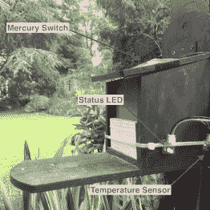
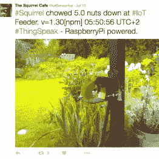

# 松鼠咖啡馆根据顾客数据预测天气

> 原文：<https://hackaday.com/2016/07/28/squirrel-cafe-to-predict-the-weather-from-customer-data/>

物理学家兼松鼠美食家 Carsten Dannat 试图将两个关键的社会经济因素联系起来:我们还剩下多少个夏天，我们什么时候会把坚果吃完。他的研究项目[松鼠咖啡馆](http://www.thesquirrelcafe.com/)，邀请松鼠抓取一些免费坚果，并收集一些有趣的顾客数据作为回报。

据说动物对自然事件有预知能力，卡斯滕的实验就是为了验证这一点。[Carsten]试图用这个装置证明的假设如下:

> 红松鼠从松鼠喂食器中获取坚果的数量与即将到来的冬季天气状况显著相关。

为了证明这一点，[卡斯滕]定期用已知数量的坚果填充木制松鼠喂食器。喂食器盖上的水银开关触发了树莓 Pi 上的 Python 脚本的执行。该脚本然后轮询 Dallas DS18B20 温度传感器，并通过 Raspberry Pi 相机模块拍摄照片。所有收集到的数据都被自动编译成一条推特(tweet),并被发送到 [ThingSpeak](https://thingspeak.com/) 进行进一步处理。

      

这种设置运行良好，为松鼠提供了花生，为[Carsten]提供了宝贵的数据。下面的视频表明，小家伙们倾向于一次拿一个坚果，所以水银开关可以有效地计数单个坚果。当重新灌装时，[Carsten]会检查实际上从工作站取走了多少坚果，这使他能够更准确地跟踪坚果的消耗量。

然而，出于某种神秘的原因，当地的松鼠群体最近决定完全抵制这家咖啡馆。两个星期以来，没有一个客人出现。这几天[的室外温度](http://www.thesquirrelcafe.com/thingspeak/temperature/)约为 35°C(95°F ),所以关于这个假设，食欲不振可能已经是松鼠坚果消费的某种天气依赖性的指标。当然还有更多因素需要考虑，比如整体食物供应、本能行为和软件缺陷，但我们已经很好奇当气温再次下降时，我们是否会看到更多的松鼠。我们的读者怎么看，松鼠真的能预测天气吗？

欣赏下面的视频，它展示了咖啡馆里毛茸茸的客人们在度暑假之前的样子:

 [https://www.youtube.com/embed/M2A6sbFU2SU?version=3&rel=1&showsearch=0&showinfo=1&iv_load_policy=1&fs=1&hl=en-US&autohide=2&wmode=transparent](https://www.youtube.com/embed/M2A6sbFU2SU?version=3&rel=1&showsearch=0&showinfo=1&iv_load_policy=1&fs=1&hl=en-US&autohide=2&wmode=transparent)

