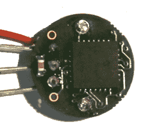

# SRF01 超声波传感器拆卸

> 原文：<https://hackaday.com/2015/11/28/srf01-ultrasonic-sensor-teardown/>

SRF01 是一款流行的超声波传感器，主要用于测距应用。[Jaanus]发现他们有一些缺陷，包括在被丢弃后无法工作。有缺陷的开始堆积起来，所以他决定到[把一个拆开](http://jaanus.tech-thing.org/teardowns-and-reviews/srf01-teardown/)，并运用他的工程技能。

SRF01 的独特之处在于它仅使用一个传感器，而不像 [SRF04](http://www.robot-electronics.co.uk/htm/srf04tech.htm) 使用两个传感器。当测量非常近的距离时，仅使用一个传感器存在问题。传感器发出声音脉冲，然后必须倾听回声。距离越小，脉冲和回声返回的时间间隔越短。这个时间有一个基本限制，因为传感器必须从所谓的振铃中恢复。[Jaanus]发现 SRF01 利用 PIC24 的 ADC 及其 500 ksps(每秒千样本)的速率解决了振铃问题。这使得它可以测量非常近的距离。

请务必查看拆卸，了解更多关于 SRF01 如何工作的细节。