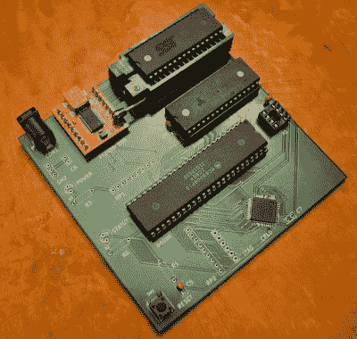
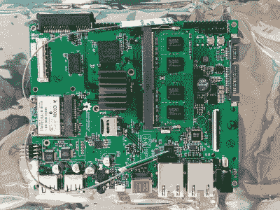

# 斯托曼的一个错误

> 原文：<https://hackaday.com/2016/01/13/stallmans-one-mistake/>

我们都欠[理查德·斯托尔曼]一大笔债，因为他对计算机做出了贡献。随着职业生涯开始于麻省理工学院的人工智能实验室，[斯托曼]在那里创造了一些最前沿的技术。他见证了一些最早的 Lisp 机器，互联网的诞生，是 Emacs 和 GCC 的必要贡献者，也是 GPL 创建的基础，GPL 许可证使芬兰 cs 学生的玩具操作系统成为这个星球上最流行的操作系统。不夸张的说，没有[Stallman]，开源软件就不会存在。

没有开放许可的许可证，Linux、Apache、PHP、Blender、Wikipedia 和 MySQL 根本就不会存在，而且我们都因为[Stallman]关于软件应该免费的见解而变得更加富有。另一方面，硬件不是。也许这只是 Stallman 提出他的观点的时间的作用，但是直到最近，开放硬件一直是不同设计的不同方面的不同许可证的组合。即使在最开放的设备中，固件使用 GPLv3，硬件文档使用 CERN 许可，知识共享散布在各种资产中。

如果说[斯托曼]犯了一个错误，那就是他没能预见到硬件最终会发生的一切。这方面的第一场战斗是十年前硬件的[数字化](https://en.wikipedia.org/wiki/Tivoization)，导致了 GPLv3 的诞生。尽管如此，这个许可证并不包括硬件，这导致了一个有趣的思想实验:构建一个完全开源的计算机需要什么？这可能吗？

### 思想实验

虽然开源并不真正适用于硬件本身，但有可能建造一台每行代码都可用的计算机吗？有没有可能只用印刷文档和键盘就能建造一台完整的计算机？是的，对于不同价值的计算机。

即使是简单的电脑也能运行 Linux。史蒂夫·钱伯林[基于 68008](http://www.bigmessowires.com/68-katy/) 制造了一台四芯片电脑，运行的是非常老版本的 Linux。我们可以从最简单的例子开始，任何人都可能制造的最基本的计算机。幸运的是，家酿有这种类型的建设锁定。最简单的开源计算机可能是基于 6502 CPU，有少量的 RAM 和 ROM，用 74 系列胶水逻辑绑在一起。视频可以用[摩托罗拉 6847 视频显示发生器](https://en.wikipedia.org/wiki/Motorola_6847)完成，通过键盘的输入可以用 6522 过孔完成。

对于软件，有几十种选择可供选择。第四，Basic 和 CP/M 都是为这样的计算机设计的。只有几个字节的 ROM，很容易构建一个完全开源的计算机，所有的东西——固件、原理图和所有程序代码——都开放供检查。

从底层开始是构建一台完全开源的计算机的简单方法，但这并不能造就一台好机器。WiFi 是不可能的，串行端口是你能得到的最好的网络，任何现代的工作流程都是完全不可能的。从顶层开始，然后一步步往下，怎么样？让我们把这个思想实验扩展到一台现代计算机，把所有东西都拆开，直到它变成一台开源的、可用的计算机。

### 可用的开源计算机

情报出来了。英特尔管理引擎(ME)是一个小型协处理器，嵌入自 2006 年以来生产的每台英特尔 PCU 中。该芯片可以访问加密引擎、ROM、RAM 和网络。它本身就是一台完整的计算机，很少有人知道它是如何工作的。虽然它是一个完美的后门，但它违背了每一种开源思想，并且不会出现在完全开源的笔记本电脑中。

追溯到更早的英特尔芯片时代，从 8080 开始的每个 x86 芯片都包含微码，这是一种告诉电路如何执行每个指令的低级软件。在过去的 20 年里，微代码几乎出现在每一个 CPU 架构中，只有一个显著的例外:ARM 芯片。

The motherboard of Novena, the open source hardware laptop. [source](https://commons.wikimedia.org/wiki/File:Novena_laptop_motherboard.jpg).

Chumby 和最初的 XBox hack 背后的工程师[Bunnie]，[为自己建造了一台开源笔记本电脑](http://hackaday.com/2012/12/16/bunnie-builds-a-laptop-for-himself-hopefully-us/)。它被称为 Novena，三年后，这款笔记本电脑终于进入了众筹支持者的手中。Novena 基于飞思卡尔的 i.MX6 芯片，这是一款运行频率为 1.2 GHz 的四核 ARM Cortex A9 芯片。该 CPU 没有任何微码，整个数据表和编程手册可从 Freescale 获得，没有 NDA。很少有强大的处理器不需要 NDA，这使得[邦尼]对芯片的选择显而易见。

尽管 Novena 是市场上最开放的 CPU 之一，但并不是所有的都是免费的。由于二进制 blobs，WiFI 卡的选择非常有限，由于同样的原因，Vivante GC2000 GPU 不能用于 3D 加速。尽管如此，Novena 仍然是现存的最有用的开源和开放硬件计算机。

也就是说，Novena 只是一块主板，而计算机不仅仅是一块玻璃纤维和铜。有硬盘，显示器，键盘，甚至网络摄像头要考虑。

### 键盘、网络摄像头和硬盘

如果开源计算机的目标是让你免受攻击者的攻击，你必须考虑连接到计算机的所有东西。这包括外围设备、驱动器以及将大型电路板变成脸书机器的所有东西。

虽然 Novena 可能是第一台可用的开源计算机，但外设却不是。推荐与 Novena 一起使用的键盘是联想键盘，基本上是将 Thinkpad 键盘重新包装成 USB 桌面键盘，拆开，然后扔进笔记本电脑机箱。它很有效，在机械键盘社区重新发现 Cherry ML 开关之前，它是我们将拥有的最好的开关。

同样，在 Novena 上安装网络摄像头的最佳方式是通过 USB。这是一个问题。2014 年， [BadUSB 引起了社区的注意](http://hackaday.com/2014/10/05/badusb-means-were-all-screwed/)，它意味着我们完蛋了。BadUSB 为任何 USB 设备中的微控制器添加了邪恶的功能，允许攻击者通过假冒的以太网连接进入计算机。只要插上 BadUSB 感染的键盘或网络摄像头，计算机就有风险。令人惊讶的是，BadUSB 攻击是开源软件中最容易对付的攻击之一；构建 USB 键盘就像对 Arduino 编程一样简单，使用更小的 ARM 芯片构建 USB 网络摄像头也是可能的。然而，到目前为止，我还没有看到许多关于 BadUSB 开源外设的争论。

![[Sprite_TM]'s hard drive hack from OHM2013](img/345db31d1fd2ca7ad7a71b76b94c35cf.png)

【Sprite _ TM】的硬盘 hack from OHM2013

如果说键盘和鼠标在开源的主持下很容易打造，那么硬盘就不容易了。即使是最基本的硬盘驱动器内部也有三核控制器芯片，几乎无法通过任何代码检查。

几乎坚不可摧并不意味着不可能，硬件社区再次为开源硬盘奠定了基础。在 OHM2013 上，[Sprite_TM]发表了一篇关于逆向工程硬盘控制器板的演讲[。虽然这是一个没有先例的项目，但它也没有先例；似乎没有人真正关心硬盘上运行的软件。这有点令人惊讶，因为硬盘包含了计算机上的所有数据。也就是说，你现在可以用你能想象的最奇怪的方式在硬盘上安装 Linux。](http://hackaday.com/2013/08/02/sprite_tm-ohm2013-talk-hacking-hard-drive-controller-chips/)

### 斯托尔曼溶液

一台完全开源的计算机几乎是不可能的，人们不得不怀疑 Stallman 用的是什么。[这是有据可查的](https://stallman.org/stallman-computing.html)。这是一台装有[libre boot 开源固件](https://libreboot.org/)的旧 Thinkpad。这台电脑中的驱动器肯定是运行专有代码，笔记本电脑的键盘是一个 USB 设备，可能会受到威胁。

无论从哪方面来看，这都不是一个理想的解决方案，这是与开源软件多样性相匹配的开源硬件生态系统的最大障碍。如果有什么不同的话，在创建 GPL 时不考虑硬件是[Stallman]的一个错误。我们最终会达到这样一个地步，你可以检查每一个连接到计算机的外围设备上运行的所有代码，但这不会很快。