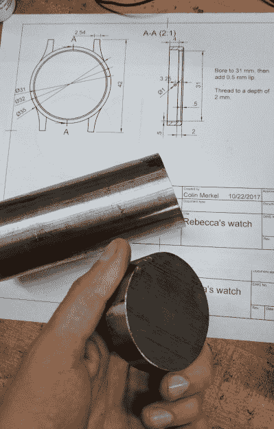

# 星图手表是一个浪漫的悲剧

> 原文：<https://hackaday.com/2018/01/10/star-chart-watch-is-a-romantic-tragedy/>

越来越明显的是，[科林·默克尔]不知道“足够好”的定义。他不仅最近完成了他的第三枚(也是最令人印象深刻的)腕表，而且他还设法组装了有史以来最荒谬的浪漫礼物之一。当我们中的一些人给我们重要的人一张星巴克的礼品卡时，他给他的女朋友做了一块手表，上面有一张图表，代表他们第一次见面的时间和地点的星星位置。

按照他一贯的风格，这个版本的文档是惊人的。如果翻阅他的建造图片库不能让你想要一台车床并开始学习金属加工，那就没什么能让你这么想了。一大块不锈钢棒在几十张图片的过程中奇迹般地变成了一只华丽的腕表，完美地概括了那句古老的格言“让它看起来简单”。

All you have to do is turn this into that. Easy.

当然，这个造型的亮点是正面的星图。为了做到这一点，他用 [PyEphem](http://rhodesmill.org/pyephem/) 标出了他们第一次见面的时间和地点可见的最亮的星星的位置。然后，他编写了一个脚本，将这些星星的位置转换成 g 代码，CNC 可以用它在适当的位置钻孔。洞的深度甚至与每颗恒星的星等(亮度)相对应，给图表带来微妙的 3D 效果。

不幸的是，[Colin]在这个构建过程中犯了几个错误，以至于他不确定该如何继续。他提到他甚至可能被迫从头开始。很难想象看起来这么好的东西怎么会以失败告终，但制表业是无情的。

首先，他用 304 不锈钢代替 303 不锈钢。这使得加工表壳更加困难，从他第一次切割开始，他就意识到这将是一个问题。虽然这是他在构建日志中多次提到的烦恼，但他至少能够解决它。

真正的问题出现在最后，当他把表组装起来的时候。他最初进行设计时假设前玻璃为 0.5 毫米厚，但实际上使用了 0.8 毫米厚的玻璃。这种微小的差异足以导致秒针在玻璃上摩擦，从而拖累机芯。最终结果是电池会非常快地耗尽，从而使手表变得毫无用处。

我们无法想象[科林]意识到发生了什么时的心碎感觉；光是读到它，我们就感觉很糟糕。但考虑到他的过往记录，我们毫不怀疑他会解决这个问题。从头再来是一件令人遗憾的事情，但知道这是学习过程的一部分会让你感到些许安慰:在学习过程中不犯几个错误，你就不会成为一个大师。

这款腕表的前身在去年的 Hackaday 展会上亮相，给人留下了深刻的印象。看到两者之间的改进是很有趣的，我们当然很兴奋看到他的下一个版本。