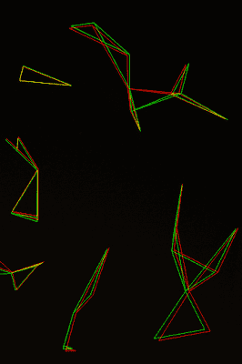

# 星星看起来有点暗淡？给他们点数学知识。

> 原文：<https://hackaday.com/2018/06/06/stars-looking-a-bit-dim-throw-some-math-at-them/>

随着高分辨率图像传感器的成本越来越低，小而便宜的单板计算机的可用性飙升，我们开始看到比以往更多的天体摄影项目。当你可以把 5 美元的 Raspberry Pi Zero 和一个像样的网络摄像头放在一个盒子里，整夜自动拍摄天空时，为什么不试一试呢？但在这样做的时候，许多黑客认识到了一个传统望远镜操作者熟知的事实:看到几颗星星很容易，看到很多星星完全是另一回事。

 问题是恒星相当暗淡；除非你在农村地区，否则光污染会加剧这个问题。你也不能仅仅让图像变亮，因为那只会增加图像中的噪点。作为一名总是在寻找挑战的程序员，[ [ Benedikt Bitterli]决定尝试使用软件来改善天体摄影图像](https://benedikt-bitterli.me/astro/)。他在他的博客上记录了整个过程，失败和所有的一切，为那些可能好奇到底是什么创造了我们在教科书上看到的不可思议的夜空图像的人。

原则上这很简单:只需拍摄大量天空照片，将它们堆叠在一起，并识别哪些光点是恒星，哪些是噪声伪像。但是执行起来当然要困难得多。首先，除非相机安装在自动跟踪天空的支架上，否则每张照片中的星星都会轻微移动。为了帮助这一过程，[Benedikt]使用了人类依赖了几千年的导航技巧:绘制星座图。通过比较每张图像中的恒星分组，他的软件能够准确地覆盖每张图像。

但这只是等式的一部分。在他的文章中，[Benedikt]回顾了当数字图像传感器观察黑色时，在噪音海洋中识别单个恒星的令人难以置信的数学量。你当然不需要理解所有的数学来欣赏最终的结果，但对于那些对计算机视觉概念感兴趣的人来说，这是一部引人入胜的读物。

这种软件正是你想要的[与你的 3D 打印星体追踪器](https://hackaday.com/2018/06/03/3d-printed-clockwork-star-tracker/)配对，或者更好的是一个[树莓派天空监测站](https://hackaday.com/2017/11/09/weatherproof-pi-looks-up-so-you-dont-have-to/)。

【感谢 Helio Machado 的提示。]