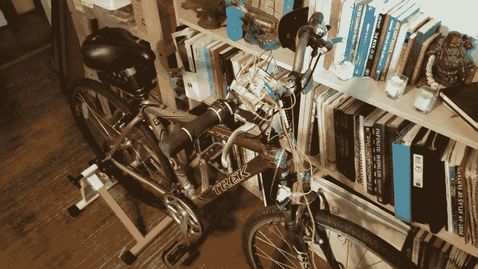

# 呆在家里玩 Skyrim 从来没有这么健康过

> 原文：<https://hackaday.com/2016/07/09/staying-in-and-playing-skyrim-has-rarely-been-this-healthy/>

想给你的一天增加一些活动，但又不想付出太多努力？[D10D3]拥有完美的解决方案，使您能够通过 Skyrim 悠闲地骑自行车。站立自行车与 HTC Vive(使用附加驱动程序 VorpX，允许使用 vr 耳机玩非 VR 功能的游戏)和 Makey Makey board 相结合，使 slack-exercise(现在是一个词)成为你日常游戏制度的一部分。

[Makey Makey](http://www.makeymakey.com/) 是钻机的骨干；它允许用户用对应于键盘和鼠标输入的电触点设置自己的输入，从而允许一个人以一些潜在的非正统方式玩视频游戏——在这种情况下，骑自行车。

设置几个按钮来控制龙人被证明是一个简单的过程。控制一些主要输入的按钮被插入到试验电路板电路中，然后使用跳线将该电路与 Makey Makey 以及接地线相连。作为一个整洁的补充，一些铝箔作为把手的良好接触，作为左看和右看的输入。考虑到 Vive 的头部跟踪也会移动相机，这被证明是一个令人迷惑的附加功能。

将试验板和按钮用拉链绑在自行车上，完成了这个简单又有健康意识的小窍门，效果非常好。如果你正在寻找另一种保持活跃的方式，那么鼓励身体活动的个人能量球怎么样？

[通过 [/r/DIY](https://www.reddit.com/r/DIY/comments/4qu37z/i_built_a_rig_to_ride_my_bicycle_through_skyrim/)