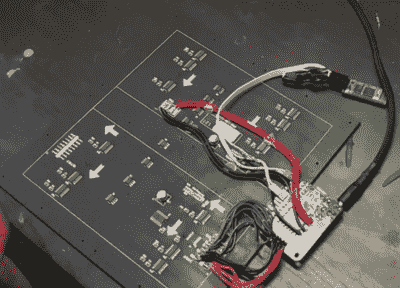

# 隐形迫击炮板在毕业典礼上释放金光

> 原文：<https://hackaday.com/2016/05/14/stealthy-mortar-board-unleashes-bling-at-graduation-ceremony/>

装饰毕业帽经常遭到校方的反对，但(丹·巴克斯)正在挑战他的学校当局，当他们看到他的所作所为时，要忍住不笑。他的造型会让观众眼花缭乱，他在帽子顶部安装了 1024 个 32×32 矩阵的 RGB 发光二极管，但隐藏在帽子的黑布下面。当发光二极管关闭时，他是不可区分的，当他点亮发光二极管时，光芒四射，上演了一场好戏。他可以在他的电话上键入消息以显示在帽子上。他甚至可以显示图像和动画 gif。

LED array control components

LED 显示屏是一个 [Adafruit 32×32 RGB LED 矩阵面板](https://www.adafruit.com/products/1484)。为了控制显示器，[丹]使用了一个 [Teensy，一个 32 位 ARM Cortex-M4 微控制器板](https://www.adafruit.com/products/2756)。无线通信通过 [JBtek HC-06 蓝牙板](http://www.amazon.com/JBtek-Bluetooth-Converter-Serial-Communication/dp/B00L08GA4Q)完成。

LED 显示屏在全白亮度下可以消耗高达 4 安培的电流，因此他选择了一个带有两个输出端口的 USB 电池，一个输出端口的电流为 2.1 安培，另一个为 2.4 安培。然后，他拼凑了一根电缆，一端有两个并行连接的 USB 连接器，另一端有一个 DC 插孔。总的来说，电池组能够通过这两个端口提供高达 4.5 安培的输出，满足 LED 显示屏的需求。DC 插孔插在天线上，所有的电力都从那里通过。

[丹]遇到的一个问题是蓝牙模块在十几岁之前就启动了。它没有及时发现问题，导致蓝牙无法工作。他找到的解决方案显示在下面嵌入的第二个视频中。该修复程序单独为蓝牙模块供电，使用限流电阻器和电容器来建立电压，延迟足够长的时间让青少年获胜。

除了放在他口袋里的电池组之外，几乎所有组件都安装在帽子的顶部。他小心翼翼地把电源线藏了起来，因为它从盖子的侧面一直延伸到电池组。

 [https://www.youtube.com/embed/OaaCpUfTQp4?version=3&rel=1&showsearch=0&showinfo=1&iv_load_policy=1&fs=1&hl=en-US&autohide=2&wmode=transparent](https://www.youtube.com/embed/OaaCpUfTQp4?version=3&rel=1&showsearch=0&showinfo=1&iv_load_policy=1&fs=1&hl=en-US&autohide=2&wmode=transparent)

我们不知道[丹]是否打算制作第二部分的视频(也许是关于软件的？)但是下面的第 1 部分视频展示了他是如何把硬件组合在一起的，以及他遇到的一些问题和他的解决方案。

 [https://www.youtube.com/embed/n36_bOPCvMg?version=3&rel=1&showsearch=0&showinfo=1&iv_load_policy=1&fs=1&hl=en-US&autohide=2&wmode=transparent](https://www.youtube.com/embed/n36_bOPCvMg?version=3&rel=1&showsearch=0&showinfo=1&iv_load_policy=1&fs=1&hl=en-US&autohide=2&wmode=transparent)

[丹]并不是唯一一个在帽子上添加电子产品的人。同样在底层的黑客活动中，[这里有一个红外发光二极管被用来闪烁更多的代码信息](http://hackaday.com/2011/06/19/the-infrared-graduation-cap/)，这是肉眼看不到的，但当时的摄像机通常会拾取。

但是对于那些愿意忍受政府愤怒的人来说，试试在帽子顶部安装一个 256 的 LED 矩阵，或者像杰瑞米·布鲁姆那样在帽子顶部安装一个相当于眩目的太阳亮度的 LED 矩阵。