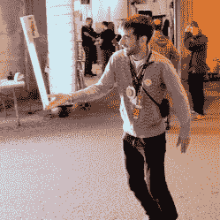

# Stecchino 游戏就是要平衡一根大牙签

> 原文：<https://hackaday.com/2018/03/23/stecchino-game-is-all-about-balancing-a-big-toothpick/>

Stecchino demo by the creator

自称“发明家爸爸”[pepelepison]的项目名为 [Stecchino](http://www.chezpapietmamie.com/pcube/arduino/stecchino/) (英文翻译链接[此处为](https://translate.google.ca/translate?hl=en&sl=fr&u=http://www.chezpapietmamie.com/pcube/arduino/stecchino/))这是一款基于 Arduino 的身体平衡游戏，旨在为所有年龄的人提供直观的使用和游戏。使用 Stecchino(意大利语中的“牙签”)包括平衡你手上的装置，并尽可能长时间保持直立。LED 灯充满了久而久之，并保持着高分记录。它是特别设计的，所有年龄的人都能立即理解并简单使用，我们认为它在这方面取得了辉煌的成功。

为了感测方向和运动，Stecchino 使用 MPU-6050 陀螺仪和加速度计板。RGB LED 条提供反馈，它包括一个小型 li-po 电池和充电器板，便于通过 USB 充电。外壳由几层激光切割和激光雕刻材料制成，也可将组件固定到位。使用的 ~~WS2828B~~ WS2812B LED 灯条从技术上来说是一个 5 V 单元，但是【pepelepoisson】发现从 3.7 V 电池直接给它们供电工作得很好；直到电池电压降到 3 伏左右，事情才开始出故障。所有的源代码和设计文件都在 [GitHub](https://github.com/pepelepoisson/Stecchino) 上。

游戏是伟大的，今天人们可用的精彩选项允许各种有趣的实验，如标签的盲版本[，或对旧经典进行新的扭曲，如](https://hackaday.com/2017/05/23/run-from-the-sound-of-footsteps-in-blind-game-of-tag/)[测试速度而不是强度](https://hackaday.com/2017/09/30/modern-strongman-games-test-your-speed-instead/)。