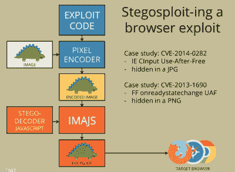
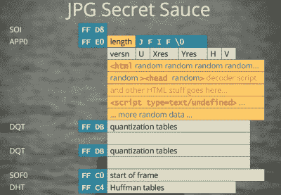

# Stegosploit:由一个 JPG 人拥有

> 原文：<https://hackaday.com/2015/11/06/stegosploit-owned-by-a-jpg/>

我们主要是硬件黑客，但偶尔我们也会看到真正让我们着迷的软件黑客。其中一个黑客是由[Saumil Shah]开发的[Stegosploit](http://stegosploit.info/)。Stegosploit 并不是真正的漏洞利用，与其说它是一种通过将漏洞隐藏在图片中向浏览器提供漏洞利用的手段。为什么？因为没有人希望图片包含可执行代码。

【sau mil】从将真正的漏洞利用代码打包成映像开始。他证明了你可以直接做到这一点，通过在像素的颜色值中编码代码的字符。但这看起来很奇怪，所以代码被以隐写术[传送](https://en.wikipedia.org/wiki/Steganography)，通过在 JPG 或 PNG 图像的最低有效位之间散布代表代码的字符位。

好了，所以漏洞代码是藏在图中的。读出它其实很简单:HTML `canvas`元素有一个内置的`getImageData()`方法，它读取给定像素的(数字)值。一点点 JavaScript 之后，你已经从图像中重建了你的代码。这是偷偷摸摸的，因为现在有漏洞利用代码在你的浏览器中运行，但你的反病毒软件不会看到它，因为它从未被写出——它在图像中，并由看起来无害的“普通”JavaScript 动态重建。

 这里是致命一击。通过将 HTML 和 JavaScript 打包到图像文件的头数据中，您可以得到一个有效的图像(JPG 或 PNG)文件，尽管如此，浏览器还是会将其解释为 HTML。最简单的方法是从网络服务器发送带有 HTTP 头的文件。即使它是一个完全有效的图像文件，带有图像文件扩展名，浏览器也会将其视为 HTML，呈现页面并运行它在其中找到的脚本。

这样做的最终结果是一个单一的图像，浏览器认为它是 HTML，其中包含 JavaScript，它显示有问题的图像，同时解开隐藏在图像阴影中的漏洞代码，并运行该代码。您只拥有一个图像文件！一切看起来都很正常。

我们喜欢这一点，因为它在一次攻击中结合了两个甜蜜的技巧:隐写术来提供漏洞利用代码，以及“多语言”文件，可以通过两种方式读取，这取决于哪个应用程序正在进行读取。在 Hackaday 上进行快速标签搜索会发现很多关于[隐写术](http://hackaday.com/tag/steganography/)的内容，但多语言文件是一种相对较新的黑客技术。

[Ange Ablertini]是将一种文件类型打包到另一种文件类型中的无可争议的大师，所以如果你想了解[Ange]的“多语言”文件类型风格的本质，请观看他在“时髦的文件格式”(YouTube) 上的[演讲。你再也看不到同样的压缩文件了。](https://www.youtube.com/watch?v=Ub5G_t-gUBc)

干得漂亮，对吧？谁说硬件人员可以享受所有的乐趣？