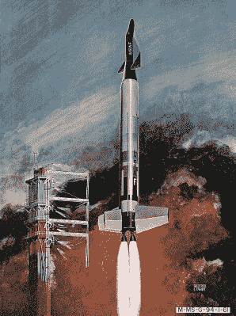
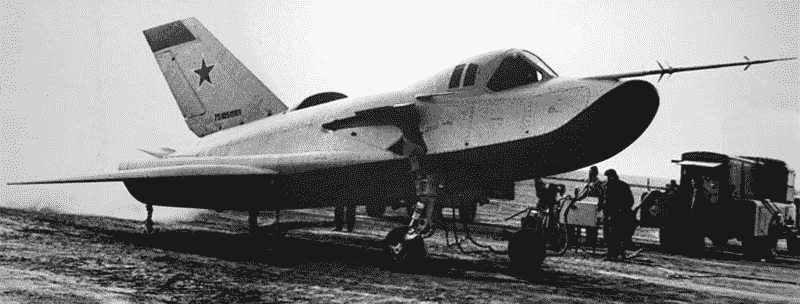

# 被盗技术:苏联航天飞机

> 原文：<https://hackaday.com/2016/04/08/stolen-tech-the-soviet-shuttle/>

美国的航天飞机计划已经寿终正寝。现在可以在航空航天博物馆、肯尼迪航天中心和加利福尼亚科学中心找到这些人造卫星。航天飞机在 135 次发射的职业生涯中使用的发射台正被重新用于 SpaceX 和太空发射系统的车辆。是的，一些硬件和技术将被重新用于 NASA 的下一代重型运载火箭，但轨道飞行器——太空飞机的美丽砖块——将永远停飞。

航天飞机是冷战的产物，虽然轨道飞行器本身从来都不是纯粹的军用飞行器，但在航天飞机的设计过程中做出的选择受到了美国空军的严重影响。苏联敏锐地意识到美国正在建造“太空轰炸机”,并迅速开始发展他们自己的载人航天飞机。

虽然这架苏联航天飞机不会像它的美国同行一样成功——单个完成的飞行器只能无人驾驶飞行一次——但这架太空飞机的故事是有史以来最伟大的间谍故事之一。它以一艘可能比它的美国孪生兄弟更有能力的宇宙飞船而告终。

The X-20 Dyna-Soar project was cancelled by the US Air Force before a prototype vehicle was built.

从一开始，可以在世界各地跑道降落的太空飞机的想法就是美国太空计划的一部分。1957 年，美国空军启动了 X-20 Dyna-Soar 项目，以开发一种载人航天飞机，用于轨道侦察、轰炸以及拦截、修复或破坏轨道上的卫星。

Dyna-Soar 项目将在车辆制造之前结束，但可重复使用的太空飞机的想法已经存在。这可能不是一个好主意:Dyna-Soar、蓝色双子座和载人轨道实验室都是美国空军因缺乏明确目标而放弃的项目。

然而，苏联一直认为太空中的军事设施是有目的的。在 20 世纪 70 年代早期到中期，苏联的几个军事空间站都进行了飞行，其中一个发射了 23 毫米或 30 毫米的大炮，作为对空间站自卫能力的测试。

1974 年，苏联军事工业委员会主席弗拉迪米尔·斯米尔诺夫在与列昂尼德·伊里奇·勃列日涅夫的一次会议上组织了未来几年的优先事项。夸大美国的能力总是符合斯米尔诺夫的最大利益；恐惧意味着资金，这种恐惧是针对国会还是党的领袖是无关紧要的。在他的报告中，斯米尔诺夫告诉勃列日涅夫，“美国人正在研究一种有翼的太空飞行器……能够以这样一种方式改变其轨道，使其在正确的时刻发现自己正好在莫斯科上空，可能载有危险的货物。”

### 航天飞机的军事应用

根据我们对 133 次成功任务的了解，美国宇航局航天飞机的设计非常奇怪。航天飞机轨道器的控制表面比它们需要的要大，特别是考虑到每一磅的航天器意味着少一磅的有效载荷。这些巨大的操纵面的原因是美国空军参与了航天飞机的设计。空军想要一种运载工具，它将从加利福尼亚海岸的范登堡空军基地向北发射，在苏联领土上空做一些事情，飞越南极，并在一个轨道后返回加利福尼亚。

这项从未执行过的任务对航天飞机轨道器设计的影响比其他任何任务都要大。在这个 90 分钟的任务中，地球将在航天飞机下旋转。对于一架空气动力学性能类似于砖块的滑翔机来说，在加利福尼亚发射和着陆需要大约 1500 英里的横向飞行能力。

航天飞机轨道器的垂直稳定器比它需要的要大，机翼比任何任务需要的都要大。可以说，航天飞机轨道器的军事要求使得它昂贵得令人难以置信，而且对于载人航天飞行来说本身就不安全。然而，在 1974 年，美国人正在研制一种具有军事用途的太空飞机，它可以飞越莫斯科，投下一枚炸弹，然后飞到安全的地方。

回想起来，太空轰炸机的想法似乎很可笑。1974 年，美国和苏联都拥有大量洲际弹道导弹，可以在几分钟内发射，并向地球另一端的目标发射数十枚弹头。

### 苏联航天飞机的起源

冷战是美国和苏联针锋相对的演习。当苏联资助越南，将美国拖入东南亚长达十年的战争时，美国会资助圣战者，迫使苏联在阿富汗发动一场毫无意义的战争。当美国空军开始通过 Dyna-Soar 项目开发小型太空飞机时，苏联人将开发螺旋，这是一种小型航天器，可以垂直发射并在世界上几乎任何跑道上着陆。

The MiG-105-11, part of the Spiral aerospace system developed in the mid 1960s and halted in 1969\. Spiral was the response to the American Dyna-Soar project.

Spiral 是为了响应美国 Dyna-Soar 项目而建造的，因此看起来非常类似于其未经测试的美国同行。这种螺旋运载工具将在一个大型助推器上垂直发射一名或两名宇航员，绕地球运行，并在几个轨道后返回地球上的任何一点。螺旋，或者至少是空天飞机试验品，被用于飞行试验。这个项目没有持续多久，因为一旦美国的 Dyna-Soar 项目结束，苏联就没有必要继续了。

随着美国航天飞机的发展，苏联人再次开始关注太空飞机。旧螺旋的设计可能已经复活了。这是不可能的。美国航天飞机和 Dyna-Soar 是完全不同的运载工具，具有不同的任务。美国空军已经淘汰了 Dyna-Soar，代之以航天飞机；苏联人也会这么做。苏联会复制美国的航天飞机。

前两架美国航天飞机于 1972 年获得授权，第一架原型机*企业号*将于 1976 年进行大气层测试。尽管美国航天飞机有非官方的军事用途，但美国国家航空航天局决定对航天飞机的所有发展保密。在 20 世纪 70 年代末，任何人都可以带着与航天飞机计划相关的文件的名称和编号，到 DC 的政府印刷局获得一份副本。到 1981 年第一次发射*号【哥伦比亚】号*的时候，数千份与航天飞机发展相关的文件从政府印刷办公室到 DC 的苏联大使馆进行了 1.5 英里的旅行。

偷美国航天飞机不仅仅是去政府印刷局拿几份文件的问题。这是最早的互联网间谍案之一，如果不是第一次的话。

美国航天飞机项目是包括麻省理工学院、加州理工学院、斯坦福大学和宾夕法尼亚州立大学在内的几十个研究机构共同努力的结果。这项研究的结果被收集到商业数据库中。随着数以千计的文件在线，克格勃恢复了 3000 多份与航天飞机有关的文件，其中 300 份与风洞试验有关，100 份与固体火箭助推器有关，少数与航天飞机的军事应用有关。这为苏联节省了数十亿美元——不需要风洞试验，计算机模拟已经存在，并且试验数据可用。

企业号航天飞机将于 1977 年进行首次自由大气层飞行，T2 号将于 1981 年进行首次太空飞行。此时，苏联版本的设计和建造——命名为*布伦*——进展顺利。哥伦比亚号第一次发射时，苏联在古巴的卫星天线下载了航天飞机上升时的遥测数据，同时远程熊轰炸机在佛罗里达海岸的大西洋上空盘旋。STS-1 在加利福尼亚爱德华兹空军基地着陆仅仅十分钟后，一颗苏联间谍卫星飞过头顶，拍摄了进场、着陆和地面设备的照片。两次发射后，在 STS-3 在新墨西哥白沙着陆前 15 分钟，另一颗苏联间谍卫星收集了着陆准备的情报。

### 美国和苏联的航天飞机

Buran, attached to an Energia booster, ready for its first and only spaceflight.

企业号航天飞机将于 1977 年进行首次自由大气层飞行，T2 号将于 1981 年进行首次太空飞行。这个时候，苏联的*号和*号航天飞机的建造正在顺利进行。

鉴于美国航天飞机轨道器上令人难以置信的数据量，Buran 系统如此相似也就不足为奇了。美国航天飞机的机翼后掠角为 80°，主翼后掠角为 45°。 *Buran* 的主翼同样是 45°后掠角，翼手套也是 78°后掠角。美国航天飞机的翼展为 23.79 米，全长 37.24 米。*的翼展为 23.92 米，全长 36.37 米。两个轨道飞行器之间的垂直稳定器的高度差只有几英寸。*

虽然轨道飞行器非常相似，但发射系统却不同。美国航天飞机使用三个安装在轨道器上的主发动机，一个大的外部燃料箱，和两个安装在外部燃料箱侧面的固体火箭发动机。苏联航天飞机的发射系统——“能源号”——看起来很相似，但却有着天壤之别。该系统使用四个助推器，以煤油和液氧为燃料，而不是两个捆绑式固体燃料助推器。美国的系统将主引擎放在航天飞机上，而苏联的系统将主引擎放在大型的中心堆栈上，每次发射后都要扔掉。

美国国家航空航天局的航天飞机将在 30 年里进行 133 次成功的飞行。苏联航天飞机“布兰号”在 1988 年只进行了一次无人驾驶飞行，尽管它展示了美国航天飞机从未有过的自动着陆能力。两艘*号【布兰】号*的姊妹船*号*和*号【贝加尔】号*建造完成，苏联航天飞机的首次载人飞行发生在 1994 年的某个时候。1991 年苏联解体搁置了这些计划，1993 年，整个计划被正式取消。

虽然 Buran 会在 2002 年的一次机库屋顶倒塌中被摧毁，但各种各样的样板和未完成的航天飞机将成为博物馆展品，在一个例子中是一家餐馆，被盗来制造这些航天飞机的技术将继续存在。当航天飞机*亚特兰蒂斯*于 1995 年首次与俄罗斯空间站*和平号*对接时，它携带了一个最初为苏联航天飞机建造的对接舱。

现在，随着两个航天飞机舰队都停飞并藏在博物馆里，回顾两个系统的发展可以看到多少是相同的——航天器本身——以及多少是不同的。苏联航天飞机的开发比美国版本稍晚，因此拥有 NASA 舰队永远不会拥有的能力。 *Buran* 完成自主着陆，因侧风复飞。这两件事在美国航天飞机上都做不到。*号挑战者*号和*号哥伦比亚*号将会因为固体火箭助推器和上升时的泡沫撞击而丢失。Energia 发射系统不会出现这种情况。

虽然苏联航天飞机的设计直接取自 20 世纪 70 年代中期的文件，但说苏联版本是偷来的并不完全正确。“布兰”号和她不完整的姐妹舰是一种设计的翻版，可以说更有能力，但是在 20 世纪 80 年代末陷入了苏联的政治和经济现实。