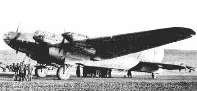

# 被盗技术:苏联超级堡垒

> 原文：<https://hackaday.com/2016/03/10/stolen-tech-the-soviet-superfortress/>

波音公司的 B-17 是第二次世界大战中数量最多的重型轰炸机，它在梅塞施密特和高射炮面前几乎坚不可摧的声誉是一个传奇。“B-17”号的首次飞行是在 1935 年，十年后，在第二次世界大战结束时，“B-17”号开始显示出它的年龄。它只能携带 6000 磅的军械；第一颗原子弹小男孩和胖子分别重 9700 磅和 10300 磅。尽管有 Avro Lancaster，盟军入侵日本仍需要一架新飞机。这架飞机将是波音 B-29 超级堡垒。

理论上，B-29 几乎可以对抗航空史上除了最现代的轰炸机之外的所有轰炸机。是的，B-29 很慢，但那只是因为喷气发动机在 1944 年还处于婴儿期。这种轰炸机是二战中被遗忘的超级武器，每个人——日本、德国、英国和苏联——都想要自己的。只有苏联人会走这么远去建造他们自己的 B-29，从坠毁和丢弃的美国轰炸机中逆向工程技术。

像二战中的所有国家一样，苏联需要一架重型轰炸机。从莫斯科飞往柏林只有 1000 英里，海参崴到东京只有 700 英里。与其说俄罗斯需要远程轰炸机，不如说他们需要能携带十几枚 500 磅炸弹的轰炸机。

The Petlyakov Pe-8, a heavy bomber used by the Soviet air forces in World War II.

战争开始时，苏联空军最强大的轰炸机将被盟军库存中的任何其他四引擎轰炸机超越。Petlyakov Pe-8 可以携带 2000 磅的炸弹飞行 1200 英里。B-17 号可以运送 6000 磅的货物走同样的距离。苏联被远远超过了，尽管柏林离莫斯科不到 1000 英里，东京离海参崴 700 英里，但最终还是需要一架更大的轰炸机。

### 对东京的突袭

美国在战争早期袭击了东京，在 1942 年 4 月的杜利特尔突袭中，但是这次行动的成功微乎其微。这次行动包括舰载 B-25 轰炸机飞越日本并降落在中国。对于飞机来说，这是一次单程旅行。几乎没有造成什么损失，任务结束后，中校·詹姆士·h·杜利特尔认为他在返回美国时会被送上法庭。正是由于巨大的士气鼓舞，杜利特突袭才被称为成功。

杜利特尔号将永远不会被复制，而且在下一次对日本的攻击之前，又过了两年。1944 年夏天，美国陆军航空兵发起了马特宏峰行动，从中国内陆深处的空军基地对日本控制的满洲、台湾和日本本土九州进行轰炸袭击。虽然这次行动不会取得巨大成功——从印度基地向中国前沿空军基地运送燃料和炸弹的后勤工作将是一场噩梦——但它确实为苏联提供了几架 B-29 飞机供研究。

### 找回 B-29

虽然苏联是盟国，但美国拒绝根据租借协议提供 B-29。这并不是说美国不愿意向苏联提供飞机；美国设计的 P-39 Ariacobra 最出名的是苏联飞机，成千上万的飞机从美国工厂运到阿拉斯加，穿过西伯利亚，到达欧洲东部前线。B-29 很特别，它是当时最大最强的轰炸机，是每个国家都想要的，也是美国不愿意分享的飞机。

在马特宏峰行动的几次任务中，几架 B-29 被损坏并改道至俄罗斯领土。一架 B-29 坠毁，另外三架可控着陆。估计建造一架苏联设计的远程重型轰炸机需要大约五年的时间，而且图纸上没有任何计划。对斯大林来说，B-29 在苏联土地上的出现是一份礼物。斯大林下令在两年内完全复制 B-29。

### 机械漫威

B-29 是一个机械奇迹。遥控炮塔、[诺顿投弹瞄准器](http://hackaday.com/2016/01/21/misleading-tech-kickstarter-bomb-sights-and-medical-rejuvinators/)、加压舱和异常强大的引擎是 20 世纪 40 年代的技术巅峰。B-29 还有其他技术进步，但对 B-29 装配线上的美国工人来说不太明显。B-29 的起落架非常巨大，这是苏联工业无法制造的。B-29 机头上令人印象深刻的透明塑料圆顶是苏联无法复制的；试飞员经常抱怨苏联制造的丙烯酸面板变形了。

苏联库存中最先进的轰炸机使用织物覆盖的副翼，而 B-29 是全铝的奇迹。即使在最好的情况下，克隆 B-29 也是一项几乎不可能完成的任务，这项任务将直接落在莫斯科郊外最重要的苏联飞机设计局局长安德烈·图波列夫的肩上。

The *General H.H. Arnold Special* being disassembled at the Central Aerodrome in Moscow

三架飞机在突袭日本时转向西伯利亚，并被迅速运送到莫斯科的中央机场。这些飞机，*阿诺德将军特别号*、*丁豪号、*和*舷梯流浪汉号*将被拆卸，用于训练和飞行测试，或者作为参考机体保留。B-29 的逆向工程需要超过 100，000 个部件进行再制造，斯大林的指令要求这些飞机是完美的复制品。这种 B-29 的复制品被称为图-4。

这说起来容易做起来难。苏联没有能力复制很多部件，不管怎样，B-29 使用了 1/16 英寸的铝蒙皮。苏联使用公制。尽管如此，复制还是成功了。图波列夫的设计团队复制了内部油漆方案，克隆飞机上复制了一般阿诺德 T2 特殊 T3 上的修补补丁。

B-29 和图-4 之间的差异不仅仅是表面上的。在 B-29 中发现的强大的 2200 马力莱特 R-3350 发动机不可用。Tu-4 配备了这种发动机的克隆版本 ASh-73TK，产生 2300 马力。这种发动机的第一个版本与莱特发动机的性能不匹配。B-29 使用的 0.50 口径机枪来源不明，图-4 安装了加农炮。B-29 的巨大轮胎无法制造，代理商转向西方战争剩余市场来装备图-4 的起落架。

### 揭秘

德国于 1945 年 5 月 8 日落入盟军手中，根据德黑兰会议的协议，苏联将在德国沦陷 90 天后参战。8 月 6 日，原子弹将落在广岛。8 月 9 日，长崎。日本将于 8 月 15 日投降，苏联不会在太平洋参战。到这个时候，B-29 已经在莫斯科的机库里被完全拆卸了，尽管直到两年后苏联最新的轰炸机才被公开。

1947 年 8 月 3 日，苏联在莫斯科西北的图希诺机场举行了航空日。所有主要空军的代表都出席了。这次飞行表演将首次公开展示苏-9 和苏-11，这是缴获的德国梅塞施米特 Me 262 喷气式战斗机的复制品。表演期间，三架大型轰炸机在 600 英尺的高空飞过。独特的流线型外形、四个轰鸣的引擎和独特的树脂玻璃机头告诉观察者这些是几年前丢失的被遗忘的 B-29。在这次飞越之后，另一架轰炸机，这次是苏联图-4 的一个乘客版本，从人群中呼啸而过。现在全世界都知道苏联人驾驶的是全新的 B-29。

The last surviving Tu-4, on display at the Monino aviation museum.

B-29 在战后不会服役太久；它很快被巨大的 B-36“和平缔造者”黯然失色，1955 年 B-52“同温层堡垒”也让它黯然失色。然而，图-4 将在苏联库存中保留几十年。

尽管围绕图-4 的神话围绕着它是 B-29 的翻版——直到据称其中一个机翼受到高射炮火的伤害——但事实并非如此。图-4 推动了苏联航空航天工业的发展，在引进图-4 仅仅十年后，苏联空军引进了图-16，一种仍在中国空军服役的喷气式轰炸机，以及图-95，一种将一直服役到 2040 年代的涡轮螺旋桨轰炸机。

这是一项令人印象深刻的工程，尽管大部分设计工作是波音公司的产品。这也不是美国设计被苏联航空工程师抄袭的唯一一次。苏联的第一颗原子弹——RDS-1，洛斯阿拉莫斯生产的《胖子和小玩意》的复制品——是由一架图-4 空投的。

现在，只有一架图-4 飞机幸存下来，在莫斯科郊区的一个航空博物馆里。虽然这对于数百架飞机的制造来说并不是一个了不起的存活率，但这是一个极好的例子，表明斯大林会在多大程度上推动苏联航空航天工业的发展。