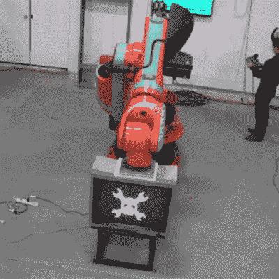

# 停止机器对机器的暴力！

> 原文：<https://hackaday.com/2016/06/13/stop-the-machine-on-machine-violence/>

我们不确定我们是否宽恕了这一切。CRT 显示器实际上已经灭绝了，这里有些人只是无缘无故地把它们砸碎。也就是说，看到大型工业机器人运动起来有点酷，所以我们真的不能责怪他们。(视频嵌入下方。)

在之前，我们已经报道过【极客群体】[用他们的机器人手臂压碎电视，尽管第一次尝试更像是失败，因为电视只是部分被压碎。当时，我们开玩笑说，这是因为他们有一个快乐的扳手将 CRT 固定在一起。但也有可能是机器人手臂只是缺少必要的咕噜声。](http://hackaday.com/2013/12/30/the-geek-group-installs-robot-destroys-crt-monitor/)

这一次，他们带着一只更强壮的机械臂来到它面前，从屏幕上取下了快乐扳手。这些人不是科学家——同时改变两个变量会导致实验不确定。但他们确实会砸东西。所以这是成功的，对吗？

好了，【极客团】你们玩够了。我们给你一张肆意破坏的免费通行证。大臂的下一步是什么？

 [https://www.youtube.com/embed/KuPi8T0Ie2w?version=3&rel=1&showsearch=0&showinfo=1&iv_load_policy=1&fs=1&hl=en-US&autohide=2&wmode=transparent](https://www.youtube.com/embed/KuPi8T0Ie2w?version=3&rel=1&showsearch=0&showinfo=1&iv_load_policy=1&fs=1&hl=en-US&autohide=2&wmode=transparent)

