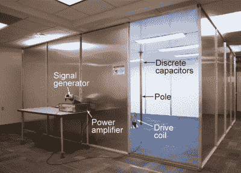
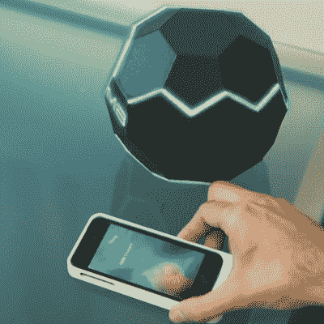

# 突然间，无线电力传输无处不在

> 原文：<https://hackaday.com/2017/02/23/suddenly-wireless-power-transmission-is-everywhere/>

无线电力传输现在已经存在，但它没有特斯拉的 Wardenclyffe 塔那么酷，也没有 OSHA 未批准的超声波电力传输系统那么愚蠢。无线电力传输今天是一个 Qi 充电器为您的手机。它的功耗很低，只有几安培，而且覆盖范围非常短。这有道理；毕竟，我们在这里处理的是平方反比定律，无线电力传输效率不是很高。

现在，突然之间，我们可以将近两千瓦的电能无线传输到散布在房间各处的电子设备上。这是迪士尼研究的一个项目，来自哥伦比亚大学，刚刚在 PLOS 一中发表，不可思议的是，这也是一个 Indiegogo 活动。不知何故，星星已经排成一行，2017 年是为你的笔记本电脑无线供电的一年。

 无线电力传输的第一个例子不仅仅是给手机充电[来自迪士尼研究](https://www.disneyresearch.com/publication/quasistatic-cavity-resonance-for-ubiquitous-wireless-power-transfer/)。本文描述了准静态空腔谐振(QSCR)将高达 1900 瓦的功率传递给房间内的线圈。在实验演示中，这种 QSCR 可以为分散在 50 平方米房间内的小型接收器供电，效率范围为 40%至 95%。简而言之，本文的摘要承诺了一种安全、高效的无线电力传输，完全消除了对墙壁插座的需求。

在实践中，迪士尼研究所的 QSCR 采用了位于房间中央的铜柱形式，墙壁、天花板和地板都包有铝。这根铜杆从地板到天花板不是连续的——它由两段组成，由电容器连接。当足够的射频能量被注入这个电极时，就可以从一个线圈中提取能量。下面的视频很好地指导了你的设置。

与所有无线电力传输方案一样，存在安全性问题。使用有限元分析，迪士尼团队发现这个房间是安全的，即使对于带有起搏器和其他植入电子设备的人来说也是如此。该团队成功地在这个房间里安装了灯、风扇和一辆遥控车，所有这些都是通过三个相互正交的线圈无线供电的。讨论继续提到这种设置可以用来给手机充电，尽管我们不确定在法拉第笼中给手机充电是否有意义。

如果来自迪士尼研究的项目还不够的话，[这是 MotherBox，一个完全不相关的 Indiegogo 活动](https://www.indiegogo.com/projects/the-motherbox-true-wireless-charging-power-phone--2)于本周推出。这不是普通的众筹活动；这项工作直接来自哥伦比亚大学，并已通过箭电子认证。所有人都认为，这是一件合法的*事情*。

MotherBox 众筹活动承诺真正的无线充电。他们在这里并不追求很大的电量——该活动只承诺足够给你的手机充电——但它在 20 英寸的距离内就能充电。

母盒的中心是一组相互垂直的三个线圈。这个论点，或者说是推销，说目前的无线充电器之所以能工作，是因为磁场是相互定向的。例如，手机壳中的线圈与充电垫中的线圈平行。由于三个线圈相互垂直排列，母盒允许“三维充电”。

母盒能用吗？嗯，如果你给线圈注入足够的能量，就会有事情发生。预期充电范围与输出功率的数据呈合理的线性关系，尽管这在三维世界中不太有意义。

是不是终于到了摆脱那些笨拙的墙上插座的时候了？不，还没有。迪士尼研究公司的系统可以工作，但是你必须在法拉第笼中给你的手机充电。不过，这将是测试自主四轴飞行器的绝佳环境。对于 MotherBox，常春藤联盟的工程师们开始了一场众筹活动，而不是写一篇论文或将想法卖给一家老牌公司。现在可能还不是买手机壳以便在星巴克无线充电的时候，但至少人们正在解决这个问题。这一次，一些技术真的起作用了。

 [https://www.youtube.com/embed/gn7T599QaN8?version=3&rel=1&showsearch=0&showinfo=1&iv_load_policy=1&fs=1&hl=en-US&autohide=2&wmode=transparent](https://www.youtube.com/embed/gn7T599QaN8?version=3&rel=1&showsearch=0&showinfo=1&iv_load_policy=1&fs=1&hl=en-US&autohide=2&wmode=transparent)

