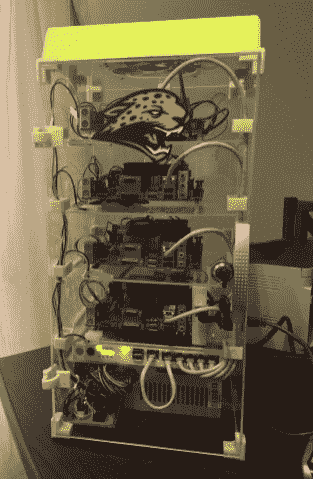
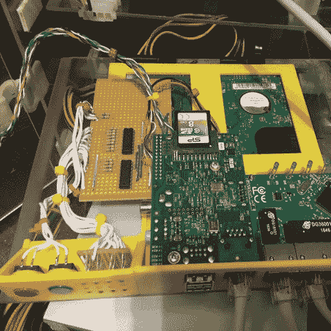

# 迷你 ITX 集群的超级计算

> 原文：<https://hackaday.com/2017/03/16/super-computing-with-mini-itx-cluster/>

科林·阿尔斯通以低廉的价格买到了几块迷你 ITX 主板，并制造了一台迷你超级计算机，他称之为[小美洲虎](https://hackaday.io/project/20196-tinyjaguar)。部分以 AMD Sempron 2650 APU 命名，TinyJaguar 拥有四块，是的，那是*四块* MSI AM1I 迷你 ITX 主板，每块都有 4GB DDR 内存。

带有定制软件的 Raspberry Pi 管理集群，并与一些 TTL 和继电器一起控制四个节点的电源。迷你超级计算机位于一个定制的丙烯酸外壳中，由一系列 3D 打印部件和紧固件固定在一起。在底部附近甚至有一个机架状的面板来容纳 RPi、一个以太网交换机、一个状态 led 阵列和两个按钮。

    

凭借总共 16 个核心的计算能力(包括 GPU)，TinyJaguar 完全有能力做一些非常酷的事情，例如运行带有 [IPyParallel](https://github.com/ipython/ipyparallel) 的 [Jupyter](http://jupyter.org/) 笔记本电脑。[Colin]在让 GPU 与 PyOpenCL 一起工作时遇到了一些问题。这需要一点痛苦和时间，但最终他能够启动 GPU，并编写了一个小的消息传递程序来显示两个内核启动并一起工作。

请务必查看[科林的]超级计算机项目页面，特别是[十个项目日志](https://hackaday.io/project/20196/logs)，它们会详细介绍这个版本中的所有内容。他还[贴出了他的代码](https://github.com/calston/tinyjaguar)，如果你想看看引擎盖下。