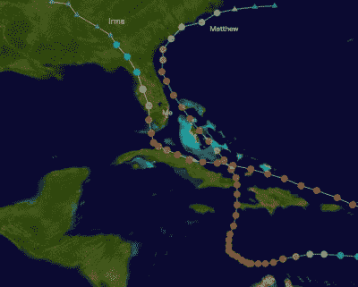
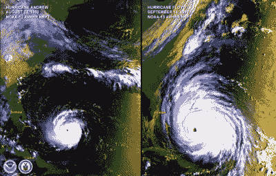
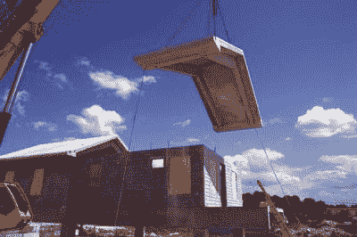
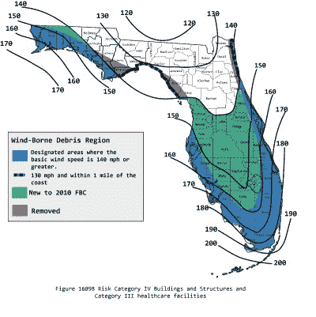

# 在飓风中幸存的工程

> 原文：<https://hackaday.com/2017/09/27/surviving-hurricanes/>

佛罗里达是一个居住的好地方，尤其是在一月左右，阳光明媚，室外温度 24 度(华氏 76 度)，而你家乡的所有朋友每天早上都要处理刮去挡风玻璃上的冰。然而，在夏末，这个宜人的热带天堂有时会变得更糟，因为佛罗里达是地球上少数几个经常出现最恶劣风暴的地方之一:飓风。作为一名佛罗里达人，也许我可以介绍一下各个地方政府及其居民采取的一些方法，以减轻这些强烈的热带风暴通常带来的破坏，因为在外人看来，住在这样一个地方可能被认为是不明智的。

## 暴风雨

Hurricanes Matthew (2016) and Irma (2017) came very close but the centers of the storms were far enough away to limit damage in my area.

在了解佛罗里达州极其健全的建筑法规和独特的建筑材料和风格之前，让我们先来看看飓风本身。飓风根据其最大风速被分类为[萨菲尔-辛普森等级](https://en.wikipedia.org/wiki/Saffir%E2%80%93Simpson_scale),这与飓风登陆时造成的破坏有着松散的联系。对于热带风暴，人们可能会失去一些棕榈叶和枯枝，但 5 级风暴可以夷平整个社区。

虽然更强烈的风暴可能非常危险，但重要的是要认识到，最强的风围绕在风眼的中心，风速随着与风眼的距离增加而呈指数下降。这意味着飓风的轻微打击将不会看到眼睛路径周围造成的破坏。此外，风眼墙的东北角往往是风暴最具破坏性的部分，这也是去年飓风马修横扫该州东海岸时拯救佛罗里达州(尤其是我自己)的原因，使飓风更强大的部分基本上远离海岸。

Hurricane Andrew (left), a Category 5 storm which in 1992 was the costliest hurricane to make landfall until Katrina in 2005\. Hurricane Floyd (right) made landfall in North Carolina as a Category 2 despite its much greater size, although at this point it was Category 4\. Photo courtesy of [http://geoalliance.asu.edu](http://geoalliance.asu.edu).

同样重要的是要注意，风对任何物体施加的力都与风速的平方成正比，这意味着 1 级飓风和 3 级飓风之间的差异可能是惊人的，即使风速只增加了 16 英里/小时。(这与车辆上的阻力随着速度的增加而呈指数增加的效应相同。)

## 设计我们的出路

在这样的地方生活，一个更明显的解决方案是在建造房屋和其他基础设施时简单地使用更坚固的材料，事实上，一些现代住宅就是这样。一种常见的建筑方法，虽然稍微贵一点，是用混凝土砌块建造房屋，然后用浇注的混凝土填充砌块中的空隙。在某些情况下，屋顶可以由混凝土制成，也可以由带有加固金属支架的重型木材制成。使用金属作为屋顶表面材料，而不是木瓦，也有助于提高房屋的抗风能力。此外，桥梁、建筑和其他基础设施也更加坚固，能够抵御飓风的强风。例如，迈阿密的摩天大楼可以承受 140 英里/小时到 180 英里/小时的风速(取决于它们是何时建造的)，这肯定是比其他任何城市如凤凰城或底特律的摩天大楼更高的设计考虑。

A concrete roof is lowered onto a hurricane-resistance concrete house. [Photo via B&A Architecture](http://baarchitecture.com/wall/?p=31).

然而，对于木制房屋，要特别注意屋顶和墙壁的连接方式，以及墙壁和地基的连接方式。强风如何影响房屋的一个奇怪之处是，它们往往会将屋顶向上掀离建筑物。为了防止这种隆起，金属飓风带被钉在所有的屋顶椽上，屋顶被钉上更多的飓风带到墙上。反过来，墙用特殊的混凝土锚固定在混凝土基础上。这些带和锚允许风载荷均匀地分布到地面，并且屋顶抵抗任何向上的力。

 [https://www.youtube.com/embed/SYNUgV8M0g4?version=3&rel=1&showsearch=0&showinfo=1&iv_load_policy=1&fs=1&hl=en-US&autohide=2&wmode=transparent](https://www.youtube.com/embed/SYNUgV8M0g4?version=3&rel=1&showsearch=0&showinfo=1&iv_load_policy=1&fs=1&hl=en-US&autohide=2&wmode=transparent)

Minimum wind speed (mph) design criteria for buildings and structures in Florida.

飓风会将屋顶*向上*抬升，这看起来似乎有悖常理，但由于风在结构上流动，抬升的产生方式与飞机机翼非常相似。这就是为什么除了确保结构本身尽可能坚固之外，还必须加固结构的薄弱点。通常飓风造成的损害不是来自风，而是来自风吹来的东西。而且，如果 150 英里/小时的风卷起 2×4 或树枝或栅栏柱，并将其发射到正常的窗户上，那么这个开口将允许风进入住宅，并产生更大的升力，以将屋顶从结构中剥离。

建筑物迎风面大小的 1%的开口就足以拆除一个屋顶。出于这个原因，专门的防风百叶窗安装在窗户和门上，或者窗户本身由特殊的抗冲击玻璃制成，这些玻璃会破碎但保持完整，从而有助于保护结构的其余部分。此外，佛罗里达州的现代建筑法规不允许住宅的门向内打开，这样整个门框都可以承受风的冲击，而不仅仅是闩锁机构。

 [https://www.youtube.com/embed/wVloPApmmtE?version=3&rel=1&showsearch=0&showinfo=1&iv_load_policy=1&fs=1&hl=en-US&autohide=2&start=70&wmode=transparent](https://www.youtube.com/embed/wVloPApmmtE?version=3&rel=1&showsearch=0&showinfo=1&iv_load_policy=1&fs=1&hl=en-US&autohide=2&start=70&wmode=transparent)

飓风还会对它们到达的地区造成另一种影响，那就是暴雨和洪水。虽然没有可行的方法来建造防洪建筑，但根据联邦政府维护的洪泛区地图来选择建筑地点通常是谨慎的。此外，居住在容易受到风暴潮袭击的屏障岛上也是不可取的，尽管[架空建筑](http://www.sun-sentinel.com/news/weather/hurricane/fl-reg-hurricane-irma-stilt-homes-20170914-story.html)可以帮助减少风暴潮造成的损失。另一方面，一些像哈维飓风这样的风暴是前所未有的，以至于我们往往无法采取任何措施来改善这种状况。

即使佛罗里达州改进了建筑法规，再多的混凝土或飓风带也无法阻止安德鲁飓风造成的所有破坏，再多的排水系统也无法阻止哈维飓风造成的所有破坏。当然，在佛罗里达这样的地方生活是有风险的，但也有相当大的回报。虽然这里的冬天比美国其他地方更容易忍受，但海浪可能会非常汹涌，除非我能在加州或夏威夷买得起房子，否则我只能这样了。